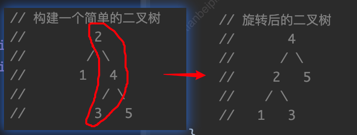
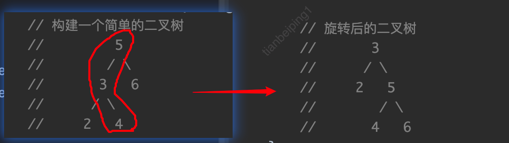

## java语言实现平衡二叉树的左旋转、右旋转和双旋转

### 学习博客

> https://blog.51cto.com/u_13527/6857816


- 平衡二叉树又叫平衡二叉搜索树，或者AVL树，有如下特点：

  - 可以是一棵空树
  - 或者它的左右子树的高度差的绝对值不大于1，并且左右子树也是平衡二叉树

- 当二叉树不平衡的时候，可以通过“旋转”来使它平衡

  - 左旋转（适用于右子树高度 - 左子树高度 > 1）
  - 右旋转（适用于左子树高度 - 右子树高度 > 1）
  - 双旋转

  ###### 左旋转（逆时针）

  - 思路分析
    - 创建一个新的节点，且其值等于二叉树根节点的值
    - 把新节点的左子树设置成当前节点的左子树
    - 把新节点的右子树设置成当前节点右子树的左子树
    - 把当前节点的值设置成其右子节点的值
    - 把当前节点的右子树设置成其右子树的右子树
    - 把当前节点的左子树设置成新节点
    - 

  ###### 右旋转（顺时针）

  - 思路分析
    - 创建一个新的节点，且其值等于二叉树根节点的值
    - 把新节点的右子树设置成当前节点的右子树
    - 把新节点的左子树设置成当前节点左子树的右子树
    - 把当前节点的值设置成其左子节点的值
    - 把当前节点的左子树设置成其左子树的左子树
    - 把当前节点的右子树设置成新节点
    - 

  ###### 双旋转

  - 思路分析（以整棵二叉树需要右旋转为例），`先左再右`
    - 如果当前节点的左子树的右子树的高度大于当前节点的左子树的左子树的高度
    - 可以先对当前节点的左子树进行左旋转
    - 然后对当前节点右旋转
  - 思路分析（以整棵二叉树需要左旋转为例），`先右再左`
    - 如果当前节点的右子树的左子树的高度大于当前节点的右子树的右子树的高度
    - 可以先对当前节点的右子树进行右旋转
    - 然后对当前节点左旋转

```java
public class Node {
    private int value;
    private Node left;
    private Node right;

    public Node(int value) {
        this.value = value;
    }

    //求以该节点为根节点的树的高度
    public int height(){
        return Math.max(this.getLeft() == null?0:this.getLeft().height(),
                        this.getRight() == null?0:this.getRight().height()) + 1;
    }

    //左子树的高度
    public int leftHeight(){
        if (this.getLeft()!=null){
            return this.getLeft().height();
        }else {
            return 0;
        }
    }
    //右子树的高度
    public int rightHeight(){
        if (this.getRight()!=null){
            return this.getRight().height();
        }else {
            return 0;
        }
    }

    //左旋转
    public void leftRotate(){
        //创建一个新的节点，且其值等于二叉树根节点的值
        Node newNode = new Node(this.getValue());
        //把新节点的左子树设置成当前节点的左子树
        newNode.setLeft(this.getLeft());
        //把新节点的右子树设置成当前节点右子树的左子树
        newNode.setRight(this.getRight().getLeft());
        //把当前节点的值设置成其右子节点的值
        this.setValue(this.getRight().getValue());
        //把当前节点的右子树设置成其右子树的右子树
        this.setRight(this.getRight().getRight());
        //把当前节点的左子树设置成新节点
        this.setLeft(newNode);
       // 左旋操作
       //  public TreeNode leftRotate(TreeNode root) {
       //      if (root == null || root.right == null) {
       //          return root;
       //      }
       //      TreeNode newRoot = root.right;
       //      root.right = newRoot.left;
       //      newRoot.left = root;
       //      return newRoot;
       //  }
    }

    //右旋转
    public void rightRotate(){
        //创建一个新的节点，且其值等于二叉树根节点的值
        Node newNode = new Node(this.getValue());
        //把新节点的右子树设置成当前节点的右子树
        newNode.setRight(this.getRight());
        //把新节点的左子树设置成当前节点左子树的右子树
        newNode.setLeft(this.getLeft().getRight());
        //把当前节点的值设置成其左子节点的值
        this.setValue(this.getLeft().getValue());
        //把当前节点的左子树设置成其左子树的左子树
        this.setLeft(this.getLeft().getLeft());
        //把当前节点的右子树设置成新节点
        this.setRight(newNode);
       // 右旋操作
       //  public TreeNode rightRotate(TreeNode root) {
       //      if (root == null || root.left == null) {
       //          return root;
       //      }
       //      TreeNode newRoot = root.left;
       //      root.left = newRoot.right;
       //      newRoot.right = root;
       //      return newRoot;
       //  }
    }


    //添加节点
    public void addNode(Node node){
        if (node == null){
            return;
        }
        if (node.value < this.value){
            if (this.getLeft() == null){
                this.setLeft(node);
            }else {
                this.getLeft().addNode(node);
            }
        }else{
            if (this.getRight() == null){
                this.setRight(node);
            }else {
                this.getRight().addNode(node);
            }
        }
        //当添加完一个节点，不平衡的话，就旋转
        //左旋转
        if (this.rightHeight() - this.leftHeight() > 1){
            //如果该节点的右子树的左子树的高度大于该节点的右子树的右子树的高度
            if (this.getRight()!= null && this.getRight().leftHeight()>this.getRight().rightHeight()){
                //就先对右子节点右旋转
                this.getRight().rightRotate();
                //然后对当前节点左旋转
                this.leftRotate();
            }else {
                //否则直接对当前节点左旋转
                this.leftRotate();
            }
            return;
        }
        //右旋转
        if (this.leftHeight() - this.rightHeight() > 1){
            //如果该节点的左子树的右子树的高度大于该节点的左子树的左子树的高度
            if (this.getLeft()!= null && this.getLeft().rightHeight()>this.getLeft().leftHeight()){
                //就先对左子节点左旋转
                this.getLeft().leftRotate();
                //然后对当前节点右旋转
                this.rightRotate();
            }else {
                //否则直接对当前节点右旋转
                this.rightRotate();
            }
            return;
        }
    }

    //中序遍历
    public void midOrder(){
        if (this.getLeft() != null){
            this.getLeft().midOrder();
        }
        System.out.println(this);
        if (this.getRight() != null){
            this.getRight().midOrder();
        }
    }
}

public class AVLTree {
    private Node root;
    //添加节点
    public void addNode(Node node){
        if (this.getRoot() == null){
            this.setRoot(node);
        }else {
            this.getRoot().addNode(node);
        }
    }
    public void midOrder(){
        if (root == null){
            return;
        }else {
            root.midOrder();
        }
    }

    public Node getRoot() {
        return root;
    }
    public void setRoot(Node root) {
        this.root = root;
    }
}

public class AVLTreeDemo {
    public static void main(String[] args) {
        //int[] array = {4,3,6,5,7,8};
        int[] array = {10,11,7,6,8,9};
        AVLTree avlTree = new AVLTree();
        for (int i = 0; i < array.length; i++) {
            avlTree.addNode(new Node(array[i]));
        }
        avlTree.midOrder();

        System.out.println("      root hight : " + avlTree.getRoot().height());
        System.out.println(" root-left hight : "+avlTree.getRoot().leftHeight());
        System.out.println("root-right hight : "+avlTree.getRoot().rightHeight());
        System.out.println("            root : "+avlTree.getRoot());
    }
}
```


### chatGTP给出：平衡二叉树

```java
class TreeNode {
    int val;
    int height;
    TreeNode left;
    TreeNode right;

    TreeNode(int val) {
        this.val = val;
        this.height = 1;
    }
}

class AVLTree {
    TreeNode root;

    // 获取树的高度
    int height(TreeNode node) {
        if (node == null) {
            return 0;
        }
        return node.height;
    }

    // 获取节点的平衡因子
    int getBalance(TreeNode node) {
        if (node == null) {
            return 0;
        }
        return height(node.left) - height(node.right);
    }

    // 右旋转
    TreeNode rotateRight(TreeNode y) {
        TreeNode x = y.left;
        TreeNode T2 = x.right;

        x.right = y;
        y.left = T2;

        y.height = Math.max(height(y.left), height(y.right)) + 1;
        x.height = Math.max(height(x.left), height(x.right)) + 1;

        return x;
    }

    // 左旋转
    TreeNode rotateLeft(TreeNode x) {
        TreeNode y = x.right;
        TreeNode T2 = y.left;

        y.left = x;
        x.right = T2;

        x.height = Math.max(height(x.left), height(x.right)) + 1;
        y.height = Math.max(height(y.left), height(y.right)) + 1;

        return y;
    }

    // 插入节点
    TreeNode insertNode(TreeNode node, int val) {
        if (node == null) {
            return new TreeNode(val);
        }

        if (val < node.val) {
            node.left = insertNode(node.left, val);
        } else if (val > node.val) {
            node.right = insertNode(node.right, val);
        } else {
            return node; // 不允许插入相同值的节点
        }

        node.height = 1 + Math.max(height(node.left), height(node.right));

        int balance = getBalance(node);

        // 左旋转
        if (balance > 1 && val < node.left.val) {
            return rotateRight(node);
        }

        // 右旋转
        if (balance < -1 && val > node.right.val) {
            return rotateLeft(node);
        }

        // 左右旋转
        if (balance > 1 && val > node.left.val) {
            node.left = rotateLeft(node.left);
            return rotateRight(node);
        }

        // 右左旋转
        if (balance < -1 && val < node.right.val) {
            node.right = rotateRight(node.right);
            return rotateLeft(node);
        }

        return node;
    }

    // 插入节点的公共接口
    void insert(int val) {
        root = insertNode(root, val);
    }
}
```

