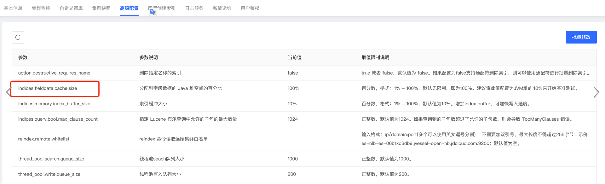

# 1.慢日志

## 配置慢日志

官方参考文档：https://www.elastic.co/guide/en/elasticsearch/reference/7.9/index-modules-slowlog.html（注意选择对应es版本）

线上集群经常会遇到读、写性能问题，比如：cpu 被打满了、jvm heap 使用率特别高等。这些性能问题都有可能是由某一个大查询导致，给索引配上慢日志，可帮助捕获耗时较长的查询语句，有利于定位性能问题。

需要通过es api配置查询和写入的慢日志级别和阈值。当查询或者写入超过阈值时，es会打印慢日志。说明耗时和具体查询语句内容。

公有云 es 默认不支持慢日志，若用户需要，可动态配置，配置方法如下：

```
# 配置慢日志的阈值，可根据业务实际需求调整，若打印的慢日志太多，可适当调大阈值
# 索引设置示例
PUT /索引name/_settings
{
  "index.search.slowlog.threshold.query.info": "1s",
  "index.search.slowlog.threshold.fetch.info": "1s",
  "index.indexing.slowlog.threshold.index.info":"2s"
}
 
# 对于后续新建索引，需在索引模板中设置，以匹配所有指定索引前缀的新建索引
PUT _template/default_slowlog
{
    "order": 1000,
    "index_patterns": [
 
      "索引前缀*"
    ],
    "settings": {
      "index.search.slowlog.threshold.query.info": "1s",
      "index.search.slowlog.threshold.fetch.info": "1s",
      "index.indexing.slowlog.threshold.index.info":"2s"
    },
    "mappings": { },
    "aliases": { }
}
 
# 查看设置
GET 索引名称/_settings?pretty
```

## 查看慢日志

当给索引配置上慢日志后，若捕获到了慢日志信息，可通过京东云控制台查看：


## 优化慢日志

- 对慢日志的优化一般从两方面进行：
  - 一是业务侧请求复杂，本身耗时长，业务侧可根据捕获到的慢日志语句进行语句优化
  - 二是集群压力大，导致请求语句耗时较长，可参考文档对集群性能进行优化：[ES 集群读写性能优化](./)

# 2.es 集群读写性能优化

[ES 集群读写性能优化](./es_write_read_youhua.md)

# 3.磁盘空间超过95%，ES自动将全部索引设置为只读，集群不能写入

注意：删除数据释放磁盘空间后，索引不会自定修改为可写，仍然是只读。需要执行api 修改配置。


```
#查看索引是否被设置为只读, "read_only_allow_delete"是否为true
curl localhost:9200/_settings?pretty
{
  "lop_edi_sum_2019.11.12" : {
    "settings" : {
      "index" : {
        "number_of_shards" : "1",
        "blocks" : {
          "read_only_allow_delete" : "true"
        },
        "provided_name" : "lop_edi_sum_2019.11.12",
        "creation_date" : "1573488001380",
        "number_of_replicas" : "1",
        "uuid" : "orpfBLmZQBew2cmQIziNig",
        "version" : {
          "created" : "6050499"
        }
      }
    }
  }
}
  
#将read_only_allow_delete设置为null 或 false
curl -X PUT \
  localhost:9200/索引名称/_settings \
  -H 'content-type: application/json' \
  -d '{
  "index": {
    "blocks": {
      "read_only_allow_delete": null
    }
  }
}'
 
PUT 索引名称/_settings
{
   "index": {
    "blocks": {
      "read_only_allow_delete": null
    }
   }
}
```


# 4.加快索引分片恢复速度

- 当节点间 rebalance 数据时、当节点发生重启时、当底层机器故障导致节点failover时，分片需要迁移数据或者重加载数据或者补数据，这时分片数据量如果太大，分片initing、reblance 过程会比较慢。es默认限制了并行恢复的数量、速度等。
- 可以修改如下配置加快 recovery 速度：

```
// 查看正在进行的分片 recovery 进度
GET _recovery?detailed=true&active_only=true
 
// 查看尚未分配的分片数量，其中，"relocating_shards" 值为正在均衡的分片数量，"initializing_shards" 值为正在初始化的分片数量，"unassigned_shards" 值为尚未分配的分片数量
GET _cluster/health?pretty
// 返回结果
{
  "cluster_name": "test",
  "status": "yellow",
  "timed_out": false,
  "number_of_nodes": 43,
  "number_of_data_nodes": 32,
  "active_primary_shards": 891,
  "active_shards": 1708,
  "relocating_shards": 5,
  "initializing_shards": 17,
  "unassigned_shards": 57,
  "delayed_unassigned_shards": 0,
  "number_of_pending_tasks": 0,
  "number_of_in_flight_fetch": 0,
  "task_max_waiting_in_queue_millis": 0,
  "active_shards_percent_as_number": 0
}
 
//与分片恢复速度相关 4 个参数：
cluster.routing.allocation.cluster_concurrent_rebalance 该参数用来控制集群内同时运行的数据均衡任务个数
cluster.routing.allocation.node_initial_primaries_recoveries 该参数用来控制节点重启时，允许同时恢复几个主分片
cluster.routing.allocation.node_concurrent_recoveries 该参数用来控制节点除了主分片重启恢复以外其他情况下，允许同时运行的数据恢复任务
indices.recovery.max_bytes_per_sec 该参数用来控制节点恢复时的速率
 
//与分片恢复速度相关 4 个参数默认值为：
"cluster.routing.allocation.node_concurrent_recoveries": 2,
"cluster.routing.allocation.cluster_concurrent_rebalance": 2, 
"cluster.routing.allocation.node_initial_primaries_recoveries": 2,
"indices.recovery.max_bytes_per_sec": "40mb"
 
//查看集群配置
GET /_cluster/settings?pretty
 
//注意：可根据集群实际情况适当调大参数，参数调的越大，内部通信带宽占用会越大，集群读、写性能受影响会越大
//加快分片恢复的速度
PUT /_cluster/settings
{
    "transient" : {
        "cluster.routing.allocation.node_concurrent_recoveries": 5,
        "cluster.routing.allocation.cluster_concurrent_rebalance": 5,
        "cluster.routing.allocation.node_initial_primaries_recoveries": 5,
        "indices.recovery.max_bytes_per_sec": "1000mb"
    }
}
 
 
//命令行
curl -XPUT -H 'content-type: application/json' 'http://localhost:9200/_cluster/settings' -d '
{
    "transient" : {
        "cluster.routing.allocation.node_concurrent_recoveries": 5,
        "cluster.routing.allocation.cluster_concurrent_rebalance": 5,
        "cluster.routing.allocation.node_initial_primaries_recoveries": 5,
        "indices.recovery.max_bytes_per_sec": "1000mb"
    }
}'
 
 
//恢复默认配置，2.x版本集群不支持 null，可使用 ”“
PUT /_cluster/settings
{
    "transient" : {
        "cluster.routing.allocation.node_concurrent_recoveries":null,
        "cluster.routing.allocation.cluster_concurrent_rebalance":null,
        "cluster.routing.allocation.node_initial_primaries_recoveries": null,
        "indices.recovery.max_bytes_per_sec" : null
    }
}
```

# 5.NoNodeAvailableException

问题：

应用侧报错：org.elasticsearch.client.transport.NoNodeAvailableException: None of the configured nodes are available:

可能的原因：

1. 使用http地址访问TCP 9300端口，请在实例详情页面确认TCP访问地址是否正确

2. 配置集群名字错误，https://www.elastic.co/guide/en/elasticsearch/client/java-api/current/transport-client.html

3. 开启了sniff

4. 节点ip变化后，域名还是解析到老ip

5. 如果集群开启了鉴权，确认用户名和密码是否配置正确

6. 客户端和集群版本不一致

7. netty版本不一致

8. 网络原因

9. 如果是蜂巢推送数据，确认全局处理器参数配置是否正确，右侧为ES中的索引信息，索引信息格式为indexName.typeName

10. 京动力平台从ES拉取数据做展示。目前京动力平台界面不能输入“集群名”，默认把用户名作为集群名使用，导致连接集群失败。（已经向京动力提需求修改。规避方式：后台修改用户名为集群名）

11. tcp 访问集群，coordinate 节点升配后 ip 改变，客户端 tcp 域名解析缓存未更新，需重启业务侧服务

12. 业务侧配置http域名，添加了http://协议头，导致域名解析异常（ Name or service not known ）

13. 客户端 oom，es 集群侧连接被迫断开

# 6.集群状态red，有索引主分片未分配；状态yellow，有索引副本分片未分配

es集群状态共有三种：red，yellow，green，集群正常状态为green，状态会根据索引异常状态变化，优先显示最严重的情况，例如：集群中没有yellow和red状态索引，就是正常状态，呈green状态；只有yellow索引，集群呈yellow状态；只有red索引，呈red状态；同时存在red状态索引和yellow状态索引，集群呈red状态。

可通过 GET _cluster/allocation/explain?pretty 命令查看集群 red 或 yellow 原因。

异常状态可能的原因：

1. 磁盘问题导致：集群每个节点的磁盘水位超过低水位（默认85%），索引副本分片无法分配，索引会变yellow状态；每个节点的磁盘水位超过高水位（默认90%)，新建索引的主分片无法分配，索引呈red状态—》扩容或者清理数据
2. 单节点离线：集群索引都设置有副本，单节点离线会导致集群状态yellow；存在0副本索引，单节点离线会导致集群状态red
3. 创建索引：新索引（有副本的）在创建初始化期间，也会短时yellow；0副本则会短时red。
4. 索引settings设置不合理：索引设置中total_shards_per_node（限制集群每个节点上只能分配该索引的几个片）值设置不合理，也会导致索引分片无法分配的情况，比如：集群3个data节点，索引分片设置的3主1副(共6个分片)，索引settings指定total_shards_per_node:1（每个节点只能分配1个片，3个节点就只能分配3个片），索引将会有3个副本分片无法分配，呈yellow状态；再比如：集群3个data节点，索引分片设置6主1副，索引settings指定total_shards_per_node:1，集群只能分配该索引的3个片，会有三个主分片和6个副本分片无法分配，有主分片无法分配，索引呈red状态

# 7. 调整索引分片数

## 索引主分片数量调整

- 新建索引时，可指定索引主分片和副本分片，例如：

```
# 新建索引
PUT test
{
  "settings": {
      "index": {#
        "number_of_shards": "5",
        "number_of_replicas": "1"
      }
    }
}
 
# 对于按日期进行拆分的索引，可以通过修改索引模板的方式，来修改之后创建的索引的主分片数量
# 比如 test*类索引，test-2022.11.11 索引为5主1副，想更改后续索引的主分片数，可以调整索引模板设置，比如调整为 10主1副，后一天创建的索引 test-2022.10.12 就会应用上新索引模板中的设置，变为 10主1副了
 PUT _template/test_template
{
    "order" : 1000,
    "index_patterns" : [
      "test*"
    ],
    "settings" : {
      "index" : {
        "number_of_shards" : "10",
        "number_of_replicas" : "1"
      }
    },
    "mappings" : {
    },
    "aliases" : {
    }
}
```


- 对于已经创建的索引，无法直接修改索引主分片数量，若要修改，可以使用 reindex 的方法重建索引，reindex 可参考官方文档：https://www.elastic.co/guide/en/elasticsearch/reference/6.8/docs-reindex.html

## 索引副本分片数量调整

es 中的索引默认副本分片数量为 1，即每个主分片都会有一个副本分片，这样主分片在丢失的情况下，副本分片可提升为主分片，保证数据的高可用。

索引的主分片一旦设定，后面是不可以更改的，但是索引的副本分片的数量是可以动态修改的，修改命令，示例如下：

```
# 可登录 es 集群图形化界面工具 kibana 或 head 调用执行 api 命令
 
# 查看索引情况
GET _cat/indices?v
 
# 查看具体索引情况
GET _cat/indices/索引名称?v
 
# 修改索引副本分片数量为 1
PUT 索引名称/_settings
{
     "index" : {
        "number_of_replicas" : "1"
      }
}
```


# 8.ik分词器的使用

[ik 分词器](./)

# 9.fielddata

官方参考文档（ clear cache ）：https://www.elastic.co/guide/en/elasticsearch/reference/6.8/indices-clearcache.html

官方参考文档（ _id field ）：https://www.elastic.co/guide/en/elasticsearch/reference/current/mapping-id-field.html

官方参考文档（ fielddata ）：https://www.elastic.co/guide/en/elasticsearch/reference/6.8/fielddata.html

```
# 查看 fielddata 缓存占用
GET _cat/fielddata?v
 
 
# 手动清除 fielddata 缓存
POST /test/_cache/clear?fielddata=true
POST /*/_cache/clear?fielddata=true
```

fielddata 缓存大小是由 indices.fielddata.cache.size，该参数默认值为 100%，即 fielddata 缓存最大能将可使用的 jvm heap 内存大小打满，京东云控制台上提供了高级配置接口，来修改这个参数：



建议将该参数的值设置为 10%，修改该参数，需要滚动重启es集群，请注意。

# 10.集群变配问题

**本地盘 ssd0.n1**

- master 节点变配
  - 增加专有 master 节点（支持，默认 3 个）
  - 节点升配（支持）
  - 节点降配（不支持）

- coordinate 节点变配
  - 增加专有 client 节点（支持）
  - 节点升配（支持）
  - 节点降配（支持）
  - 扩容节点数（支持）
  - 缩容节点数（支持）

- data 节点变配
  - 节点升配（支持）
  - 节点降配（支持）
  - 扩容节点数（支持）
  - 缩容节点数（支持）


**云盘 g.n1**

- master 节点变配
  - 增加专有 master 节点（支持，默认 3 个）
  - 节点升配（支持）
  - 节点降配（不支持）

- coordinate 节点变配
  - 增加专有 coordinate 节点（支持）
  - 节点升配（支持）
  - 节点降配（支持）
  - 扩容节点数（支持）
  - 缩容节点数（支持）

- data 节点变配
  - 节点升配（支持）
  - 节点降配（不支持降配磁盘规格）
  - 扩容节点数（支持）
  - 缩容节点数（支持）

**常见问题**

- 注意：
  - 线上集群设置专有 master 节点和 coordinate 节点，集群稳定性、安全性和读写性能均会有大大提升
  - 变更配置，一次仅支持修改其中一个属性（节点规格，节点数量，单点存储规格，专用主节点规格，协调节点）
  - 本地盘ES升级规格，必须要专有主节点；
  - 减少数据节点数量，必须要专有主节点；
  - 专有主节点，可以升级和降低规格，数量不可修改；
  - 协调节点，可以升级和降低规格，以及增加和减少节点数量；
- 控制台（物流云管平台）集群配置入口？

## 集群配置入口


## 增加专有master节点

集群增加专有 master 节点（默认 3 个），需要重启集群，期间集群不可用，预估持续几分钟的时间（若数据量过大，可能持续时间更久），若业务可停写后再进行该操作，恢复速度会更快。

## 专有master节点升配和降配

- 若集群开启了专有master节点，默认数量是3个（数量不能变），其中1个会被选举为主master节点，另外2个为候选master节点，云盘类型
- 专有master节点变配（升配和降配），不涉及数据的恢复和迁移，速度会比较快，正常情况下，几分钟内可以完成。
- 需注意：专有master节点变配过程，3个master节点会滚动变配，会先进行2个候选master节点的变配，最后再进行主master节点的变配。当进行候选master节点变配时，对集群无影响；当进行主master节点的变配时，集群会出现短暂中断，期间读、写均会失败，需要等待另外2个候选master节点重新选出主master节点后才会恢复，该过程大约会持续10几秒。


## 增加专有协调节点

- 变更时间：几分钟
- 集群增加专有 coordinate 节点（建议最少 3 个），建议 coordinate 节点规格选择与 data 节点规格一致。
- 变更完成后，集群访问入口节点会由 data 节点变为 coordinate 节点，原 data 节点会禁止访问（业务侧不要开启 sniff 嗅探 功能）。
- 若业务侧使用 http 域名访问集群，则业务侧不需变更配置，http 域名会自动将绑定的 ip 由 data节点更改为 coordinate 节点。
- 若业务侧使用 tcp 协议访问集群，业务侧需要变更集群访问节点 tcp 域名配置，由data节点tcp域名更改为 coordinate 节点域名。

## 增加或减少协调节点数量

- 若业务侧使用 tcp 域名（9300端口）访问集群，协调节点数量增加或减少后，业务侧需要添加配置上变更后 正确的协调节点tcp 域名信息，否则，新扩容的协调节点不起作用或者打到已缩容的节点上的请求会失败；
- 若业务侧 http 域名（9200端口）访问集群，http域名会自动添加绑定新扩缩容后的协调节点ip，业务侧不需要做改动

## 升配协调节点规格

- 用户升配集群 coordinate 节点，会滚动节点升配，升配过程不涉及数据迁移。

- 若业务侧使用 tcp 域名（9300端口）访问集群，节点升配完成之后，节点 ip 地址会发生改变，由于业务侧 tcp 域名与 ip 的解析关系存在缓存，并不会立即更改过来，导致集群不可用，报 NoNodeAvailableException，解决办法：重启业务侧服务。

- 若业务侧 http 域名（9200端口）访问集群，则无此问题。

## 云盘 data 节点垂直变配（变更节点规格）

- 问题：云盘 data 节点垂直变配（增加 cpu、内存、磁盘配置）过程中，对集群有什么影响？
  - 1、集群状态必须为 green
  - 2、data 节点变配，要保证集群中的索引至少 1 副本
  - 3、在集群拥有专有 master 节点和 coordinate 节点情况下，变配 data 节点，会采用滚动重启方式，一个节点变更之后，需等到该节点上的数据重新加载完成，集群恢复健康状态之后，再进行下一个节点的变更。变配过程中不会影响集群的可用性，过程中会伴随着数据的加载和 rebalance，会对集群整体性能造成影响，如读、写延迟增大。
  - 4、在集群没有专有 master 节点和 coordinate 节点情况下，同采用滚动重启方式，若业务侧使用http域名访问，则业务侧无需改动；但若业务侧使用 tcp 域名访问，请求是直接打到 data 节点上，变配过程需要谨慎，节点变配后 ip 地址会变化，由于 业务侧 tcp 域名与 ip 的解析关系存在缓存，可能并不会立即更改过来，导致升配完成后集群访问超时。解决办法：重启业务侧服务。
  - 5、涉及磁盘缩容，需评估缩容后的磁盘水位要低于85%，如不满足，建议清理部分历史索引满足条件，再进行变更，否则缩容会失败。

## 云盘 data 节点水平扩容（增加节点个数）

- 变更配置 → 修改节点数量（增加节点数为扩容节点，减少节点数为缩容节点）
- 若集群无专有 master 节点，扩容 data 节点过程，集群会滚动重启一遍；
- 若集群有专有 master 节点，集群不会滚动重启
- 若集群无专有 coordinate 节点，且业务侧使用 tcp 域名访问，扩容 data 节点完成后，业务侧最好添加配置上新扩容 data 节点的 tcp 域名信息；若集群无专有 coordinate 节点，且业务侧使用 http 域名访问，http域名会自动添加绑定新扩容的data节点ip，业务侧不需要做改动
- 若集群有专有 coordinate 节点，业务侧不管使用 http域名还是 tcp域名访问，扩容 data 节点完成后，业务侧都不需要做改动
- 注意：扩容完 data节点后，集群中的数据会进行 rebalance 均衡数据，均衡过程耗时长短与集群数据量有关。数据迁移过程中，实时查看分片迁移进度，可使用命令：**GET _cat/recovery?v&&active_only=true**，若需要调大迁移速度，可参考文档：[加快分片迁移和恢复速度](./)，迁移速度越大，可能会占用较多集群内部通信带宽，导致业务读、写延迟增大，具体要根据业务实际可接受情况调整迁移速度快慢。当各节点上的分片数达到一致后，数据 rebalance 完成，可通过 **GET _cat/allocation?v** 命令查看各节点上的分片数（shards 列）。

## 本地盘和云盘 data 节点水平缩容

- 若集群没有专有 master 节点，不允许缩容
- 若缩容之后，磁盘水位会超过85%，这种缩容操作也不被允许
- 缩容过程，需要先将预缩容节点上的数据迁移至其它节点上，数据迁移完成后，才将节点缩容掉，缩容过程完成
- 注意：缩容 data节点过程中，集群中的数据会进行 rebalance 均衡数据，均衡过程耗时长短与预缩容节点上的数据量有关。数据迁移过程中，实时查看分片迁移进度，可使用命令：**GET _cat/recovery?v&&active_only=true**，若需要调大迁移速度，可参考文档：[加快分片迁移和恢复速度](./)，迁移速度越大，可能会占用较多集群内部通信带宽，导致业务读、写延迟增大，具体要根据业务实际可接受情况调整迁移速度快慢。当预缩容节点上的分片数为0后，说明数据 rebalance 完成，可通过 **GET _cat/allocation?v** 命令查看各节点上的分片数（shards 列）。

## 本地盘 data 节点升配

- 本地盘 ES 升级规格，集群必须要专有主节点，否则，不允许升配。
- 本地盘 data 节点升配节点规格，不同于云盘节点升配。举一个例子来说明：假如预将 10 个 4c/16G 的 data 节点（旧），升配为 10 个 8c/64G 的 data 节点（新），会先扩容出来 10 个 8C/64G 的中转节点，旧节点上的数据全部迁移至中转节点上，然后旧的 10 个 4c/16G 的 data 节点会升配成新的 10 个 8c/64G 的 data 节点，数据会再从中转节点移回到升配完成的新 data 节点上，最后再将 10 个中转节点缩容掉，本地盘 data 节点升配完成。
- 若业务使用 http 域名访问集群，升配过程中不会影响集群的可用性，业务侧无需做改动。
- 若业务使用 tcp 域名访问集群，且无专有协调节点，业务访问是直连的 data 节点，data 节点升配完成后，data节点 ip 地址会发生变化，由于 业务侧 tcp 域名与 ip 的解析关系存在缓存，并没有立即更改过来，集群可能会访问不通，报错：NoNodeAvailableException，可通过重启业务侧服务来解决。
- 升配过程中，主要耗时点在于数据迁移，集群中的数据量越大，耗时会越长，数据迁移主要分两步：
  - 第一步，是将数据从 node-* 往中转节点 nodescale-* 上迁移，可通过 **GET _cat/allocation?v** 命令查看集群中的数据分布，当 node-* 节点上的分片数（shards 列）都为0时，数据已全部迁移到中转节点上，第一步完成。
  - 第二步，node-* 节点全部完成升配后，数据会往回迁，即从中转节点 nodescale-* 迁移到 node-* 上，可通过 **GET _cat/allocation?v** 命令查看集群中的数据分布，当 nodescale-* 节点上的分片数（shards 列）都为0时，数据已全部回迁完成，第二步完成。
  - 注意：数据迁移过程中，实时查看分片迁移进度，可使用命令：**GET _cat/recovery?v&&active_only=true**，若需要调大迁移速度，可参考文档：[加快分片迁移和恢复速度](./)，迁移速度越大，可能会占用较多集群内部通信带宽，导致业务读、写延迟增大，具体要根据业务实际可接受情况调整迁移速度快慢。

## 本地盘 data 节点降配

- 本地盘 ES 降低节点规格，集群必须要专有主节点，否则，不允许降配。
- 节点降配会进行一系列校验，比如磁盘容量，若校验不通过，不允许降配。
- 本地盘 data 节点降配节点规格，不同于云盘节点降配。举一个例子来说明：假如预将 10 个4c/8G 的 data 节点（旧），降配为 10 个 2c/4G 的 data 节点（新），会先扩容出来 10 个 2C/4G 的中转节点，旧节点上的数据全部迁移至中转节点上，然后旧的 10 个 4c/8G 的 data 节点会降配成新的 10 个2c/4G 的 data 节点，数据会再从中转节点移回到降配完成的新 data 节点上，最后再将 10 个中转节点缩容掉，本地盘 data 节点降配完成。
- 若业务使用 http 域名访问集群，降配过程中不会影响集群的可用性，业务侧无需做改动。
- 若业务使用 tcp 域名访问集群，且无专有协调节点，业务访问是直连的 data 节点，data 节点降配完成后，data节点 ip 地址会发生变化，由于 业务侧 tcp 域名与 ip 的解析关系存在缓存，并没有立即更改过来，集群可能会访问不通，报错：NoNodeAvailableException，可通过重启业务侧服务来解决。
- 降配过程中，主要耗时点在于数据迁移，集群中的数据量越大，耗时会越长，数据迁移主要分两步：
  - 第一步，增加相同规格，相同数量的过渡节点（nodescale-*），将数据从 node-* 往中转节点 nodescale-* 上迁移，可通过 **GET _cat/allocation?v** 命令查看集群中的数据分布，当 node-* 节点上的分片数（shards 列）都为0时，数据已全部迁移到中转节点上，第一步完成。
  - 第二步，node-* 节点先滚动重启完成降配后，数据会往回迁，即从中转节点 nodescale-* 迁移到 node-* 上，可通过 **GET _cat/allocation?v** 命令查看集群中的数据分布，当 nodescale-* 节点上的分片数（shards 列）都为0时，数据已全部回迁完成，缩容掉过渡节点，第二步完成。
  - 注意：数据迁移过程中，实时查看分片迁移进度，可使用命令：**GET _cat/recovery?v&&active_only=true**，若需要调大迁移速度，可参考文档：[加快分片迁移和恢复速度](./)，迁移速度越大，可能会占用较多集群内部通信带宽，导致业务读、写延迟增大，具体要根据业务实际可接受情况调整迁移速度快慢。

## 本地盘 data 节点水平扩容

- 变更配置 → 修改节点数量（增加节点数为扩容节点）
- 若集群无专有 master 节点，扩容 data 节点过程，集群会滚动重启一遍；
- 若集群有专有 master 节点，集群不会滚动重启
- 若集群无专有 coordinate 节点，且业务侧使用 tcp 域名访问，扩容 data 节点完成后，业务侧最好添加配置上新扩容 data 节点的 tcp 域名信息；若集群无专有 coordinate 节点，且业务侧使用 http 域名访问，http域名会自动添加绑定新扩容的data节点ip，业务侧不需要做改动
- 若集群有专有 coordinate 节点，业务侧不管使用 http域名还是 tcp域名访问，扩容 data 节点完成后，业务侧都不需要做改动
- 注意：扩容完 data节点后，集群中的数据会进行 rebalance 均衡数据，均衡过程耗时长短与集群数据量有关。数据迁移过程中，实时查看分片迁移进度，可使用命令：**GET _cat/recovery?v&&active_only=true**，若需要调大迁移速度，可参考文档：[加快分片迁移和恢复速度](./)，迁移速度越大，可能会占用较多集群内部通信带宽，导致业务读、写延迟增大，具体要根据业务实际可接受情况调整迁移速度快慢。当各节点上的分片数达到一致后，数据 rebalance 完成，可通过 **GET _cat/allocation?v** 命令查看各节点上的分片数（shards 列）。

## 扩容（缩容）data 节点

-  问题：扩容（缩容）data 节点
  - 变更配置 → 修改节点数量（增加节点数为扩容节点，减少节点数为缩容节点）
  - 扩容 data 节点过程，若集群无专有 master 节点，扩容过程中，集群会滚动重启一遍
  - 缩容 data 节点，要求集群必须有专有 master 节点
  - 若缩容之后，磁盘水位会超过85%，这种缩容操作不被允许
  - 例如：从 3 个 data 节点扩容到 5 个 data 节点
    

# 11.集群重启

控制台 -》更多 -》重启：


# 12.滚动重启集群

- 注意：集群滚动重启时，要求集群中的索引至少都有1副本，若索引为0副本，在重启过程中，该索引会red，不可用！！！若集群只有2个节点，滚动重启过程中集群也会不可用（建议集群至少保证3节点，才具备高可用）！！！
- 滚动重启集群所有节点，一个节点重启后，等待集群恢复成健康状态 green，再重启下一个节点，滚动重启时索引至少为 1 副本，才能够保障重启过程中可以持续提供服务，重启时间较长，与数据量的大小相关
- 若滚动重启过程中，希望可以加快集群恢复速度，可参考上述第 3条：加快索引recovery速度


# 13.delete_by_query 和 forcemerge

请参考官方文档：https://www.elastic.co/guide/en/elasticsearch/reference/6.8/docs-delete-by-query.html

delete_by_query 删除文档，请注意：

- 1、delete_by_query 删除文档，是逻辑删除，不会立即释放磁盘空间
- 2、delete_by_query 删除文档，需要先查后删，会对集群性能造成一些损耗（比如：cpu 使用率增加）
- 3、若执行完 delete_by_query 操作后，发现集群性能影响较大，想取消，取消方法为：

```
# 查看集群索引列表，docs.deleted列表示deleted状态的文档数
GET _cat/indices?v
GET _cat/indices?v&&s=docs.deleted:desc
 
# 查看指定索引
GET _cat/indices/索引名称?v
```

执行完 delete_by_query 操作后，若业务侧想要立即释放磁盘空间，该命令：**POST 索引名称/_forcemerge?only_expunge_deletes=true** 可以强制 force merge，进行释放，但请注意：

- 1、forcemerege 操作比较重，执行过程中，对集群性能有较大影响，建议在流量低峰时进行

- 2、forcemerge 执行后，在底层 segment 文件 merge 过程中，是先将两个符合要求的旧 segment 文件合并成一个新 segment 文件，合并完成后，再将旧 segment 文件删除掉，即在合并过程中，存在一段时间，旧 segment 文件和合并后的新 segment 文件会同时存在。所以 forcemerge 执行后，会发现，索引的数据量反而是先上升后下降的。故要求在执行 forcemerge 操作时，集群节点磁盘空间要有足够空闲。

- 3、forcemerge 执行过程中，若发现对集群性能影响比较大，业务受到影响，想要强制取消 forcemerge 操作，请注意，无法通过命令取消，需要重启集群中的节点才能取消。

问题1：delete_by_query 和 forcemerge 操作，执行过程中，具体会对业务造成影响的程度如何？业务是否可接受？

答：由于不同业务涉及索引的数据量不一样、删除的文档数不一样、业务敏感程度不一样等多方面因素，无法统一评估，请各业务侧根据各自业务实际测试，建议每次删除的文档数少一些，多批次少量进行。

问题2：delete_by_query 删除文档和直接删除索引的区别？

答：delete_by_query 删除文档操作是逻辑删除，不会立即释放磁盘空间，且对集群性能有一定程度的损耗；而直接删除索引是物理删除，会立即释放磁盘空间。实际工作中，建议不要一直将数据写入到一个索引中，导致索引越来越大，后期维护麻烦，而建议将索引按照时间进行拆分，比如按天建索引、按月建索引，这样对于过期历史数据，可以直接删除历史索引。

# 14.forcemerge 清理deleted状态的文档

delete_by_query 删除文档或者 update 更新文档后，会产生 deleted 状态的文档，查看方式：

```
# 查看集群索引列表，docs.deleted列表示deleted状态的文档数 GET _cat/indices?v GET _cat/indices?v&&s=docs.deleted:desc # 查看指定索引 GET _cat/indices/索引名称?v
```

这些deleted状态的文档是被逻辑删除了，但不会立即释放磁盘空间，每次查询数据时，还是会全量查询所有文档（包括 deleted 状态的文档），只是在返回结果时，会将这些 deleted 状态的文档过滤掉。deleted 状态的文档越多，对集群的性能影响会越大。若业务侧想要强行释放掉这些 deleted 状态的文档，可以使用该命令：**POST 索引名称/_forcemerge?only_expunge_deletes=true ，**强制 force merge进行释放，但请注意：

- 1、forcemerege 操作比较重，执行过程中，对集群性能有较大影响，建议在流量低峰时进行

- 2、forcemerge 执行后，在底层 segment 文件 merge 过程中，是先将两个符合要求的旧 segment 文件合并成一个新 segment 文件，合并完成后，再将旧 segment 文件删除掉，即在合并过程中，存在一段时间，旧 segment 文件和合并后的新 segment 文件会同时存在。所以 forcemerge 执行后，会发现，索引的数据量反而是先上升后下降的。故要求在执行 forcemerge 操作时，集群节点磁盘空间要有足够空闲。

- 3、forcemerge 执行过程中，若发现对集群性能影响比较大，业务受到影响，想要强制取消 forcemerge 操作，**请注意：**正在执行的forcemerge 操作可通过 GET _cat/tasks?v 命令查看，但无法通过命令取消，需要重启集群中的节点才能释放取消。

问题1：forcemerge 操作，执行过程中，具体会对业务造成影响的程度如何？业务是否可接受？

答：1、forcemerge 执行过程中，会占用较多cpu、磁盘io、内存等资源，可能会导致集群性能受到较大影响，建议在业务流量低峰时执行该操作，建议不要批量执行，一次只操作一个索引；

​    2、在执行 forcemerge 过程中，集群中的数据量会先增加再降低，所以执行该操作前，要保证集群节点磁盘水位留有较大空闲，建议磁盘水位不要超过 60%；

​    3、正在执行的 forcemerge 任务可通过 GET _cat/tasks?v 命令查看，请注意，若执行完 forcemerge 命令后，发现集群性能影响较大，想要中止 forcemerge 操作，只能通过重启集群节点的方式取消中止。

# 15.公有云es版本：_basic和普通版本的区别

问题：6.3.2_basic和6.3.2版本的区别是什么？

答：_basic版本是带xpack功能的，普通的没有

# 16.京东云控制台es产品介绍

- 京东云控制台官方产品文档：https://docs.jdcloud.com/cn/jcs-for-elasticsearch/product-overview

## 基本信息

基本信息页面，详细描述了集群的基本信息：

## 集群监控

集群监控，分“集群级别”和“节点级别”两个维度，向业务侧提供了集群的监控信息。

```
# 不加鉴权访问，报鉴权错误
curl "es域名/_cluster/health?pretty"
 
# 加鉴权访问，可正常返回结果
curl -u用户名:密码 "es域名/_cluster/health?pretty"
```

# 17.es写入出现index faild一般是什么原因导致的

业务方在往es集群写入数据的时候，有时候会出现index faild的问题，这种一般可能是并发更新同一条文档，version冲突导致的，业务方可以在client端配置捕获异常。


# 18. 7.x 版本es调整单节点shard总数上限

7.x版本的es默认每个node的shard数量为1000，超过将因无法新增shard造成无法新建索引，错误信息如下：

{"error":{"root_cause":[{"type":"remote_transport_exception","reason":"[master-0][11.70.248.49:9300][indices:admin/create]"}],"type":"illegal_argument_exception","reason":"Validation Failed: 1: this action would add [32] total shards, but this cluster currently has [15974]/[16000] maximum shards open;"},"status":400}

解决方法：

1、定时清理历史过期索引，适当调小索引分片数，扩容集群节点数

2、调大节点允许分配的分片数限制，默认为 1000

```
# 调整每个节点允许分配的分片数
PUT _cluster/settings
{
  "persistent": {
    "cluster.max_shards_per_node": 2000
  }
}
# 查看
GET _cluster/settings?pretty
```


# 19. alias别名创建报错：InvalidAliasNameException[Invalid alias name [xxx], an index exists with the same name as the alias]

创建同之前的索引的相同名称的别名，不删除索引而创建同名的别名会报错“an index exists with the same name as the alias”

解决办法：

1、确认集群中是否已经有了同样名字的索引

2、更换要创建的索引别名或者删除名字相同的索引

# 20. 索引分片数怎么设置，设置不合理会导致数据分布不均衡

数据分布不均衡的问题一般是由于索引的分片数设置与集群中的数据节点数不一致导致的，索引分片数设置方式：详见第7条

建议：集群n个data节点，索引的分片数设置就为n主1副或者n*m（m不为0）主1副，好比3个数据节点，索引分片数可以设置为3主1副或者6主1副等等；假设集群3个data节点，索引设置的1主1副，索引个数达到一定量以后，集群的水位分布不均衡问题就会很明显

# 21. Kibana界面打开报异常：Kibana server is not ready yet

问题：es中的.kibana开头索引冲突导致kibana界面不能正常打开

解决办法：

1、删除kibana关联的es集群中的所有.kibana开头的索引

2、联系运维人员重启下kibana节点

# 22. ES 数据迁移

[ES 数据迁移]()

# 23. 2.x版本es集群动态修改queue

```
# 2.1.2版本支持动态修改线程池相关参数
PUT _cluster/settings
{
  "persistent": {
    "threadpool": {
      "search": {
        "queue": "2000"
      },
      "get": {
        "queue": "2000"
      },
      "index": {
        "queue": "2000"
      },
      "bulk": {
        "queue": "2000"
      }
    }
  }
}
```

# 24. ES2.1.2版本删除数据_delete_by_query

[2.1.2版本的_delete_by_query](https://www.elastic.co/guide/en/elasticsearch/plugins/2.1/plugins-delete-by-query.html)，与高版本的执行语法不太一样

```
DELETE /twitter/tweet/_query
{
  "query": {
    "term": {
      "user": "kimchy"
    }
  }
}
```

按文档删除

```
#indexName -索引表名字
# _type 文档的type
# id文档id
# routing 可选，如果用户文档写入时指定了routing，那么删除时也需要指定
curl -u用户名:密码 -XDELETE "http://localhost:9200/{indexName}/{_type}/{id}?routing=xxx"
 
curl -u用户名:密码 -XDELETE "http://localhost:9200/indexName/type/1?routing=010051"
```

https://www.elastic.co/guide/en/elasticsearch/plugins/2.1/delete-by-query-plugin-reason.html    
https://www.elastic.co/guide/en/elasticsearch/reference/1.7/docs-delete-by-query.html    
https://www.elastic.co/guide/en/elasticsearch/reference/2.1/breaking_20_removed_features.html 

# 25.2.1.2版本es集群创建快照需要安装cloud-aws快照

待补充。。。


# 26.更改高级配置需要重启集群

公有云es集群更改高级配置，需要重启集群中的节点，才能生效，默认重启方式为滚动重启，也可选择强制重启（请谨慎选择）。

对于滚动重启集群：

- 集群滚动重启时，要求集群中的索引至少都有1副本，若索引为0副本，在重启过程中，该索引会red，不可用！！！若集群只有2个节点，滚动重启过程中集群也会不可用（建议集群至少保证3节点，才具备高可用）！！！
- 滚动重启集群所有节点，一个节点重启后，等待集群恢复成健康状态 green，再重启下一个节点，滚动重启时索引至少为 1 副本，才能够保障重启过程中可以持续提供服务
- 滚动重启时间长短，与数据量的大小相关，集群分片默认恢复并发数为2，默认恢复速度为40mb/s，可大体根据此推测滚动重启时间，若滚动重启过程中，希望可以加快集群恢复速度，请参考：[加快分片迁移和恢复速度](https://cf.jd.com/pages/viewpage.action?pageId=415590779#id-用户常见使用问题-6.加快索引recovery速度)

对于强制重启集群：

- 强制重启可缩短集群重启时间，但是强制重启是集群中所有节点并发重启，重启过程，集群会不可用，请谨慎选择
- 若选择强制重启，建议业务侧最好先停写，这样也可加快重启速度。
- 若业务侧停写后强制重启集群，一般可在几分钟内节点并发重启完成，节点重启完成后，会从磁盘中重新加载数据，数据恢复快慢，也与数据量大小相关，若希望加快集群恢复速度，请参考：[加快分片迁移和恢复速度](https://cf.jd.com/pages/viewpage.action?pageId=415590779#id-用户常见使用问题-6.加快索引recovery速度)


# 27. 关于公有云sql插件使用的问题

公有云所有版本的集群都统一安装过sql插件： https://github.com/NLPchina/elasticsearch-sql 

公有云basic版本的集群，另外多一个xpack sql插件


关于nlpcn-sql插件的使用方法：

```
对于version < 6.4.3.0 版本的es
使用curl：
curl -H"Content-Type: application/json" -XPOST host/_sql -d'select * from indexName'
 
使用kibana(dev-tool): GET /_sql?sql=select * from indexName
 
对于version >= 6.4.3.0 && version < 7.5.0.0 版本的es
使用curl:
curl -H"Content-Type: application/json" -XPOST host/_sql -d'select * from indexName'
curl -H"Content-Type: application/json" -XPOST host/_sql -d'{
    "sql": "select * from indexName"
}'
 
使用kibana(dev-tool): 
POST /_sql
{"sql": "select * from indexName"}
 
 
对于version >= 7.5.0.0
使用curl:
curl -H"Content-Type: application/json" -XPOST host/_nlpcn/sql -d'select * from indexName'
curl -H"Content-Type: application/json" -XPOST host/_sql -d'{
    "sql": "select * from indexName"
}'
 
使用kibana(dev-tool): 
POST /_nlpcn/sql
{"sql": "select * from indexName"}
```


关于xpack-sql插件的使用方法：

```
POST /_xpack/sql?format=txt
{
    "query": "SELECT * FROM my_index"
}
```

# 28. 客户端报错：Invalid or missing build flavor [oss]; nested exception is ElasticsearchException[Invalid or missing build flavor [oss]]

原因：7.14版本之后,elastic官方修改协议，改了sdk client的版本验证规则，由于版本不对等，且不是basic的版本就会这种报错。

处理办法有两种，如下：

1、es集群换成basic版本 

2、降低客户端sdk版本，与es保持一致