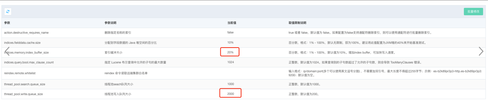
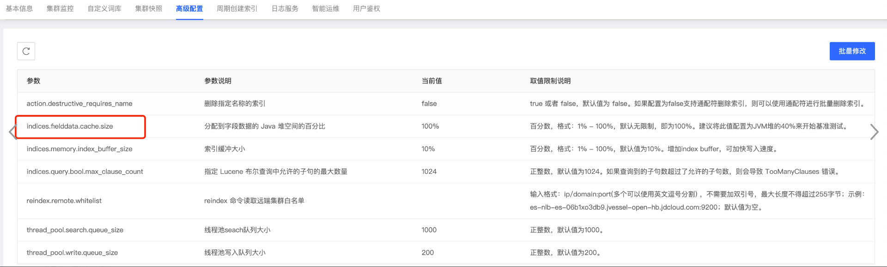
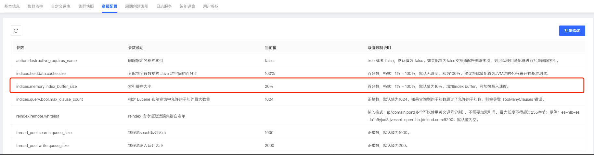

以下集群性能优化方案为参考方案，需根据集群具体情况具体分析：

## 写性能优化：

### **1、公有云 es 增加专有 master 节点和 client 节点**

- es 节点应该角色划分，各司其责，线上集群设置专有 master 节点和 coordinate 节点，集群稳定性、安全性和读写性能均会有大大提升
- 问题一：云 es 集群增加专有 master 节点（默认 3 个），需要重启集群，期间集群不可用（一般持续时间几分钟，若集群数据量较大，持续时间会更长），若业务侧可先停止读、写流量，恢复速度会加快。
- 问题二：云 es 集群增加专有 coordinate 节点（建议最少 3 个），集群访问入口节点会由 data 节点变为 coordinate 节点，原 data 节点会禁止访问（业务侧不要开启 sniff 嗅探 功能），若业务侧使用 tcp 协议访问集群，业务侧需要变更集群访问节点 tcp 域名配置。若业务侧使用 http 协议访问集群，使用 LB 域名，则业务侧不需变更配置，但在 LB 域名更换绑定 ip 时，可能会有秒级网络抖动。

### **2、公有云 es 高级配置调优示例**

- 修改集群高级配置，需要重启集群，支持滚动重启和强制重启两种方式：
  - 集群滚动重启时，要求集群中的索引至少都有1副本，若索引为0副本，在重启过程中，该索引会red，不可用！！！
  - 集群滚动重启时，一个节点重启后，等待集群恢复成健康状态 green，再重启下一个节点，重启时间较长，与数据量的大小相关
  - 集群滚动重启过程中，若希望可以加快集群恢复速度，可参考：[加快索引recovery速度](./es_recovery_youhua.md)
  - 集群强制重启时，是所有节点同时进行重启，重启过程集群会不可用，请谨慎评估！！！



### **3、indices.fielddata.cache.size 优化**

官方参考文档（ clear cache ）：https://www.elastic.co/guide/en/elasticsearch/reference/6.8/indices-clearcache.html

官方参考文档（ _id field ）：https://www.elastic.co/guide/en/elasticsearch/reference/current/mapping-id-field.html

官方参考文档（ fielddata ）：https://www.elastic.co/guide/en/elasticsearch/reference/6.8/fielddata.html

```
# 查看 fielddata 缓存占用
GET _cat/fielddata?v
 
# 手动清除 fielddata 缓存
POST /test/_cache/clear?fielddata=true
POST /*/_cache/clear?fielddata=true
```

fielddata 缓存大小是由 indices.fielddata.cache.size，该参数默认值为 100%，即 fielddata 缓存最大能将可使用的 jvm heap 内存大小打满，京东云控制台上提供了高级配置接口，来修改这个参数：



建议将该参数的值设置为 10%，修改该参数，需要滚动重启es集群，请注意。

### **4、indices.memory.index_buffer_size 优化**

- 过多的 segment 文件会导致频繁的 merge 操作，merge 操作会占用大量的 cpu、io 资源

- 调大 index buffer，默认为 jvm heap 大小的 10%，调大该值，线上集群建议设置为20%，可提升集群写入性能。
- 注意：调整该参数，需要滚动重启集群后，才可生效

 配置示例：

```
# elasticsearch.yml静态配置参数，需重启节点以生效
indices.memory.index_buffer_size: 20%
```

公有云es 高级配置修改：



### **5、thread_pool.write.queue_size 优化**

es集群7.x之前版本，write queue 默认值为 200，当集群节点整体cpu使用率并未打满，但出现write reject 时，可通过调大write queue 值来进行优化集群的写入性能。


### **6、公有云 es 提升硬件配置**

- 公有云 es 节点变更配置：[公有云ES变更配置常见问题](https://cf.jd.com/pages/viewpage.action?pageId=415590779#id-用户常见使用问题-用户常见使用问题-26.集群变配问题)
- 提升内存配置，给更多的 filesystem cache 内存
- 提升 cpu 配置，cpu 核数越多，机器性能越好
- 若读、写流量比较大，建议使用本地盘存储，云盘存储 io 带宽有限制

### **7、定时清理过期索引、数据，减轻集群压力**

- 集群中过多的索引数、过多的分片数、过多的数据量，会占用节点较多 jvm heap 资源（segment memory），增大 master 节点压力，降低集群整体性能
- 建议定时清理过期索引、数据

### **8、调大 refresh_interval 的值（牺牲实时性）**

- 过多的 segment 文件会导致频繁的 merge 操作，merge 操作会占用大量的 cpu、io 资源
- 索引级别设置 refresh_interval，默认为 1s，可以调大该参数，比如 30s，这样可以减少生成的 segment 文件数量，提升写入性能，当然对查询性能提升也有帮助
- 注意：调大 refresh_interval 值，会牺牲查询的实时性，refresh_interval 值默认为 1s，意味着数据写入1s后即可查询到，假如调大到 30s，写入30s后才可查询到。适用于对查询实时性要求不高的场景

 配置示例：

```
# 索引模板中配置refresh_interval
PUT _template/test-template
{
   "order" : 0,
    "index_patterns" : [
      "test*"
    ],
    "settings" : {
      "index" : {
        "refresh_interval" : "30s"
      }
    },
    "mappings" : { },
    "aliases" : { }
}
 
# 索引中配置refresh_interval，默认是1s
PUT 索引名称/_settings
{
  "index.refresh_interval": "30s"
}
```


### **9、优化 translog，降低写磁盘的频率（牺牲可靠性）**

对 translog 文件刷盘的优化，主要涉及到如下三个配置：

- index.translog.durability

为了保证数据写入的可靠性，该值的默认参数值为 request，即，每一次 bulk、index、delete 请求都会执行 translog 的刷盘，会较大地影响整体入库性能。如果在对入库性能要求较高的场景，并且系统可以接受一定几率的数据丢失，可以将该参数设置成 “async” 方式，并适当增加 translog 的刷盘周期。

```
index.translog.durability: async
```

- index.translog.sync_interval

将刷盘方式改成“async”后，es 默认每5秒执行一次translog文件的刷盘，这样会减少频繁的translog刷盘操作，提升集群的写入性能。同时存在数据丢失的风险，极端情况下会丢失5s内的数据。若追求数据写入性能，而允许部分数据的丢失，可以适当调大该值。

```
# 注意：当索引处于open状态时，该配置有些es版本不支持动态设置 index.translog.sync_interval: 60s
```

- index.translog.flush_threshod_size

触发es节点flush操作的条件有两个，每隔30分钟会自动执行flush操作或者当translog文件大小超过512mb后，会触发flush操作，为减少flush操作频率以提升写入性能，可通过index.translog.flush_threshod_size参数适当调大translog文件的限制大小。

```
index.translog.flush_threshod_size: 512mb
```

配置示例：

```
PUT 索引名称/_settings
{
    "index.translog.durability": "async",
    "index.translog.sync_interval": "5s",
    "index.translog.flush_threshod_size": "512mb"
}
 
 
# 设置索引模板
PUT _template/索引模板名称
{
    "order" : 0,
    "index_patterns" : [
      "*"
    ],
    "settings" : {
      "index" : {
        "refresh_interval": "1m",
        "translog.durability": "async",
        "translog.sync_interval": "10s",
        "translog.flush_threshold_size": "1g"
      }
    },
   "mappings" : {}
}
```


### **10、均衡分片、避免热点**

- 现象：集群中各节点压力不均衡，比如部分节点磁盘使用率很高、cpu使用率很高，这一般与集群中数据的分布不均匀有关，部分节点压力过大，导致集群整体性能变差。
- 原因：es集群采用点对点通信，符合”木桶理论“，一个节点出现性能问题，往往会影响到整个集群的性能。很多情况下出现节点数据不均衡或者个别节点cpu过高的情况，会导致热点问题的产生。
- 热点判断：
  - 1、理论上，如果es节点热点数据分布比较均衡，对应的各节点的压力也应该比较均衡，当出现各节点压力不均衡时，首先应该考虑到是否有热点数据分布不均导致
  - 2、查看索引分片设置（GET _cat/indices/索引名称?v），若索引分片数不为集群data节点数的倍数，则会导致索引分片无法均匀分布到每个节点上
  - 3、查看索引分片数据量、分片数是否一致（GET *cat/shards/索引名称?v），*理论上同一索引各分片的数据量、文档数应该一致或差别不大，若同一索引各分片数据量、文档数相差较大，多为业务写入数据时指定了路由规则导致（需业务侧确认）
  - 4、查看索引主分片分布是否均匀，es写入是往主分片中写的，然后再同步数据到副本分片，若索引主分片分布不均匀，会导致热点问题

- 优化：

  - 合理设置主分片数，确保单个索引的分片可以均匀分配在所有数据节点上。线上集群一般建议索引数较大的索引**主分片数量设置成data节点数量或者data节点数量的倍数**

  - 当集群发生重启，或者扩容时，很容易导致原来均匀分布的索引变得不均匀。index.routing.allocation.total_share_per_node：限定每个索引在每个节点上可分配的主分片数。

    ```
    # 假如 5个节点的集群。索引有 5个主分片，1个副本，应该如何设置 index.routing.allocation.total_share_per_node 的值，以强制让数据分布均匀？理论值：（5+5）/5 = 2
    # 情况1：假如只是临时设置该参数，强制均衡一下分片，可按理论值设置，索引分片强制均衡完成后，再重新取消该限制
    # 情况2：假如想将该参数设置到索引模板中，对索引一直持续生效，生产环境中建议要适当调大这个数字，避免有节点下线时，分片无法正常迁移
     
    PUT 索引名称/_settings
    {
      "index" : {
            "routing" : {
              "allocation" : {
                "total_shards_per_node" : 2
              }
            }
      }
    }
    ```

    

- 避免使用自定义路由
  - 如果使用自定义路由，可能会导致同一索引每个分片之间的数据量差异较大。es默认路由字段为 _id

### **11、write reject 问题优化**

- 集群整体cpu使用率均非常高，导致 write reject，计算资源已经到达瓶颈，可扩容集群解决
- 集群只有部分节点cpu使用率非常高，导致 write reject，首先排查 **9、均衡分片、避免热点**
- 集群整体cpu使用率并不高，确存在较多 write reject，可考虑调大write queue，默认为 200
- 参照前面几条优化方案，提升集群整体性能

### 12、频繁gc问题优化

默认young 区较小，若集群节点young gc频繁，或产生 old gc，建议优化：

- 1、索引配置慢日志，根据捕获到的慢日志信息，优化业务请求
- 2、更换jvm 垃圾回收器，建议可更换为g1


## 读性能优化：

### **1、优化写入性能**

同一集群的读、写是共用资源的，优化写入性能的方法同样适用于优化读性能，彼此互相影响，相辅相成。

### **2、优化分片**

- 避免 Over Sharing

  - 一个查询需要访问每一个分片，分片过多，会导致不必要的查询开销

- 结合应用场景，控制单个分片的尺寸

  - Search: 20GB
  - Logging: 40GB

- Force-merge Read-only索引

- - 使用基于时间序列的索引，将只读的索引进行 force merge，减少 segment 数量

### **3、增加协调节点数量**

### **4、减少集群中的索引数量和分片数量**

### **5、search reject 问题优化**

- 搜索线程池显示“拒绝”计数的持续增加，该计数基于上次集群重启而累积


```
GET /_cat/thread_pool?v
GET _cat/thread_pool/search?v&&h=node_name,name,active,queue,rejected,completed
```

- 问题描述

- - 场景1：查询的目标是太多分片，超过集群中的CPU核数。这会在搜索线程池中创建排队任务，从而导致搜索拒绝。（假如一个索引有100个分片，极端情况这100个分片都在一个node上，当有查询请求打过来时，节点会分别向着100个分片发送100个请求来进行搜索，100个请求就需要100个线程来处理，如果cpu核数只有20，则一次只能处理20个请求，那么就会造成任务的堆积。）
  - 场景2：磁盘 I/O 读写速度慢
  - 场景3：cpu 繁忙导致搜索排队（写入占用大量 cpu 资源）
  - 场景4：search_queue 较小，将search_queue适当调大，就算cpu处理不过来，也不会reject，而是在 search queue中进行排队
  - 场景5：查询语句复杂，需要大量计算资源，单次查询比较耗时
- 解决方案
  - 减少索引分片数，创建索引时（索引数据量不大）设置1主1副（7.x版本后默认1主1副）
  - 改进磁盘I/O性能，使用SSD磁盘，做raid
  - 提升cpu配置，或者扩容以分摊压力
  - cpu使用率尚未达到瓶颈，可调大search_queue，`thread_pool.search.queue_size: 1000`
  - 优化查询语句，避免复杂大查询

### **6、增加 replica 副本数量（特殊情况下）**

- 资源充足情况下可考虑（cpu，memory，disk，带宽等资源有较大空闲）
- 对安全性要求特别高时可考虑多副本
- 增加 replica 副本数量，会降低写入性能

### **7、集群侧限制业务大查询**

### **8、提升硬件配置**

- 更多 cpu 核数
- 更大 file cache 内存
- 更高配置硬盘，固态硬盘（SSD）性能比机械硬盘（HDD）更好，硬盘做raid，raid 0，raid 5，raid 10，提升磁盘读写性能

### **9、避免使用 script 脚本**

- 尽量将数据先行计算，然后保存到 Elasticsearch 中，尽量避免查询时的 Script 计算

### **10、避免使用通配符开始的正则表达**

- 通配符开头的正则，性能非常糟糕，需避免使用

示例：

```
GET test/_search
{
    "query": {
        "wildcard": {
            "title": {
                "value": "*elastic*"
            }
        }
    }
}
```

### **11、避免复杂的聚合查询**

### **12、避免过深的分页查询**

### **13、避免使用 Nested 类型的数据，避免使用 Parent/Child 关系**

- 使用 Nested 类型的数据，查询速度会慢几倍
- 使用 Parent/Child 关系，查询速度会慢几百倍