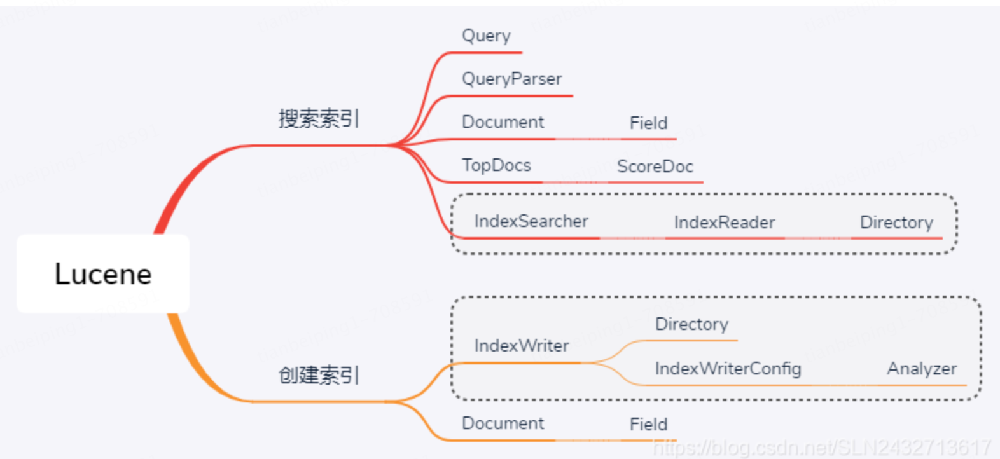

# 官方网站

https://lucene.apache.org/core/index.html

博客参考： https://blog.csdn.net/u013573133/article/details/48246351

```xml
<dependency>
  <groupId>org.apache.lucene</groupId>
  <artifactId>lucene-core</artifactId>
  <version>9.10.0</version>
</dependency>
<dependency>
  <groupId>org.apache.lucene</groupId>
  <artifactId>lucene-queryparser</artifactId>
  <version>9.10.0</version>
</dependency>
```

## IndexWriter

IndexWriter提供了一些参数可供设置，列表如下：

（1）.mergeFactory: 控制index的大小和频率，默认值：10，两个作用：1.一个段有多少document，2.多少个段合成一个大段

（2）.maxMergeDocs：限制一个段中的document数目，默认值：Integer.MAX_VALUE

（3）.minMergeDocs：缓存在内存中的document数目，超过他以后会写入到磁盘，默认值：10

（4）.maxFieldLength：一个Field中最大Term数目，超过部分忽略，不会index到field中，所以自然也就搜索不到，默认值：1000

这些参数的的详细说明比较复杂：mergeFactor有双重作用

(1)设置每mergeFactor个document写入一个段，比如每10个document写入一个段

(2)设置每mergeFacotr个小段合并到一个大段，比如10个document的时候合并为1小段，以后有10个小段以后合并到一个大段，有10个大段以后再合并，实际的document数目会是mergeFactor的指数

简单的来说mergeFactor 越大，系统会用更多的内存，更少磁盘处理，如果要打批量的作index，那么把mergeFactor设置大没错， mergeFactor 小了以后， index数目也会增多，searhing的效率会降低，但是mergeFactor增大一点一点，内存消耗会增大很多(指数关系),所以要留意不要”out of memory”

把maxMergeDocs设置小，可以强制让达到一定数量的document写为一个段，这样可以抵消部分mergeFactor的作用.

minMergeDocs相当于设置一个小的cache,第一个这个数目的document会留在内存里面，不写入磁盘。这些参数同样是没有最佳值的，必须根据实际情况一点点调整。

maxFieldLength可以在任何时刻设置，设置后，接下来的index的Field会按照新的length截取，之前已经index的部分不会改变。可以设置为Integer.MAX_VALUE

## Document

### Field

- [`TextField`](https://lucene.apache.org/core/9_10_0/core/org/apache/lucene/document/TextField.html): [`Reader`](https://docs.oracle.com/en/java/javase/11/docs/api/java.base/java/io/Reader.html?is-external=true) or [`String`](https://docs.oracle.com/en/java/javase/11/docs/api/java.base/java/lang/String.html?is-external=true) indexed for full-text search
- [`StringField`](https://lucene.apache.org/core/9_10_0/core/org/apache/lucene/document/StringField.html): [`String`](https://docs.oracle.com/en/java/javase/11/docs/api/java.base/java/lang/String.html?is-external=true) indexed verbatim as a single token
- [`IntField`](https://lucene.apache.org/core/9_10_0/core/org/apache/lucene/document/IntField.html): `int` indexed for exact/range queries.
- [`LongField`](https://lucene.apache.org/core/9_10_0/core/org/apache/lucene/document/LongField.html): `long` indexed for exact/range queries.
- [`FloatField`](https://lucene.apache.org/core/9_10_0/core/org/apache/lucene/document/FloatField.html): `float` indexed for exact/range queries.
- [`DoubleField`](https://lucene.apache.org/core/9_10_0/core/org/apache/lucene/document/DoubleField.html): `double` indexed for exact/range queries.
- [`SortedDocValuesField`](https://lucene.apache.org/core/9_10_0/core/org/apache/lucene/document/SortedDocValuesField.html): `byte[]` indexed column-wise for sorting/faceting
- [`SortedSetDocValuesField`](https://lucene.apache.org/core/9_10_0/core/org/apache/lucene/document/SortedSetDocValuesField.html): `SortedSet<byte[]>` indexed column-wise for sorting/faceting
- [`NumericDocValuesField`](https://lucene.apache.org/core/9_10_0/core/org/apache/lucene/document/NumericDocValuesField.html): `long` indexed column-wise for sorting/faceting
- [`SortedNumericDocValuesField`](https://lucene.apache.org/core/9_10_0/core/org/apache/lucene/document/SortedNumericDocValuesField.html): `SortedSet<long>` indexed column-wise for sorting/faceting
- [`StoredField`](https://lucene.apache.org/core/9_10_0/core/org/apache/lucene/document/StoredField.html): Stored-only value for retrieving in summary results

### Store

no：Do not store the field value in the index

yes：Do not store the field value in the index

## Query

```java
 TermQuery tq = new TermQuery(new Term("fieldName", "term"));
```

- [`TermQuery`](https://lucene.apache.org/core/9_10_0/core/org/apache/lucene/search/TermQuery.html)
- [`BooleanQuery`](https://lucene.apache.org/core/9_10_0/core/org/apache/lucene/search/BooleanQuery.html)
  - MUST - BooleanClause.Occur.MUST
  - MUST_NOT - BooleanClause.Occur.MUST_NOT
  - SHOULD - BooleanClause.Occur.SHOULD    (BooleanQuery.Builder setMinimumNumberShouldMatch)
  - FILTER - BooleanClause.Occur.FILTER
- [`WildcardQuery`](https://lucene.apache.org/core/9_10_0/core/org/apache/lucene/search/WildcardQuery.html)
- [`PhraseQuery`](https://lucene.apache.org/core/9_10_0/core/org/apache/lucene/search/PhraseQuery.html)
- [`PrefixQuery`](https://lucene.apache.org/core/9_10_0/core/org/apache/lucene/search/PrefixQuery.html)
- [`MultiPhraseQuery`](https://lucene.apache.org/core/9_10_0/core/org/apache/lucene/search/MultiPhraseQuery.html)
-  [`WildcardQuery`](https://lucene.apache.org/core/9_10_0/core/org/apache/lucene/search/WildcardQuery.html)
- [`FuzzyQuery`](https://lucene.apache.org/core/9_10_0/core/org/apache/lucene/search/FuzzyQuery.html)
- [`RegexpQuery`](https://lucene.apache.org/core/9_10_0/core/org/apache/lucene/search/RegexpQuery.html)
- [`TermRangeQuery`](https://lucene.apache.org/core/9_10_0/core/org/apache/lucene/search/TermRangeQuery.html)
- [`PointRangeQuery`](https://lucene.apache.org/core/9_10_0/core/org/apache/lucene/search/PointRangeQuery.html)
- [`ConstantScoreQuery`](https://lucene.apache.org/core/9_10_0/core/org/apache/lucene/search/ConstantScoreQuery.html)
- [`DisjunctionMaxQuery`](https://lucene.apache.org/core/9_10_0/core/org/apache/lucene/search/DisjunctionMaxQuery.html)
- [`MatchAllDocsQuery`](https://lucene.apache.org/core/9_10_0/core/org/apache/lucene/search/MatchAllDocsQuery.html)

```java
Query originalQuery = new BooleanQuery.Builder()
                .add(new TermQuery(new Term("body", "apache")), BooleanClause.Occur.SHOULD)
                .add(new TermQuery(new Term("name", "lucene")), BooleanClause.Occur.SHOULD)
                .setMinimumNumberShouldMatch(1)
                .build();
Query reqQuery = new BooleanQuery.Builder()
  .add(new TermQuery(new Term("age", "12")),BooleanClause.Occur.MUST).build();
	.add(originalQuery,BooleanClause.Occur.MUST).build();
```

es 查询Json 样式如下：

```json
{
  "bool": {
    "must": [
      {"term":{"agen":12}},
      {
        "bool": {
          "should": [
            {"term": {"body": "apache"}},
            {"term": {"name": "lucene"}}
          ]
        },
        "minimumNumberShould": 1
      }
    ]
  }
}
```

### sort

```java
// true:降序 false:升序
// SortField类型: SCORE、DOC、AUTO、STRING、INT、FLOAT、CUSTOM
Sort sort = new Sort(new SortField[]{
  new SortField("id", SortField.INT, true),
  new SortField("createTime", SortField.INT, false)
});
//
Hits hits = searcher.search(query,sort);
```

Lucene 两个基本的功能即 创建索引 和 搜索索引。主要类如下图：



使用案例如下，参考地址：https://lucene.apache.org/core/9_10_0/core/index.html

```java
// 插入
// 分词
Analyzer analyzer = new StandardAnalyzer();
Path indexPath = Files.createTempDirectory("tempIndex"); // 目录，文件存储位置
Directory directory = FSDirectory.open(indexPath);

// 存储在缓存中
StandardAnalyzer analyzer = new StandardAnalyzer();
Directory index = new ByteBuffersDirectory();

// 索引
IndexWriterConfig config = new IndexWriterConfig(analyzer);
IndexWriter iwriter = new IndexWriter(directory, config);
// 创建文档
Document doc = new Document();
String text = "This is the text to be indexed.";
// 添加字段
doc.add(new Field("fieldname", text, TextField.TYPE_STORED));
iwriter.addDocument(doc);
iwriter.close();

// 查询
DirectoryReader ireader = DirectoryReader.open(directory);
IndexSearcher isearcher = new IndexSearcher(ireader);
// Parse a simple query that searches for "text":
// 搜索字段选择
QueryParser parser = new QueryParser("fieldname", analyzer);
// 搜索字段内容输入
Query query = parser.parse("text");
// 执行查询
ScoreDoc[] hits = isearcher.search(query, 10).scoreDocs;
// 返回结果判断
assertEquals(1, hits.length);
// Iterate through the results:
// 返回对应结构，迭代查询
StoredFields storedFields = isearcher.storedFields();
for (int i = 0; i < hits.length; i++) {
  // 获取对应的文档
	Document hitDoc = storedFields.document(hits[i].doc);
  // 文档对应的值
	assertEquals("This is the text to be indexed.", hitDoc.get("fieldname"));
}
ireader.close();
directory.close();
IOUtils.rm(indexPath);
```

