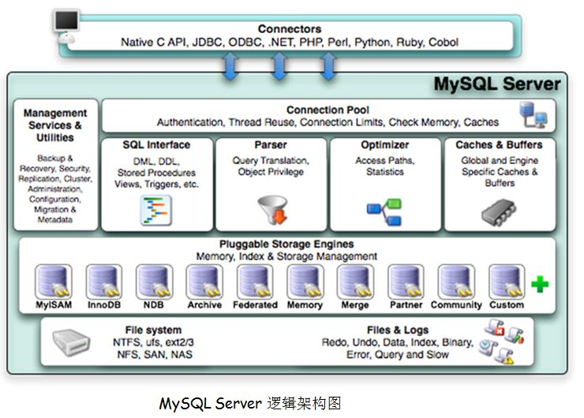

##

### 并发控制和锁的概念
```
解决并发问题最有效的方案是引入了锁的机制，锁在功能上分为共享锁(shared lock)和排它锁(exclusive lock)即通常说的读锁和写锁。

当一个select语句在执行时可以施加读锁，这样就可以允许其它的select操作进行，因为在这个过程中数据信息是不会被改变的这样就能够提高数据库的运行效率。当需要对数据更新时，就需要施加写锁了，不在允许其它的操作进行，以免产生数据的脏读和幻读。锁同样有粒度大小，有表级锁(table lock)和行级锁(row lock)，分别在数据操作的过程中完成行的锁定和表的锁定

```
 默认MySQL中自动提交是开启的
```
    show variables like 'autocommit'

    事务（ACID）特性

    原子性(atomicity):事务中的所有操作要么全部提交成功，要么全部失败回滚。

    一致性(consistency):数据库总是从一个一致性状态转换到另一个一致性状态。

    隔离性(isolation):一个事务所做的修改在提交之前对其它事务是不可见的。

    持久性(durability):一旦事务提交，其所做的修改便会永久保存在数据库中。


    事务隔离级别：

    READ UNCOMMITTED(读未提交)：事务中的修改即使未提交也是对其它事务可见

    READ COMMITTED(读提交)：事务提交后所做的修改才会被另一个事务看见，可能产生一个事务中两次查询的结果不同。

    REPEATABLE READ(可重读)：只有当前事务提交才能看见另一个事务的修改结果。解决了一个事务中两次查询的结果不同的问题。

    SERIALIZABLE(串行化)：只有一个事务提交之后才会执行另一个事务

    查询事务隔离级别：

    show variables like 'tx_isolation'

    临时修改隔离级别：

    set tx_isolation ='REDA-COMMITTED'

    start transaction;
    select .....
    update .....
    insert .....
    commit;

```

MYSQL 存储引擎

```
    show table status like 'user'\G

```

存储引擎的介绍：

```

InnoDB 引擎：
    1、讲数据存储在表空间中，表空间由一系列的数据文件组成，由InnoDB 管理
    2、支持每个表的数据和索引存在单独的文件中(innodb_file_per_table)
    3、支持事务,采用mvcc来控制并发，并实现的4个事务隔离级别，支持外键
    4、索引基于聚簇索引建立，对于主键查询有较高性能
    5、数据文件的平台无关性，支持数据在不同的架构平台移植
    6、能够过一些工具支持正真的热备。如XtraBackup等
    7、内部进行自身优化如采取可预测性预读，能够自动在内存中创建hash索引等。

MyISAM引擎：
    1.MySQL5.1中默认，不支持事务和行级锁；
    2.提供大量特性如全文索引、空间函数、压缩、延迟更新等；
    3.数据库故障后，安全恢复性差；
    4.对于只读数据可以忍受故障恢复，MyISAM依然非常适用；
    5.日志服务器的场景也比较适用，只需插入和数据读取操作；
    6.不支持单表一个文件，会将所有的数据和索引内容分别存在两个文件中；
    7.MyISAM对整张表加锁而不是对行，所以不适用写操作比较多的场景；
    8.支持索引缓存不支持数据缓存。

```
修改引擎方法  alter table ss engine = InnoDB

EXPLAIN 解析 执行的SQL ：

    explain select * from news
查看数据库基本信息

    show variables like '%version%';
日志设置：

    show variables like '%general%';
日志设置 文件样式：

    show variables like '%log_output%';  ##【table or file】
设置环境系统
```
查询 show variables  like '%slow_query%'
开启 set global slow_query_log=1

开启通用日志查询： set global general_log=on;

关闭通用日志查询： set globalgeneral_log=off;

设置通用日志输出为表方式： set globallog_output=’TABLE’;

设置通用日志输出为文件方式： set globallog_output=’FILE’;

设置通用日志输出为表和文件方式：set global log_output=’FILE,TABLE’;
```
#### 注意：上述命令只对当前生效，当MySQL重启失效，如果要永久生效，需要配置my.cnf）

select * from mysql.general_log  [慢日志查询]

是否开启慢查询：show variables like '%query%';

查询当前慢查询的语句的个数: show global status like '%slow%';

补充：
```
    perlmysqldumpslow –s c –t 10 slow-query.log

    -s 表示按何种方式排序，c、t、l、r分别是按照记录次数、时间、查询时间、返回的记录数来排序，ac、at、al、ar，表示相应的倒叙；

    -t 表示top的意思，后面跟着的数据表示返回前面多少条；

    -g 后面可以写正则表达式匹配，大小写不敏感

```


