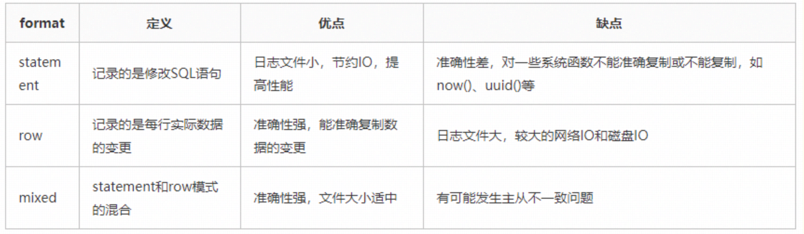
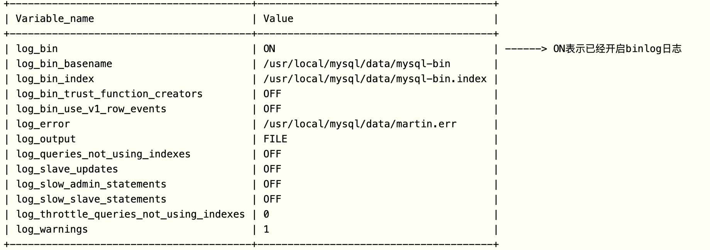
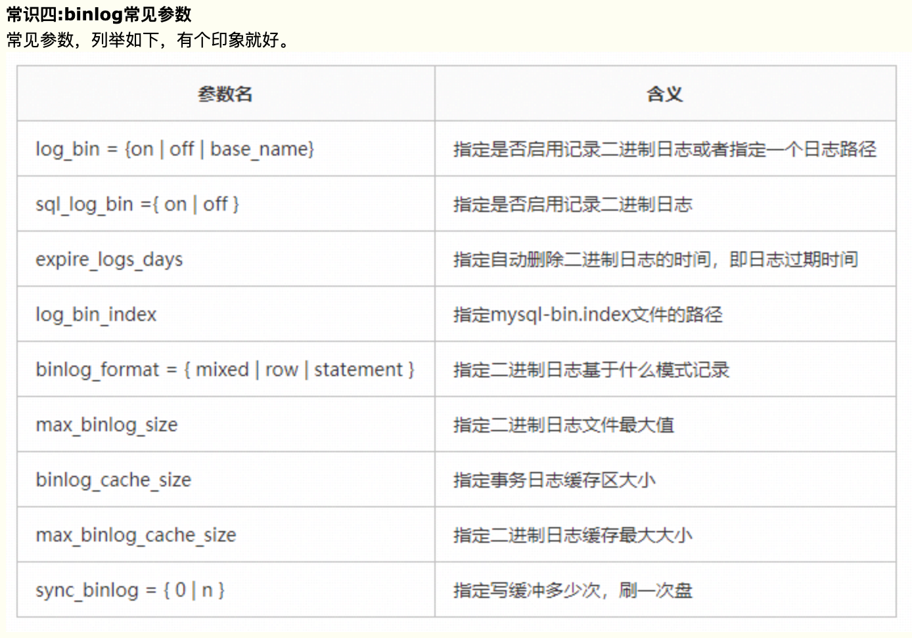

# mysql查看binlog日志



> 业内目前推荐使用的是`row`模式，准确性高，虽然说文件大，但是现在有SSD和万兆光纤网络，这些磁盘IO和网络IO都是可以接受的。

## 开启binlog

在[mysqld] 区块设置/添加 log-bin=mysql-bin 确认是打开状态(值 mysql-bin 是日志的基本名或前缀名)

```shell
# 可以看到mysql优先加载/etc/my.cnf中的配置
/etc/my.cnf /etc/mysql/my.cnf /usr/etc/my.cnf ~/.my.cnf

#=============================================================================================
# mysqld节添加开启binlog的配置文件如下:
#=============================================================================================
#第一种方式:
#开启binlog日志
log_bin=ON
#binlog日志的基本文件名
log_bin_basename=/var/lib/mysql/mysql-bin
#binlog文件的索引文件，管理所有binlog文件
log_bin_index=/var/lib/mysql/mysql-bin.index
#配置serverid
server-id=1

#第二种方式:
#此一行等同于上面log_bin三行
log-bin=/var/lib/mysql/mysql-bin
#配置serverid
server-id=1

#=============================================================================================
# MySQL配置文件my.cnf文件中的mysqld节的配置：
#=============================================================================================
[mysqld]
#设置日志三种格式：STATEMENT、ROW、MIXED 。
binlog_format = mixed
#设置日志路径，注意路经需要mysql用户有权限写
log-bin = /data/mysql/logs/mysql-bin.log
#设置binlog清理时间
expire_logs_days = 7
#binlog每个日志文件大小
max_binlog_size = 100m
#binlog缓存大小
binlog_cache_size = 4m
#最大binlog缓存大小
max_binlog_cache_size = 512m
```

### 查看配置变量

> show variables like 'log_%'; 







## mysql查看binlog

```shell
mysql> show binlog events;  #只查看第一个binlog文件的内容
mysql> show binlog events ``in` `'mysql-bin.000002'``;#查看指定binlog文件的内容
mysql> show binary logs; #获取binlog文件列表
mysql> show master status； #查看当前正在写入的binlog文件

# 处理   如果是row格式，加上-v或者-vv参数就行
mysqlbinlog -vv mysql-bin.000001
```

### 搜索查看，解析出sql文件中

工具默认的安装路径为：/usr/local/mysql/bin/mysqlbinlog

> ```sh
> /usr/local/mysql/bin/mysqlbinlog --start-datetime=``"2013-03-01 00:00:00"` `--stop-datetime=``"2014-03-21 23:59:59"` `/usr/local/mysql/``var``/mysql-bin.000007 -r test2.sql
> 
> ```

## 删binlog

1. 使用`reset master`,该命令将会删除所有日志，并让日志文件重新从000001开始
2. `purge master logs to "binlog_name.00000X" ` 指定删除日志文件
3. 使用`--expire_logs_days=N`选项指定过了多少天日志自动过期清空

# python读取

https://github.com/julien-duponchelle/python-mysql-replication

> pip install mysql-replication

官方文档：https://python-mysql-replication.readthedocs.io/en/latest/index.html

```python
# -*- coding: utf-8 -*-
import datetime
import json

from pymysqlreplication import BinLogStreamReader
from pymysqlreplication.row_event import (
    DeleteRowsEvent,
    UpdateRowsEvent,
    WriteRowsEvent,
  # TableMapEvent
)

class DateEncoder(json.JSONEncoder):
    """
    自定义类，解决报错：
    TypeError: Object of type 'datetime' is not JSON serializable
    """
    def default(self, obj):
        if isinstance(obj, datetime.datetime):
            return obj.strftime('%Y-%m-%d %H:%M:%S')
        elif isinstance(obj, datetime.date):
            return obj.strftime("%Y-%m-%d")
        else:
            return json.JSONEncoder.default(self, obj)

# 配置数据库信息
mysql_settings = {
    'host': '127.0.0.1',
    'port': 3306,
    'user': 'root',
    'passwd': '123456'
}
def main():
    # 实例化binlog 流对象
    stream = BinLogStreamReader(
        connection_settings=mysql_settings,
        server_id=100,  # slave标识，唯一
        blocking=True,  # 阻塞等待后续事件
        # 设定只监控写操作：增、删、改
        only_events=[
            DeleteRowsEvent,
            UpdateRowsEvent,
            WriteRowsEvent
        ]
    )

    for binlogevent in stream:
        # binlogevent.dump()  # 打印所有信息
        for row in binlogevent.rows:
            # 打印 库名 和 表名
            event = {"schema": binlogevent.schema, "table": binlogevent.table}
            if isinstance(binlogevent, DeleteRowsEvent):
                event["action"] = "delete"
                event["data"] = row["values"]

            elif isinstance(binlogevent, UpdateRowsEvent):
                event["action"] = "update"
                event["data"] = row["after_values"]  # 注意这里不是values

            elif isinstance(binlogevent, WriteRowsEvent):
                event["action"] = "insert"
                event["data"] = row["values"]

            print(json.dumps(event, cls=DateEncoder))
            # sys.stdout.flush()

    # stream.close()  # 如果使用阻塞模式，这行多余了


if __name__ == '__main__':
    main()
"""
输出数据格式
{
    "schema": "demo",    # 数据库名
    "table": "student",  # 表名
    "action": "update",  # 动作 insert、delete、update
    "data": {            # 数据，里边包含所有字段
        "id": 26, 
        "name": "haha", 
        "age": 34, 
        "update_time": "2019-06-06 16:59:06", 
        "display": 0
    }
}
"""
```

