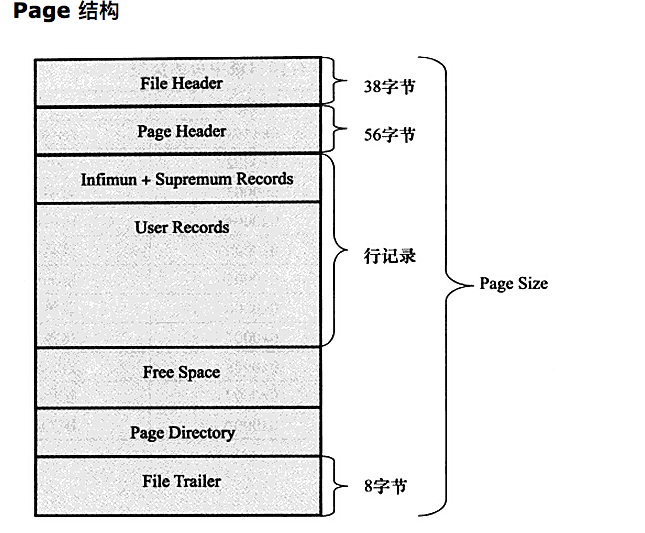

## Mysql 数据页

#### 介绍

>  页（Page）是 Innodb 存储引擎用于管理数据的最小磁盘单位。
>
> 常见的页类型有数据页、Undo 页、系统页、事务数据页等，本文主要分析的是数据页。
>
> 默认的页大小为 16KB，每个页中至少存储有 2 条或以上的行记录，
>
> 本文主要分析的是页与行记录的数据结构，有关索引和 B-tree 的部分在后续文章中介绍。


#### 如图参考：





> 上图为 Page 数据结构

```
1、 File Header 字段用于记录 Page 的头信息，
其中比较重要的是 FIL_PAGE_PREV 和 FIL_PAGE_NEXT 字段，通过这两个字段，我们可以找到该页的上一页和下一页，实际上所有页通过两个字段可以形成一条双向链表。
Page Header 字段用于记录 Page 的状态信息。
2、接下来的 Infimum 和 Supremum 是两个伪行记录:
	Infimum（下确界）记录比该页中任何主键值都要小的值，
	Supremum （上确界）记录比该页中任何主键值都要大的值，这个伪记录分别构成了页中记录的边界。
3、User Records 中存放的是实际的数据行记录
4、Free Space 中存放的是空闲空间，被删除的行记录会被记录成空闲空间。
5、Page Directory 记录着与二叉查找相关的信息。
6、File Trailer 存储用于检测数据完整性的校验和等数据。

File Header [38字节]
Page Header [56字节]
Infimum+Supremum [26字节]
File Trailer[8字节]
其他都都不确定
```

#### Innodb 存储引擎提供了两种格式的行记录：Compact 和 Redundant


```
1、变长字段长度列表：逆序记录每一个列的长度，如果列的长度小于 255 字节，则使用一个字节，否则使用 2 个字节。该字段的实际长度取决于列数和每一列的长度，因此是变长的。
2、NULL 标志位：一个字节，表示该行是否有 NULL 值（此处有疑问，8位，最多只能表示 8 列？）
3、记录头信息：五个字节，其中 next_record 记录了下一条记录的相对位置，一个页中的所有记录使用这个字段形成了一条单链表。
3、列数据部分：除了记录每一列对应的数据外，还有隐藏列，它们分别是 Transaction ID、Roll Pointer 以及 row_id（当没有指定主键）。

```

**注意**：此处需要注意固定长度 CHAR 数据类型和变长 VCHAR 数据类型在 Compact 记录下为 NULL 时不占用任何存储空间。


```
字段长度偏移列表：与 Compact 中的变长字段长度列表相同的是它们都是按照列的逆序顺序设置值的，不同的是字段长度偏移列表记录的是偏移量，每一次都需要加上上一次的偏移，同时对于 CHAR 的 NULL 值，会直接按照最大空间记录，而对于 VCHAR 的 NULL 值不占用任何存储空间。
```

**注意**：此处需要注意 VCHAR 类型和 CHAR 类型在建表时传入的参数是字符长度而不是字节长度，实际的字节长度需要跟编码方式相关联，例如 UTF-8 一个中文字符需要 3 字节来表示，这样 CHAR(10) 以 UTF-8 来表示的话，它的字节长度在 10 - 30 之间。


#### 行溢出

我们知道数据页的大小是 16KB，Innodb 存储引擎保证了每一页至少有两条记录，如果一页当中的记录过大，会截取前 768 个字节存入页中，其余的放入 BLOB Page。