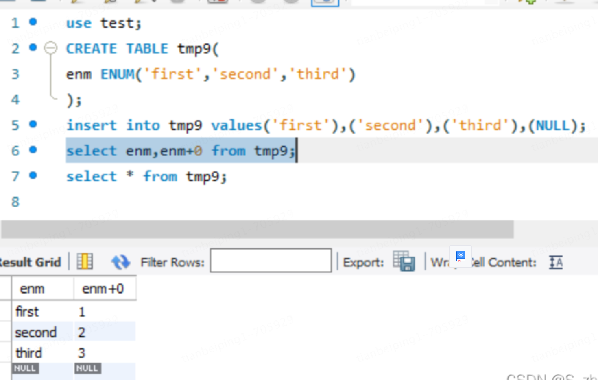

# 1、数据库操作

```sql
-- 查看数据库执行所有编码
show charset;

-- 查看所有字符管理
-- SHOW COLLATION LIKE 'utf8%'; 查看关联utf8的
SHOW COLLATION; 
-- utf8_general_ci 校对速度快，但准确度稍差。
-- utf8_unicode_ci 准确度高，但校对速度稍慢

-- 创建数据库   create database my_demo_db;
create database IF NOT EXISTS 数据库名 default CHARACTER set utf8mb4 collate utf8mb4_general_ci;
-- gb2312  gb2312_chinese_ci

-- 更新数据库编码
alter database 数据库名称 default character set 编码方式 collate 编码方式_bin

-- 删除数据库
DROP DATABASE IF EXISTS `my_demo_db`;

-- 查看所有表的列
SHOW FULL COLUMNS FROM job_exec_result;
```

### 后缀表示该比较规则是否区分语言中的重音、大小写。具体如下：

> 查看所有：SHOW COLLATION;

| 后缀 | 英文释义           | 描述             |
| ---- | ------------------ | ---------------- |
| _ai  | accent insensitive | 不区分重音       |
| _as  | accent sensitive   | 区分重音         |
| _ci  | case insensitive   | 不区分大小写     |
| _cs  | case sensitive     | 区分大小写       |
| _bin | binary             | 以二进制方式比较 |

# 2、DDL

## 基础操作

[详谈 MySQL 8.0 原子 DDL 原理](https://zhuanlan.zhihu.com/p/563903345)

### 创建表

> 1、在MySQL 8.0版本之前，默认字符集为 `latin1`不支持中文，utf8字符集指向的是`utf8mb3`,从MySQL 8.0开始，数据库的默认编码将改为`utf8mb4`，从而避免上述乱码的问题。
>
> 2、修改5.7字符集`vim /etc/my.cnf` 文件最好增加`character_set_server=utf8 `
>
> 3、在MySQL中utf8就是utf8mb3（只使用1～3个字节表示字符），如果要存储emoji表情，就需要使用utf8mb4（使用1～4个字节表示字符）
>
> 4、`unsigned` 无符号标记

```sql
CREATE TABLE if not exists `students` (
  `id` bigint unsigned NOT NULL AUTO_INCREMENT COMMENT '主键id',
  `name` varchar(100) NOT NULL COMMENT '姓名',
  `create_pin` varchar(100) NOT NULL COMMENT '创建人',
  `create_time` datetime NOT NULL default CURRENT_TIMESTAMP COMMENT '创建时间',
  `modify_pin` varchar(100) DEFAULT NULL COMMENT '修改人',
  `modify_time` datetime DEFAULT default CURRENT_TIMESTAMP ON UPDATE CURRENT_TIMESTAMP COMMENT '更新时间',
  `yn` int DEFAULT '1' COMMENT '记录状态（1:有效，-1:无效）',
   PRIMARY KEY (`id`)
) ENGINE=InnoDB AUTO_INCREMENT=1 DEFAULT CHARSET=utf8mb4 COLLATE=utf8mb4_general_ci COMMENT='学生联系表'
-- utf8mb4_general_ci 不区分大小写
-- utf8mb4_bin 区分大小写

-- 修改表备注
ALTER TABLE 表名称 COMMENT '表名称备注';

-- 修改表名称
RENAME TABLE 旧表名称 TO 新表名称;
-- 案例：RENAME TABLE old_table1 TO new_table1, old_table2 TO new_table2;

-- 删除表
DROP TABLE IF EXISTS `students`;
```

### 更新表

```sql
-- 更新表字段类型（字符类型）
ALTER TABLE `students` CONVERT TO CHARSET utf8mb4;
ALTER TABLE `students` DEFAULT CHARACTER SET 'utf8' COLLATE 'utf8_general_ci';

-- 添加字段
-- 在中间位置添加字段 AFTER（之后）、FIRST（放在第一个位置）
ALTER TABLE <表名> ADD <新字段名> <数据类型> [约束条件] AFTER <已经存在的字段名>;
ALTER TABLE `students` ADD COLUMN `age` INT(4) not null defualt '1' comment '年纪' FIRST;
ALTER TABLE `students` ADD COLUMN `name` varchar(100) defualt null comment '姓名' after age;

-- 修改字段
-- 修改字段数据类型
ALTER TABLE <表名> MODIFY <字段名> <数据类型> COMMENT <注释>;
-- ALTER TABLE tb_emp1 MODIFY name VARCHAR(30);

-- 修改字段名称
ALTER TABLE <表名> CHANGE <旧字段名> <新字段名> <新数据类型> COMMENT <注释>;
-- ALTER TABLE tb_emp1 CHANGE col1 col3 CHAR(30);

-- 删除字段
ALTER TABLE <表名> DROP <字段名>；
-- ALTER TABLE tb_emp1 DROP col2;

--  字符类型修改
-- 在MySQL中，InnoDB存储引擎默认的字符集是utf8,utf8mb4等,这些字符集再存储数据时没有指定排序规则的话,会默认使用utf8_general_ci或utf8mb4_general_ci 作为表的排序规则,那么该表内的数据讲不区分大小写,这两种排序规则都是case-insensitive（不区分大小写）的.   改为 utf8_bin 或者 utf8mb4_bin 是区分大小写的
-- 表的修改
ALTER TABLE <table_name> CONVERT TO CHARACTER SET <charset_name> COLLATE <collation_name>;
-- 某一个字段修改
alter table <表名> change <要修改的字段> <字段名> <数据类型> character set utf8 collate utf8_general_ci <约束条件>；
-- alter table user_bean change address address varchar(255) character set utf8 collate utf8_general_ci not null  COMMENT '地址';
```

## 3、索引操作

1、添加主键索引（PRIMARY KEY）

> ALTER TABLE table_name ADD PRIMARY KEY ( column)

2、添加普通索引（INDEX） 

> ALTER TABLE table_name ADD INDEX index_name ( column ) 

3、添加唯一索引（UNIQUE）

> ALTER TABLE table_name ADD UNIQUE (column) 

4、添加全文索引（FULLTEXT）

> ALTER TABLE table_name ADD FULLTEXT ( column) 

5、添加复合索引

> ALTER TABLE table_name ADD INDEX index_name ( column1, column2, column3 )

6、删除索引

> DROP INDEX index_name ON table

# 4、DML

## insert插入数据

####  查询查询表

```sql
-- 创建表插入数据
create table xxx like xxxxx; 

-- 查询插入表 ，mysql5.7可以使用：create table xxx as select * from xx
insert into xxx select * from xxxxx; 
```

### 检查如果存在key，则更新数据`ON DUPLICATE KEY UPDATE `

```sql
insert into (id,name,age) values('1','tian',19) ON DUPLICATE KEY UPDATE name='tian',age='age'
```

# 5、数据库数据存储容量计算查询

### 查看所有数据库容量大小

```sql
SELECT
    table_schema AS '数据库',
    sum(table_rows) AS '记录数',
    sum(TRUNCATE (data_length / 1024 / 1024, 2)) AS '数据容量(MB)',
    sum(TRUNCATE (index_length / 1024 / 1024, 2)) AS '索引容量(MB)'
FROM	information_schema.TABLES
GROUP BY table_schema
ORDER BY sum(data_length) DESC,sum(index_length) DESC;
```

### 查看所有数据库各表容量大小

```sql
SELECT
    table_schema AS '数据库',
    table_name AS '表名',
    table_rows AS '记录数',
    TRUNCATE (data_length / 1024 / 1024, 2) AS '数据容量(MB)',
    TRUNCATE (index_length / 1024 / 1024, 2) AS '索引容量(MB)'
FROM information_schema.TABLES
-- where table_schema = ''
ORDER BY data_length DESC, index_length DESC;
```

### 查看所有产生碎片的表

```sql
SELECT table_schema db, table_name, data_free, engine
FROM information_schema.tables
WHERE table_schema NOT IN ('information_schema', 'mysql') AND data_free > 0
ORDER BY DATA_FREE DESC;
```

### 清理表碎片

```sql
/*1. MyISAM表*/  
OPTIMIZE TABLE 表名  
/*2. InnoDB表*/  
ALTER TABLE 表名 engine = InnoDB
```

# 6、数据库表字段类型

## 字段类型

### 整数类型（精确值）

| 类型      | 存储（字节） | 有符号数值取值范围       | 无符号数值取值范围 |
| --------- | ------------ | ------------------------ | ------------------ |
| TINYINT   | 1            | -128 ~ 127               | 0 ~ 255            |
| SMALLINT  | 2            | -32768 ~ 32767           | 0 ~ 65535          |
| MEDIUMINT | 3            | -8388608 ~ 8388607       | 0 ~ 16777215       |
| INT       | 4            | -2147483648 ~ 2147483647 | 0 ~ 4294967295     |
| BIGINT    | 8            | -2^63 ~ 2^63-1           | 0 ~ 2^64-1         |

### 定点类型（精确值）

| 类型    | 存储（字节）                                                 | 数值取值范围                                                 |
| ------- | ------------------------------------------------------------ | ------------------------------------------------------------ |
| DECIMAL | 依赖于DECIMAL(M, D)中的具体精度。具体的计算方法，可以参考：MySQL官方手册12.24.2 DECIMAL Data Type  Characteristics | 依赖于DECIMAL(M, D)中的具体精度。例如： DECIMAL(5, 2)的取值范围为：-999.99 ~ 999.99。 |

DECIMAL(M, D)，如果D省略则默认为0，如果M省略则默认为10。
M指的是最大位数（精度），取值范围为1~65；
D指的是小数位数（刻度），取值范围为0~30，且不能大于M。
定点类型可以精确表示数据，也可以精确计算，经常用于金融、会计等精确计算的场景。

### 浮点类型（近似值）

FLOAT：单精度浮点型，占用4个字节。
DOUBLE：双精度浮点型，占用8个字节。
需要注意的是：浮点类型，不能精确进行数据表示和计算，如果涉及到精确计算，使用整数类型和定点类型。

### 日期和时间类型

| 类型      | 存储（字节） | 范围                                                   | 格式                      |
| --------- | ------------ | ------------------------------------------------------ | ------------------------- |
| DATE      | 3            | ‘1000-01-01’ ~ ‘9999-12-31’                            | ‘YYYY-MM-DD’              |
| TIME      | 3            | ‘-838:59:59’ ~ ‘838:59:59’                             | ‘hh:mm:ss’ 或 ‘hhh:mm:ss’ |
| DATETIME  | 8            | ‘1000-01-01 00:00:00’ ~ ‘9999-12-31 23:59:59’          | ‘YYYY-MM-DD hh:mm:ss’     |
| TIMESTAMP | 4            | ‘1970-01-01 00:00:01’ UTC 到 ‘2038-01-19 03:14:07’ UTC | ‘YYYY-MM-DD hh:mm:ss’     |
| YEAR      | 1            | 1901 ~ 2155                                            | YYYY 或者 ‘YYYY’          |

### 字符串（字符和字节）类型

| 类型       | 大小                           | 解释                         |
| ---------- | ------------------------------ | ---------------------------- |
| CHAR       | 0 ~ 255 bytes                  | 定长字符串                   |
| VARCHAR    | 0 ~ 65535 bytes                | 变长字符串                   |
| TINYTEXT   | 0 ~ 255 bytes（2^8-1）         | 短文本字符串                 |
| MEDIUMTEXT | 0 ~ 16 777 215 bytes（2^24-1） | 中等长度文本数据             |
| TEXT       | 0 ~ 65535 bytes（2^16-1）      | 长文本数据                   |
| LONGTEXT   | 0 ~ 4294967295 bytes（2^32-1） | 极大文本数据（4GB字符）      |
| TINYBLOB   | 0 ~ 255 bytes                  | 二进制形式的短长文本数据     |
| MEDIUMBLOB | 0 ~ 16777215 bytes             | 二进制形式的中等长度文本数据 |
| BLOB       | 0 ~ 65535 bytes                | 二进制形式的长文本数据       |
| LONGBLOB   | 0 ~ 4294967295 bytes           | 二进制形式的极大文本数据     |

> 字符串常用的是CHAR(n)，VARCHAR(n)，其中n指的是字符串的长度。

### JSON类型

> 对于 JSON 文档，KEY 名不能重复。如果插入的值中存在重复 KEY，在 MySQL 8.0.3 之前，遵循 first duplicate key wins 原则，会保留第一个 KEY，后面的将被丢弃掉
>
> 将参数聚合为JSON数组或对象，新增了`行内操作符 ->>`，是`列路径运算符 ->`的增强

使用参考

```sql
-- 创建表
create table emp_details(	emp_no int primary key,	details json );
-- 插入数据
insert into emp_details(emp_no, details)
values (1, 
	'{"location":"IN", "phone":"+11800000000", "email":"abc@example.com","address":{"linel":"abc", "line2":"xyz street","city":"Bangalore","pin":"560103"}}');
-- 查询数据
select emp_no, details->'$.address.pin' as pin from emp_details;
-- 查询结果如下:
-- emp_no pin
-- 1      560103

-- 如果不用引号检索数据，可以使用->>运算符
select emp_no, details->'$.address.pin' as pin from emp_details;
-- 查询结果如下:
-- emp_no pin
-- 1      560103

-- 提取其中多个数据
select JSON_EXTRACT(details, "$.address.pin", "$.phone") from emp_details;
select json_extract('[10, 20, [30, 40]]', '$[0]'); -- 获取0元素值
select json_extract('[10, 20, [30, 40]]', '$[0 to 1]'); -- 从0到1的元素
select json_extract('[10, 20, [30, 40]]', '$[*]'); -- 所有元素
select JSON_KEYS(details); -- 获取元素key
SELECT JSON_VALUE('{"fname": "Joe", "lname": "Palmer"}', '$.fname'); -- 获取value值
	-- SELECT JSON_VALUE('{"item": "shoes", "price": "49.95"}', '$.price' RETURNING DECIMAL(4,2)) AS price;
select JSON_LENGTH(details); -- 获取元素长度
select JSON_ARRAY(1, "abc", NULL, TRUE, now()); -- 创建元素
select JSON_OBJECT('emp_no', 2, 'name', 'tom'); -- 创建json对象
select json_quote('null') -- 返回值为字符串
select emp_no from emp_details where details->>'$.address.pin'="560103"; -- 搜索值
select JSON_CONTAINS(details->>'$.address.pin', "560103"); -- 连接查询值
select JSON_CONTAINS_PATH(details, 'one', "$.address.linel") from emp_details; -- 查找值是否存在

-- 修改
update emp_details set details = JSON_SET(details, "$.address.pin", "560100", "$.nickname", "kai") where emp_no = 1;
-- 这种情况pin不会被更新，只会添加一个新的字段address.line4
update emp_details  set details = JSON_INSERT(details, "$.address.pin", "560132", "$.address.line4", "A Wing") where emp_no = 1; 
-- 这种情况下，line5不会被添加，只有pin会被更新
update emp_details  set details = JSON_REPLACE(details, "$.address.pin", "560132", "$.address.line5", "Landmark") where emp_no = 1;


-- 数组
-- 添加
SET @j = '["a", ["b", "c"], "d"]';
SELECT JSON_ARRAY_APPEND(@j, '$[1]', 1);

SET @j = '["a", {"b": [1, 2]}, [3, 4]]';
SELECT JSON_ARRAY_INSERT(@j, '$[1]', 'x');

SELECT JSON_MERGE('[1, 2]', '[true, false]');

SELECT JSON_MERGE_PATCH('[1, 2]', '[true, false]');

SELECT JSON_MERGE_PRESERVE('[1, 2]', '[true, false]');
SELECT JSON_MERGE_PRESERVE('{"name": "x"}', '{"id": 47}');

-- 删除
update emp_details set details = JSON_REMOVE(details, "$.address.linel") where emp_no = 1;

-- 查看
SELECT JSON_DEPTH('{}'), JSON_DEPTH('[]'), JSON_DEPTH('true'), JSON_DEPTH('[10, 20]'), JSON_DEPTH('[[], {}]'),JSON_DEPTH('[10, {"a": 20}]');

SET @j = '{"a": [10, true]}';
SELECT JSON_TYPE(JSON_EXTRACT(@j, '$.a'));
```

###  ENUM类型

> 字段名 ENUM('值1','值2',...,'值n')
>
> ENUM列总有一个默认值：如果将ENUM列声明为NULL，NULL值则为该列的一个有效值，并且默认值为NULL：如果ENUM列被声明为NOT NULL，其默认值为允许的值列表的第一个元素。



