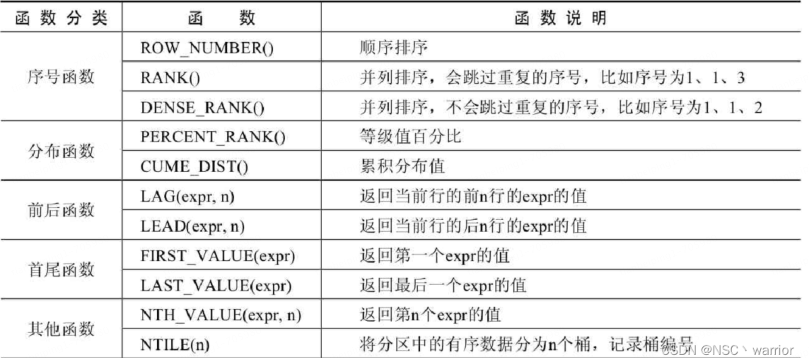

# mysql 特性

## 窗口函数

> 官方文档：https://dev.mysql.com/doc/refman/8.0/en/window-function-descriptions.html#function_row-number

窗口函数可以分为`静态窗口函数`和`动态窗口函数`。

- 静态窗口函数的窗口大小是固定的，不会因为记录的不同而不同；
- 动态窗口函数的窗口大小会随着记录的不同而变化

窗口函数总体上可以分为序号函数、分布函数、前后函数、首尾函数和其他函数，如下表：



### 语法结构

> 博客参考文章：https://blog.csdn.net/csr_warrior/article/details/122505386

```sql
-- 窗口函数的语法结构是：
函数 OVER（[PARTITION BY 字段名 ORDER BY 字段名 ASC|DESC]）

-- 或
函数 OVER 窗口名 … WINDOW 窗口名 AS （[PARTITION BY 字段名 ORDER BY 字段名 ASC|DESC]）

-- 使用案列
SELECT * FROM (
  SELECT ROW_NUMBER() OVER(PARTITION BY category_id ORDER BY price DESC) AS row_num,
  id, category_id, category, NAME, price, stock
  FROM goods
) t
WHERE row_num <= 3;

-- 以下两个sql 效果一样
-- mysql5.7写法
SELECT s.city AS 城市,s.county AS 区,s.sales_value AS 区销售额,
	b.sales_value AS 市销售额,s.sales_value/b.sales_value AS 市比率,
	a.sales_value AS 总销售额,s.sales_value/a.sales_value AS 总比率
FROM sales s
	JOIN sales b ON (s.city=b.city) -- 连接市统计结果临时表
	JOIN sales a                   -- 连接总计金额临时表
ORDER BY s.city,s.county;
-- 使用了窗口函数
SELECT city AS 城市,county AS 区,sales_value AS 区销售额,
	SUM(sales_value) OVER(PARTITION BY city) AS 市销售额,  -- 计算市销售额
	sales_value/SUM(sales_value) OVER(PARTITION BY city) AS 市比率,
	SUM(sales_value) OVER() AS 总销售额,   -- 计算总销售额
	sales_value/SUM(sales_value) OVER() AS 总比率
FROM sales
ORDER BY city,county;
```

- OVER 关键字指定函数窗口的范围。
  - 如果省略后面括号中的内容，则窗口会包含满足WHERE条件的所有记录，窗口函数会基于所有满足WHERE条件的记录进行计算。
  - 如果OVER关键字后面的括号不为空，则可以使用如下语法设置窗口。
- 窗口名：为窗口设置一个别名，用来标识窗口。
- PARTITION BY子句：指定窗口函数按照哪些字段进行分组。分组后，窗口函数可以在每个分组中分别执行。
- ORDER BY子句：指定窗口函数按照哪些字段进行排序。执行排序操作使窗口函数按照排序后的数据记录的顺序进行编号。
- FRAME子句：为分区中的某个子集定义规则，可以用来作为滑动窗口使用
