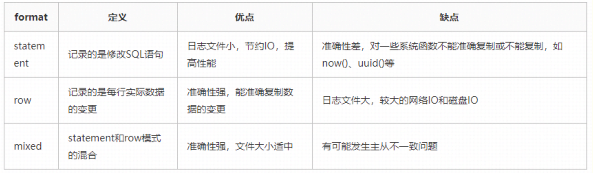
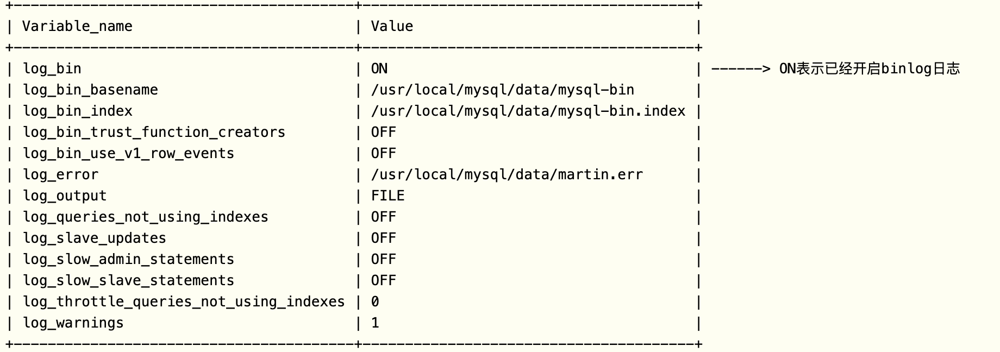

## canel配置

https://github.com/alibaba/canal/wiki/QuickStart


# mysql查看binlog日志



> 业内目前推荐使用的是`row`模式，准确性高，虽然说文件大，但是现在有SSD和万兆光纤网络，这些磁盘IO和网络IO都是可以接受的。

## 开启binlog

在[mysqld] 区块设置/添加 log-bin=mysql-bin 确认是打开状态(值 mysql-bin 是日志的基本名或前缀名)

```shell
# 可以看到mysql优先加载/etc/my.cnf中的配置
/etc/my.cnf /etc/mysql/my.cnf /usr/etc/my.cnf ~/.my.cnf

#=============================================================================================
# mysqld节添加开启binlog的配置文件如下:
#=============================================================================================
#第一种方式:
#开启binlog日志
log_bin=ON
#binlog日志的基本文件名
log_bin_basename=/var/lib/mysql/mysql-bin
#binlog文件的索引文件，管理所有binlog文件
log_bin_index=/var/lib/mysql/mysql-bin.index
#配置serverid
server-id=1

#第二种方式:
#此一行等同于上面log_bin三行
log-bin=/var/lib/mysql/mysql-bin
#配置serverid
server-id=1

#=============================================================================================
# MySQL配置文件my.cnf文件中的mysqld节的配置：
#=============================================================================================
[mysqld]
#设置日志三种格式：STATEMENT、ROW、MIXED 。
binlog_format = mixed
#设置日志路径，注意路经需要mysql用户有权限写
log-bin = /data/mysql/logs/mysql-bin.log
#设置binlog清理时间
expire_logs_days = 7
#binlog每个日志文件大小
max_binlog_size = 100m
#binlog缓存大小
binlog_cache_size = 4m
#最大binlog缓存大小
max_binlog_cache_size = 512m
```

### 查看配置变量

> show variables like 'log_%'; 




## mysql查看binlog

```shell
mysql> show binlog events;  #只查看第一个binlog文件的内容
mysql> show binlog events ``in` `'mysql-bin.000002'``;#查看指定binlog文件的内容
mysql> show binary logs; #获取binlog文件列表
mysql> show master status； #查看当前正在写入的binlog文件

# 处理   如果是row格式，加上-v或者-vv参数就行
mysqlbinlog -vv mysql-bin.000001
```

### 搜索查看，解析出sql文件中

工具默认的安装路径为：/usr/local/mysql/bin/mysqlbinlog

> ```sh
> /usr/local/mysql/bin/mysqlbinlog --start-datetime=``"2013-03-01 00:00:00"` `--stop-datetime=``"2014-03-21 23:59:59"` `/usr/local/mysql/``var``/mysql-bin.000007 -r test2.sql
> 
> ```

## 删binlog

1. 使用`reset master`,该命令将会删除所有日志，并让日志文件重新从000001开始
2. `purge master logs to "binlog_name.00000X" ` 指定删除日志文件
3. 使用`--expire_logs_days=N`选项指定过了多少天日志自动过期清空

# java读取

## canal

> https://github.com/alibaba/canal

```xml
<dependency>
  <groupId>com.alibaba.otter</groupId>
  <artifactId>canal.parse</artifactId>
  <version>1.1.7</version>
</dependency>
```

```java
MysqlEventParser parser = new MysqlEventParser();
AuthenticationInfo authenticationInfo = new AuthenticationInfo(new InetSocketAddress(host, port), username, password);
parser.setMasterInfo(authenticationInfo)

// 位置信息，缓冲到本地信息, 存储指针
File dataDir = Paths.get(savePositionDir).toFile();
// 500 毫秒写入到文件里面，binlog同步的位置
FileMixedLogPositionManager fileMixedLogPositionManager = new FileMixedLogPositionManager(dataDir, 500, new MemoryLogPositionManager()) {
  @Override
  public LogPosition getLatestIndexBy(String destination) {
    LogPosition latestIndexBy = super.getLatestIndexBy(destination);
    if (Objects.isNull(latestIndexBy) || Objects.isNull(latestIndexBy.getPostion())) {
      return null;
    }
    return null;
  }
};
fileMixedLogPositionManager.start();
parser.setLogPositionManager(fileMixedLogPositionManager);

// 增加过滤
String regexFilter = yanxiSyncBinlogTableService.fetchSyncTable();
parser.setEventFilter(new AviaterRegexFilter(regexFilter));

// 过滤不要操作
parser.setFilterQueryDcl(true);
parser.setFilterQueryDml(true);
parser.setFilterQueryDdl(true);

//  parser.setFilterRows(false);
//  parser.setFilterTableError(true);
//  parser.setUseDruidDdlFilter(true);
//  通过 startPosition 或者 startDatetime 标定读取 binlog 内容的开始位置
//  parser.setMasterPosition(new EntryPosition(startFileWithPosition.getFileName(), startFileWithPosition.getPosition(), startDatetime));
parser.setHaController(new HeartBeatHAController());
parser.setAlarmHandler(new EmailAlarmHandlerHandler());
// 解析发布处理
//        parser.setEventSink(new CustomCanalEventSink(jdqProducer));
parser.setEventSink(customCanalEventSink);
// 启动
parser.start();
```

数据处理

```java
import com.alibaba.fastjson.JSON;
import com.alibaba.otter.canal.filter.aviater.AviaterRegexFilter;
import com.alibaba.otter.canal.protocol.CanalEntry;
import com.alibaba.otter.canal.sink.AbstractCanalEventSink;
import com.alibaba.otter.canal.sink.exception.CanalSinkException;
import com.jd.jingdai.common.Consts;
import com.jd.jingdai.common.TargetTypeEnum;
import com.jd.jingdai.service.jdq.JdqProducer;
import com.jd.jingdai.service.dispatcher.EntryEvent;
import com.jd.jingdai.service.dispatcher.EventProducer;
import org.slf4j.Logger;
import org.slf4j.LoggerFactory;
import org.springframework.stereotype.Component;
import org.springframework.util.CollectionUtils;

import javax.annotation.Resource;
import java.net.InetSocketAddress;
import java.util.*;
import java.util.concurrent.*;
import java.util.stream.Collectors;

public class CustomCanalEventSink extends AbstractCanalEventSink<List<CanalEntry.Entry>> {

    private static Logger logger = LoggerFactory.getLogger(JdqProducer.class);
		// 过滤需要传递到数据值
    private static final Set<String> printableSet = Arrays.stream("insert,update,delete".split(",")).collect(Collectors.toSet());
    /**
     * 重写方法，处理Canal数据
     *
     * @param entries           Canal数据列表
     * @param inetSocketAddress 网络地址
     * @param s                 字符串参数
     * @return 是否成功处理数据
     * @throws CanalSinkException 处理Canal数据异常
     */
    @Override
    public boolean sink(List<CanalEntry.Entry> entries, InetSocketAddress inetSocketAddress, String s) throws CanalSinkException {

        for (CanalEntry.Entry entry : entries) {
            String schemaName = entry.getHeader().getSchemaName();
            String tableName = entry.getHeader().getTableName();
            long executeTime = entry.getHeader().getExecuteTime();
            if (entry.getEntryType() == CanalEntry.EntryType.ROWDATA) {
                List<CanalEntry.Column> columnsList = null;
                CanalEntry.EventType eventType = null;
                try {
                    // 解析可能会出现错误
                    CanalEntry.RowChange rowChage = CanalEntry.RowChange.parseFrom(entry.getStoreValue());
                    eventType = rowChage.getEventType();
                    for (CanalEntry.RowData rowData : rowChage.getRowDatasList()) {
                        if (eventType == CanalEntry.EventType.DELETE && printableSet.contains(eventType.name().toLowerCase())) {
                            // 获取删除前的数据
                            columnsList = rowData.getBeforeColumnsList();
                            dealSendEventDisruptor(eventType.name().toLowerCase(), schemaName, tableName, executeTime, columnsList);
                        } else if (eventType == CanalEntry.EventType.INSERT && printableSet.contains(eventType.name().toLowerCase())) {
                            // 获取插入后的数据
                            columnsList = rowData.getAfterColumnsList();
                            dealSendEventDisruptor(eventType.name().toLowerCase(), schemaName, tableName, executeTime, columnsList);
                        } else if (eventType == CanalEntry.EventType.UPDATE && printableSet.contains(eventType.name().toLowerCase())) {
                            // 获取更新后的数据
                            columnsList = rowData.getAfterColumnsList();
                            dealSendEventDisruptor(eventType.name().toLowerCase(), schemaName, tableName, executeTime, columnsList);
                        }
                    }
                } catch (Exception ex) {
                    logger.info("schema:{},table:{},execute:{},type:{},data:{}", schemaName, tableName, executeTime, eventType, JSON.toJSONString(columnsList));
                    logger.error("binlog处理数据异常," + ex.getMessage(), ex);
                    // 会再次重失败的开始消费
                }
            }
        }

        // 通过就可以提交下一个
        return true;
    }

    /**
     * 处理发送事件到Disruptor
     *
     * @param action      操作类型
     * @param schemaName  数据库schema名称
     * @param tableName   表名称
     * @param executeTime 执行时间
     * @param columnList  列列表
     * @return 无返回值
     * @throws IllegalArgumentException 如果columnList为空，则直接返回
     */
    private void dealSendEventDisruptor(String action, String schemaName, String tableName, long executeTime, List<CanalEntry.Column> columnList) {
        if (CollectionUtils.isEmpty(columnList)) {
            return;
        }
        Map<String, String> mapData = columnList.stream().collect(Collectors.toMap(CanalEntry.Column::getName, CanalEntry.Column::getValue, (v1, v2) -> v1));
        Map<String, Object> tranData = new HashMap<String, Object>() {{
            put(Consts.SCHEMA, schemaName);
            put(Consts.TABLE, tableName);
            put(Consts.ACTION, action);
            put(Consts.ACTION_TIME, executeTime);
            put(Consts.DATA, mapData);
        }};
      	// 数据发送到MQ
        //jdqProducer.send(tranData);
    }

}
```


# python读取

https://github.com/julien-duponchelle/python-mysql-replication

> pip install mysql-replication

官方文档：https://python-mysql-replication.readthedocs.io/en/latest/index.html

```python
# -*- coding: utf-8 -*-
import datetime
import json

from pymysqlreplication import BinLogStreamReader
from pymysqlreplication.row_event import (
    DeleteRowsEvent,
    UpdateRowsEvent,
    WriteRowsEvent,
  # TableMapEvent
)

class DateEncoder(json.JSONEncoder):
    """
    自定义类，解决报错：
    TypeError: Object of type 'datetime' is not JSON serializable
    """
    def default(self, obj):
        if isinstance(obj, datetime.datetime):
            return obj.strftime('%Y-%m-%d %H:%M:%S')
        elif isinstance(obj, datetime.date):
            return obj.strftime("%Y-%m-%d")
        else:
            return json.JSONEncoder.default(self, obj)

# 配置数据库信息
mysql_settings = {
    'host': '127.0.0.1',
    'port': 3306,
    'user': 'root',
    'passwd': '123456'
}
def main():
    # 实例化binlog 流对象
    stream = BinLogStreamReader(
        connection_settings=mysql_settings,
        server_id=100,  # slave标识，唯一
        blocking=True,  # 阻塞等待后续事件
        # 设定只监控写操作：增、删、改
        only_events=[
            DeleteRowsEvent,
            UpdateRowsEvent,
            WriteRowsEvent
        ]
    )

    for binlogevent in stream:
        # binlogevent.dump()  # 打印所有信息
        for row in binlogevent.rows:
            # 打印 库名 和 表名
            event = {"schema": binlogevent.schema, "table": binlogevent.table}
            if isinstance(binlogevent, DeleteRowsEvent):
                event["action"] = "delete"
                event["data"] = row["values"]

            elif isinstance(binlogevent, UpdateRowsEvent):
                event["action"] = "update"
                event["data"] = row["after_values"]  # 注意这里不是values

            elif isinstance(binlogevent, WriteRowsEvent):
                event["action"] = "insert"
                event["data"] = row["values"]

            print(json.dumps(event, cls=DateEncoder))
            # sys.stdout.flush()

    # stream.close()  # 如果使用阻塞模式，这行多余了


if __name__ == '__main__':
    main()
"""
输出数据格式
{
    "schema": "demo",    # 数据库名
    "table": "student",  # 表名
    "action": "update",  # 动作 insert、delete、update
    "data": {            # 数据，里边包含所有字段
        "id": 26, 
        "name": "haha", 
        "age": 34, 
        "update_time": "2019-06-06 16:59:06", 
        "display": 0
    }
}
"""
```

