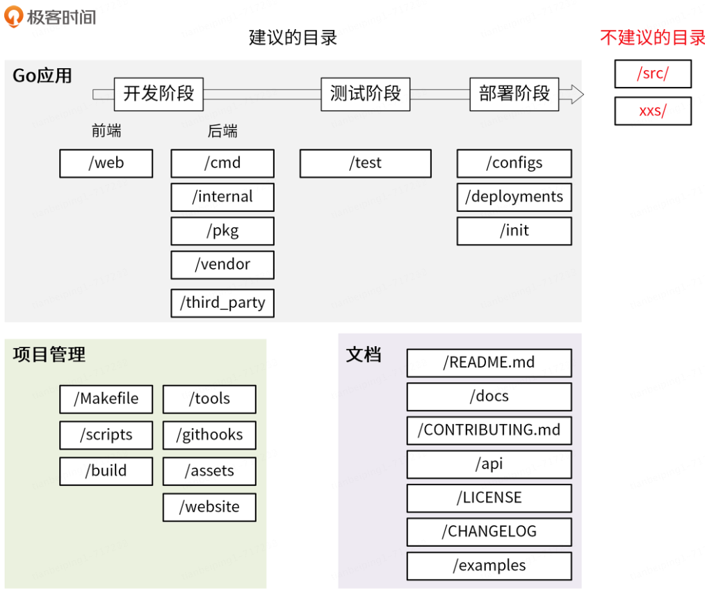

## 编译不同环境

```sh
CGO_ENABLED=0 GOOS=linux GOARCH=amd64 go build main.go
CGO_ENABLED=0 GOOS=windows GOARCH=amd64 go build main.go

// main.go 为源文件
```




### Go应用开发目录

- **/web:** 前端代码存放目录，主要用来存放 `Web` 静态资源，服务端模板和单页应用（`SPAs`）
- **/cmd:** 一个项目有很多组件，可以把组件 `main` 函数所在的文件夹统一放在 `/cmd` 目录下；这里要保证 `/cmd/<组件名>` 目录下不要存放太多的代码，如果你认为代码可以导入并在其他项目中使用，那么它应该位于 `/pkg` 目录中。如果代码不是可重用的，或者你不希望其他人重用它，请将该代码放到 `/internal` 目录中
- **/internal:** 存放私有应用和库代码。如果一些代码，你不希望在其他应用和库中被导入，可以将这部分代码放在`/internal` 目录下
  - /internal 目录建议包含如下目录：
    - **/internal/apiserver：**该目录中存放真实的应用代码。这些应用的共享代码存放在 /internal/pkg 目录下。
    - **/internal/pkg：**存放项目内可共享，项目外不共享的包。这些包提供了比较基础、通用的功能，例如工具、错误码、用户验证等功能。
  - 建议是，一开始将所有的共享代码存放在 /internal/pkg 目录下，当该共享代码做好了对外开发的准备后，再转存到 /pkg 目录下。
  - 放入 internal 的包从 go 机制上就无法被外部引用。
- **/pkg:** 该目录中存放可以被外部应用使用的代码库，其他项目可以直接通过 `import` 导入这里的代码。所以，我们在将代码库放入该目录时一定要慎重。
- **/vendor:** 项目依赖，可通过 go mod vendor 创建。需要注意的是，如果是一个 Go 库，不要提交 vendor 依赖包。vendor 就是把依赖的代码 clone 一份，放在 vendor 中，这样构建时，go 编译器会使用 vendor 中的依赖，而不是到网上去下载，也不会使用本地 module cache 中的依赖。
-  **/third_party:**  外部帮助工具，分支代码或其他第三方应用（例如 Swagger UI）。比如我们 fork 了一个第三方 go 包，并做了一些小的改动，我们可以放在目录 /third_party/forked 下。一方面可以很清楚的知道该包是 fork 第三方的，另一方面又能够方便地和 upstream 同步

### 应用测试目录

- **/test:**   用于存放其他外部测试应用和测试数据。/test 目录的构建方式比较灵活：对于大的项目，有一个数据子目录是有意义的。例如，如果需要 Go 忽略该目录中的内容，可以使用 /test/data 或 /test/testdata 目录。
  - 需要注意的是，Go 也会忽略以 . 或 _ 开头的目录或文件。这样在命名测试数据目录方面，可以具有更大的灵活性。

### Go 应用部署目录

- **/configs:** 这个目录用来配置文件模板或默认配置。例如，可以在这里存放 `confd` 或 `consul-template` 模板文件。这里有一点要注意，配置中不能携带敏感信息，这些敏感信息，我们可以用占位符来替代，例如：
- **/deployments:** 用来存放 `Iaas`、`PaaS` 系统和容器编排部署配置和模板（`Docker-Compose`，`Kubernetes/Helm`，`Mesos`，`Terraform`，`Bosh`）。在一些项目，特别是用 `Kubernetes` 部署的项目中，这个目录可能命名为 `deploy`。
- **/init:** 存放初始化系统（`systemd`，`upstart`，`sysv`）和进程管理配置文件（`runit`，`supervisord`）。比如 `sysemd` 的 `unit` 文件。这类文件，在非容器化部署的项目中会用到。

### Go 应用项目管理目录

- /Makefile: 一个 `Go` 项目在其根目录下应该有一个 `Makefile` 工具，用来对项目进行管理，`Makefile` 通常用来执行静态代码检查、单元测试、编译等功能。其他常见功能：

  - 静态代码检查(lint)：推荐用 golangci-lint。

  - 单元测试(test)：运行 go test ./...。

  - 编译(build)：编译源码，支持不同的平台，不同的 CPU 架构。

  - 镜像打包和发布(image/image.push)：现在的系统比较推荐用 Docker/Kubernetes 进行部署，所以一般也要有镜像构建功能

  - 清理（clean）:清理临时文件或者编译后的产物。

  - 代码生成（gen）：比如要编译生成 protobuf pb.go 文件。

  - 部署（deploy，可选）：一键部署功能，方便测试。

  - 发布（release）：发布功能，比如：发布到 Docker Hub、github 等。

  - 帮助（help）:告诉 Makefile 有哪些功能，如何执行这些功能。

  - 版权声明（add-copyright）：如果是开源项目，可能需要在每个文件中添加版权头，这可以通过 Makefile 来添加。

  - API 文档（swagger）：如果使用 swagger 来生成 API 文档，这可以通过 Makefile 来生成。

  - > 建议：直接执行 `make` 时，执行如下各项 `format -> lint -> test -> build`，如果是有代码生成的操作，还可能需要首先生成代码 `gen -> format -> lint -> test -> build`。

- scripts: 该目录主要用来存放脚本文件，实现构建、安装、分析等不同功能。不同项目，里面可能存放不同的文件，但通常可以考虑包含以下 3 个目录

  - /scripts/make-rules：用来存放 makefile 文件，实现 /Makefile 文件中的各个功能。Makefile 有很多功能，为了保持它的简洁，我建议你将各个功能的具体实现放在 /scripts/make-rules 文件夹下

  - /scripts/lib：shell 库，用来存放 shell 脚本。一个大型项目中有很多自动化任务，比如发布、更新文档、生成代码等，所以要写很多 shell 脚本，这些 shell 脚本会有一些通用功能，可以抽象成库，存放在 /scripts/lib 目录下，比如 logging.sh，util.sh 等。

  - /scripts/install：如果项目支持自动化部署，可以将自动化部署脚本放在此目录下。如果部署脚本简单，也可以直接放在 /scripts 目录下。

  - > 另外，`shell` 脚本中的函数名，建议采用语义化的命名方式，例如 `iam::log::info` 这种语义化的命名方式，可以使调用者轻松的辨别出函数的功能类别，便于函数的管理和引用。

- /build: 这里存放安装包和持续集成相关的文件。这个目录下有 3 个大概率会使用到的目录，在设计目录结构时可以考虑进去。

  - `/build/package`：存放容器（`Docker`）、系统（`deb`, `rpm`, `pkg`）的包配置和脚本。
  - `/build/ci`：存放 `CI`的配置文件和脚本。
  - `/build/docker`：存放子项目各个组件的 `Dockerfile` 文件。

- /tools: 存放这个项目的支持工具。这些工具可导入来自 `/pkg` 和 `/internal` 目录的代码。

- /githooks: `Git` 钩子。比如，我们可以将 `commit-msg` 存放在该目录。

- /assets: 项目使用的其他资源 (图片、`CSS`、`JavaScript` 等)。

- /website: 如果你不使用 `Github` 页面，则在这里放置项目的网站数据。

### Go 应用文档目录

- /README.md: 项目的 README 文件一般包含了项目的介绍、功能、快速安装和使用指引、详细的文档链接以及开发指引等。
- /docs: 存放设计文档、开发文档和用户文档等（除了 godoc 生成的文档）。推荐存放以下几个子目录：
- /docs/devel/{en-US,zh-CN}：存放开发文档、hack 文档等。
  - /docs/guide/{en-US,zh-CN}: 存放用户手册，安装、quickstart、产品文档等，分为中文文档和英文文档。
  - /docs/images：存放图片文件。
  - /CONTRIBUTING.md: 开源就绪的项目，用来说明如何贡献代码，如何开源协同等等。CONTRIBUTING.md 不仅能够规范协同流程，还能降低第三方开发者贡献代码的难度。
- /api: /api 目录中存放的是当前项目对外提供的各种不同类型的 API 接口定义文件，其中可能包含类似 /api/protobuf-spec、/api/thrift-spec、/api/http-spec、openapi、swagger 的目录，这些目录包含了当前项目对外提供和依赖的所有 API 文件。
- /LICENSE: 版权文件可以是私有的，也可以是开源的。常用的开源协议有：Apache 2.0、MIT、BSD、GPL、Mozilla、LGPL。
- /CHANGELOG: 当项目有更新时，为了方便了解当前版本的更新内容或者历史更新内容，需要将更新记录存放到 CHANGELOG 目录。
- /examples: 存放应用程序或者公共包的示例代码


## 建议

对于小型项目，可以考虑先包含 `cmd`、`pkg`、`internal` 3 个目录，其他目录后面按需创建，例如：

```bash
# tree --noreport -L 2 tms
tms
├── cmd
├── internal
├── pkg
└── README.md
```

## 实际项目参考目录

```bash
├── admin.sh                     # 进程的start|stop|status|restart控制文件
├── conf                         # 配置文件统一存放目录
│   ├── config.yaml              # 配置文件
│   ├── server.crt               # TLS配置文件
│   └── server.key
├── config                       # 专门用来处理配置和配置文件的Go package
│   └── config.go                 
├── db.sql                       # 在部署新环境时，可以登录MySQL客户端，执行source db.sql创建数据库和表
├── docs                         # swagger文档，执行 swag init 生成的
│   ├── docs.go
│   └── swagger
│       ├── swagger.json
│       └── swagger.yaml
├── handler                      # 类似MVC架构中的C，用来读取输入，并将处理流程转发给实际的处理函数，最后返回结果
│   ├── handler.go
│   ├── sd                       # 健康检查handler
│   │   └── check.go 
│   └── user                     # 核心：用户业务逻辑handler
│       ├── create.go            # 新增用户
│       ├── delete.go            # 删除用户
│       ├── get.go               # 获取指定的用户信息
│       ├── list.go              # 查询用户列表
│       ├── login.go             # 用户登录
│       ├── update.go            # 更新用户
│       └── user.go              # 存放用户handler公用的函数、结构体等
├── main.go                      # Go程序唯一入口
├── Makefile                     # Makefile文件，一般大型软件系统都是采用make来作为编译工具
├── model                        # 数据库相关的操作统一放在这里，包括数据库初始化和对表的增删改查
│   ├── init.go                  # 初始化和连接数据库
│   ├── model.go                 # 存放一些公用的go struct
│   └── user.go                  # 用户相关的数据库CURD操作
├── pkg                          # 引用的包
│   ├── auth                     # 认证包
│   │   └── auth.go
│   ├── constvar                 # 常量统一存放位置
│   │   └── constvar.go
│   ├── errno                    # 错误码存放位置
│   │   ├── code.go
│   │   └── errno.go
│   ├── token
│   │   └── token.go
│   └── version                  # 版本包
│       ├── base.go
│       ├── doc.go
│       └── version.go
├── README.md                    # API目录README
├── router                       # 路由相关处理
│   ├── middleware               # API服务器用的是Gin Web框架，Gin中间件存放位置
│   │   ├── auth.go 
│   │   ├── header.go
│   │   ├── logging.go
│   │   └── requestid.go
│   └── router.go
├── service                      # 实际业务处理函数存放位置
│   └── service.go
├── util                         # 工具类函数存放目录
│   ├── util.go 
│   └── util_test.go
└── vendor                         # vendor目录用来管理依赖包
    ├── github.com
    ├── golang.org
    ├── gopkg.in
    └── vendor.json
```

