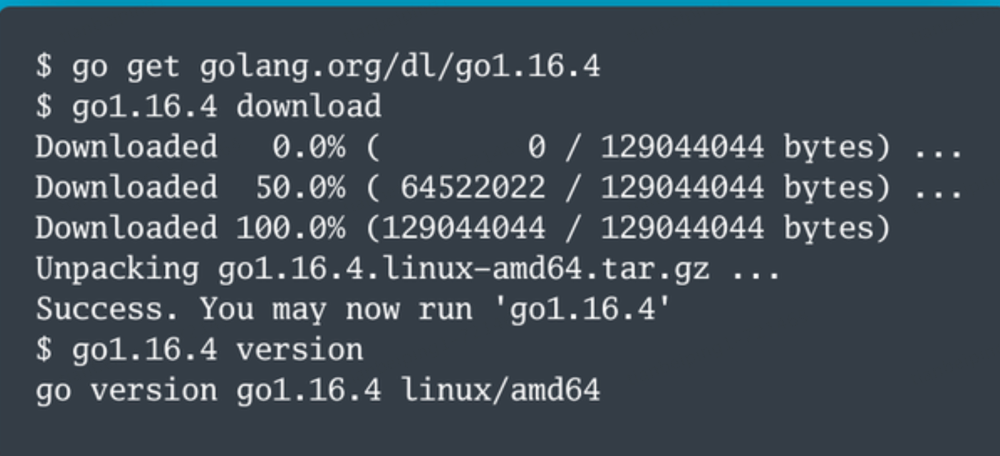

### 一、go get 命令

**这种方法有一个前提，那就是当前系统中已经通过标准方法安装过某个版本的 Go 了。**

#### 1.1 使用方法：

在项目中初始化 Go Modules：

```javascript
go mod init <module-name>
```

go 版本安装/版本切换,安装不同版本的 Go：

```javascript
go get golang.org/dl/go<x.y>
go<x.y> download
go<x.y> version
```



切换全局 Go 版本：

```javascript
go<x.y> use
```

### Goenv

官网：[https://github.com/go-nv/goenv](https://cloud.tencent.com/developer/tools/blog-entry?target=https%3A%2F%2Fgithub.com%2Fgo-nv%2Fgoenv&source=article&objectId=2345580)

Goenv 是另一个 Go 多版本管理工具，它的工作原理与其他语言的版本管理工具（如 Ruby 的 RVM 和 Python 的 pyenv）类似。以下是使用 Goenv 的基本步骤：

安装 Goenv（你需要先安装 Git）：

```javascript
git clone https://github.com/syndbg/goenv.git ~/.goenv
```

将 Goenv 添加到你的 shell 配置文件（例如 `~/.bashrc` 或 `~/.zshrc`）中：

```javascript
echo 'export GOENV_ROOT="$HOME/.goenv"' >> ~/.bashrc
echo 'export PATH="$GOENV_ROOT/bin:$PATH"' >> ~/.bashrc
echo 'eval "$(goenv init -)"' >> ~/.bashrc
```

安装你需要的 Go 版本：

```javascript
goenv install go1.x.x
```

使用特定版本的 Go：

```javascript
goenv global go1.x.x
```

### 三、GVM (Go Version Manager)

官网：[https://github.com/moovweb/gvm](https://cloud.tencent.com/developer/tools/blog-entry?target=https%3A%2F%2Fgithub.com%2Fmoovweb%2Fgvm&source=article&objectId=2345580)

GVM 是一个流行的 Go 多版本管理工具，它允许你在同一台机器上安装和切换不同版本的 Go。以下是使用 GVM 的基本步骤：

安装 GVM：

```javascript
bash < <(curl -s -S -L https://raw.githubusercontent.com/moovweb/gvm/master/binscripts/gvm-installer)
```

安装你需要的 Go 版本：

```javascript
gvm install go1.x.x
```

使用特定版本的 Go：

```javascript
gvm use go1.x.x
```