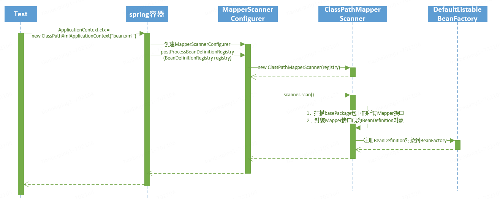

# spring 和 mybatis 基础配置

Java 线程池

```xml

```


```xml
<!-- dataSource -->
<bean id="dataSource" class="com.alibaba.druid.pool.DruidDataSource" init-method="init" destroy-method="close">
    <property name="driverClassName" value="${driver}"/>
    <property name="url" value="${url}"/>
    <property name="username" value="${username}"/>
    <property name="password" value="${password}"/>
</bean>

<!-- spring 和 mybatis 整合 -->
<bean id="sqlSessionFactory" class="org.mybatis.spring.SqlSessionFactoryBean">
	<!-- 指定 mybatis 要连接的数据源 -->
	<property name="dataSource" ref="dataSource"/>
	<!-- mybatis 配置文件的地址 -->
    <property name="configLocation" value="classpath:mybatis-config.xml"/>
	<!-- mybatis 的 mapper 文件的地址 -->
	<property name="mapperLocations" value="classpath:com/atguigu/mapper/*.xml"/>
</bean>

<!-- 配置 Mapper 接口扫描 -->
<bean id="mapperScannerConfigurer" class="org.mybatis.spring.mapper.MapperScannerConfigurer">
	<property name="basePackage" value="com.atguigu.mapper"/>
	<property name="sqlSessionFactoryBeanName" value="sqlSessionFactory"/>
</bean>

```




## Spring mybtais标准配置（Druid）

```xml
<!--suppress SpringPlaceholdersInspection -->
<beans xmlns="http://www.springframework.org/schema/beans"
       xmlns:xsi="http://www.w3.org/2001/XMLSchema-instance" xmlns:tx="http://www.springframework.org/schema/tx"
       xsi:schemaLocation="http://www.springframework.org/schema/beans
						http://www.springframework.org/schema/beans/spring-beans-4.3.xsd
						http://www.springframework.org/schema/tx
						http://www.springframework.org/schema/tx/spring-tx.xsd"
       default-autowire="byName">

    <bean id="primaryDataSource" class="com.alibaba.druid.pool.DruidDataSource" init-method="init"
          destroy-method="close" abstract="true">
        <property name="driverClassName" value="${jdbc.driverClass}"/>
        <property name="initialSize" value="${jdbc.initialSize}"/>
        <property name="minIdle" value="${jdbc.minIdle}"/>
        <property name="maxActive" value="${jdbc.maxActive}"/>
        <property name="maxWait" value="60000"/>
        <property name="validationQuery" value="SELECT 1"/>
        <property name="keepAlive" value="true" />
        <property name="testWhileIdle" value="true"/>
        <property name="testOnBorrow" value="true"/>
        <property name="testOnReturn" value="false"/>
        <property name="dbType" value="mysql"/>
        <property name="timeBetweenConnectErrorMillis" value="30000"/>
        <property name="filters" value="stat"/>
        <!-- 配置一个连接在池中最小生存的时间，单位是毫秒 -->
        <property name="minEvictableIdleTimeMillis" value="10000" />
        <property name="timeBetweenEvictionRunsMillis" value="10000" />
    </bean>

    <bean id="masterDataSource" parent="primaryDataSource" primary="true">
        <property name="url" value="${primary.jdbc.jdbcUrl}"/>
        <property name="username" value="${primary.jdbc.username}"/>
        <property name="password" value="${primary.jdbc.password}"/>
    </bean>

    <bean id="slaveDataSource" parent="primaryDataSource">
        <property name="url" value="${save.jdbc.jdbcUrl}"/>
        <property name="username" value="${save.jdbc.username}"/>
        <property name="password" value="${save.jdbc.password}"/>
    </bean>

   <!-- 
			DynamicDataSource 继承以下类
			org.springframework.jdbc.datasource.lookup.AbstractRoutingDataSource 
		-->
    <bean id="primaryDynamicDataSource" class="com.tbp.demo.dao.dbrouting.DynamicDataSource">
        <property name="targetDataSources">
            <map key-type="java.lang.String">
                <entry value-ref="slaveDataSource" key="slaveDataSource"/>
                <entry value-ref="masterDataSource" key="masterDataSource"/>
            </map>
        </property>
        <property name="defaultTargetDataSource" ref="masterDataSource"/>
    </bean>

    <bean id="sessionFactory" class="org.mybatis.spring.SqlSessionFactoryBean">
        <property name="dataSource" ref="primaryDynamicDataSource"/>
        <property name="configLocation" value="classpath:mybatis-primary.xml"/>
    </bean>

    <bean id="sqlTemplate" class="org.mybatis.spring.SqlSessionTemplate">
        <constructor-arg index="0" ref="sessionFactory"/>
    </bean>

    <bean id="primaryTransactionManager" class="org.springframework.jdbc.datasource.DataSourceTransactionManager">
        <property name="dataSource" ref="primaryDynamicDataSource"/>
    </bean>
		
  	<!-- 事物处理 -->
    <tx:annotation-driven transaction-manager="primaryTransactionManager"/>
</beans>
```


## SpringBoot默认连接池(Hikari)使用

```properties
#数据库配置
spring.datasource.driver-class-name=com.mysql.cj.jdbc.Driver
spring.datasource.url=jdbc:mysql://localhost:3306/my_demo?serverTimezone=UTC&useUnicode=true&characterEncoding=utf8
spring.datasource.username=root
spring.datasource.password=123456
 
# 数据库连接池配置
#最小空闲连接，默认值10，小于0或大于maximum-pool-size，都会重置为maximum-pool-size
spring.datasource.hikari.minimum-idle=10
#最大连接数，小于等于0会被重置为默认值10；大于零小于1会被重置为minimum-idle的值
spring.datasource.hikari.maximum-pool-size=20
#空闲连接超时时间，默认值600000（10分钟），大于等于max-lifetime且max-lifetime>0，会被重置为0；不等于0且小于10秒，会被重置为10秒
spring.datasource.hikari.idle-timeout=500000
#连接最大存活时间，不等于0且小于30秒，会被重置为默认值30分钟.设置应该比mysql设置的超时时间短
spring.datasource.hikari.max-lifetime=540000
#连接超时时间：毫秒，小于250毫秒，否则被重置为默认值30秒
spring.datasource.hikari.connection-timeout=60000
```


## SpringBoot默认连接池(druid)使用

> 导入druid-spring-boot-starter包(推荐1.2.21版本)

```xml
<!--引入druid数据源 1.1.10 此版本的数据监控中心可以直接使用-->
<dependency>
  <groupId>com.alibaba</groupId>
  <artifactId>druid-spring-boot-starter</artifactId>
  <version>1.1.10</version>
</dependency>

<!--druid数据源 1.1.21 此版本的数据监控中心增加了登录界面需要增加配置类-->
<dependency>
  <groupId>com.alibaba</groupId>
  <artifactId>druid-spring-boot-starter</artifactId>
  <version>1.1.21</version>
</dependency>
```


```properties
#数据库连接中修改数据源类型
spring.datasource.type=com.alibaba.druid.pool.DruidDataSource
 
# druid参数调优（可选）,若配置如下参数则必须手动添加配置类
# 初始化大小，最小，最大
spring.datasource.initialSize=5
spring.datasource.minIdle=5
spring.datasource.maxActive=20
# 配置获取连接等待超时的时间
spring.datasource.maxWait=60000
# 配置间隔多久才进行一次检测，检测需要关闭的空闲连接，单位是毫秒
spring.datasource.timeBetweenEvictionRunsMillis=60000
# 配置一个连接在池中最小生存的时间，单位是毫秒
spring.datasource.minEvictableIdleTimeMillis=300000

# 测试连接
spring.datasource.testWhileIdle=true
spring.datasource.testOnBorrow=false
spring.datasource.testOnReturn=false
# 打开PSCache，并且指定每个连接上PSCache的大小
spring.datasource.poolPreparedStatements=true
# 配置监控统计拦截的filters
# asyncInit是1.1.4中新增加的配置，如果有initialSize数量较多时，打开会加快应用启动时间
spring.datasource.asyncInit=true
# druid监控配置信息
spring.datasource.filters=stat,config
spring.datasource.maxPoolPreparedStatementPerConnectionSize=20
spring.datasource.useGlobalDataSourceStat=true
spring.datasource.connectionProperties=druid.stat.mergeSql=true;druid.stat.slowSqlMillis=500
```

### Java 配置web

```java
/**
 * Druid连接池监控配置信息
 * 提示：druid-spring-boot-starter jar包的版本高于1.1.10时才需要配置该类
 * 1.若低于1.1.10版本时直接访问：IP:端口/druid/index.html即可
 * 2.若高于1.0.10版本时访问:IP:端口/druid/login.html即可 账号密码根据自己设置的来
 */
@Configuration
public class DruidMonitorConfig {
 
    //因为Springboot内置了servlet容器，所以没有web.xml，替代方法就是将ServletRegistrationBean注册进去
    //加入后台监控
    @Bean  //这里其实就相当于servlet的web.xml
    public ServletRegistrationBean<StatViewServlet> statViewServlet() {
        ServletRegistrationBean<StatViewServlet> bean =
          new ServletRegistrationBean<>(new StatViewServlet(), "/druid/*");
 
        //后台需要有人登录，进行配置
        //bean.addUrlMappings(); 这个可以添加映射，我们在构造里已经写了
        //设置一些初始化参数
        Map<String, String> initParas = new HashMap<>();
        initParas.put("loginUsername", "admin");//它这个账户密码是固定的
        initParas.put("loginPassword", "123456");
        //允许谁能防伪
        initParas.put("allow", "");//这个值为空或没有就允许所有人访问，ip白名单
        //initParas.put("allow","localhost");//只允许本机访问，多个ip用逗号,隔开
        //initParas.put("deny","");//ip黑名单，拒绝谁访问 deny和allow同时存在优先deny
        initParas.put("resetEnable", "false");//禁用HTML页面的Reset按钮
        bean.setInitParameters(initParas);
        return bean;
    }
 
    //再配置一个过滤器，Servlet按上面的方式注册Filter也只能这样
    @Bean
    public FilterRegistrationBean<WebStatFilter> webStatFilter() {
        FilterRegistrationBean<WebStatFilter> bean = new FilterRegistrationBean<>();
        //可以设置也可以获取,设置一个阿里巴巴的过滤器
        bean.setFilter(new WebStatFilter());
        bean.addUrlPatterns("/*");
        //可以过滤和排除哪些东西
        Map<String, String> initParams = new HashMap<>();
        //把不需要监控的过滤掉,这些不进行统计
        initParams.put("exclusions", "*.js,*.css,/druid/*");
        bean.setInitParameters(initParams);
        return bean;
    }
}
```

