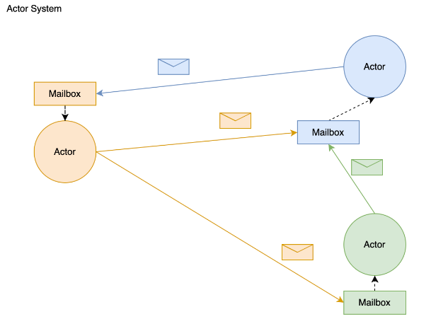

# AKKA

> 最新版本文档：https://doc.akka.io/docs/akka/current/
>
> https://doc.akka.io/docs/akka/current/remoting-artery.html
>
> 中文文档：https://guobinhit.github.io/akka-guide/

## maven

> 目前最新一集到  2.9.1
>
> > https://doc.akka.io/docs/akka/current/typed/guide/modules.html

```xml
<project>
    <modelVersion>4.0.0</modelVersion>
    <groupId>hello-akka-java</groupId>
    <artifactId>app</artifactId>
    <version>1.0</version>

    <properties>
       <scala.binary.version>2.12</scala.binary.version>
       <akka.version>2.6.19</akka.version>
    </properties>

    <dependencies>
        <dependency>
            <groupId>com.typesafe.akka</groupId>
            <artifactId>akka-actor_${scala.binary.version}</artifactId>
            <version>${akka.version}</version>
        </dependency>
      	<dependency>
          <groupId>com.typesafe.akka</groupId>
          <artifactId>akka-remote_${scala.binary.version}</artifactId>
        </dependency>
    </dependencies>
</project>
```

## 概念



1. Akka 处理并发的方式基于 Actor 模型，如上图
2. 在基于 Actor 的系统里，所有的事物都是 Actor，就好像面向对象设计里面一切皆对象
3. Actor 模型是作为一个并发模型，Actor 与 Actor 之间只能通过消息进行通信，如图信封
   1. Actor 向 Actor 发送消息时必须获取对象的引用即：ActorRef，就好像张三给李四打电话必须知道李四的电话号码一样
   2. Actor 向 Actor 发送的消息并不是直接给到 Actor 的，而是统一发送到对应 Actor 内部的 Mailbox(内部封装，用户不可见)，由 Mailbox 转发给 Actor
   3. Mailbox 可以识别出每个消息的发送者
4. 当一个 Actor 给另外一个 Actor 发消息，消息是有序的，多个 Actor 之间顺序不保证
5. 发送消息的 Actor 可以等待消息的响应也可以异步处理
6. ActorSystem 的职责是负责并管理其创建的 Actor，一个进程中的 ActorSystem 是单例的，Actor 可以有多个

### 继承 AbstractActor 后可以重写：

1. preStart：Actor 创建时自动异步启动
2. postStop：getContext.stop(ActorRef)时调用
3. preRestart：Actor 重启前调用，用于清理崩溃的数据
4. postRestart：Actor 重启后调用，用于崩溃后的初始化，默认调用 preStart


## remoting`被设计为`Peer-to-Peer`而非`Client-Server

# 使用案例

可以做成服务和消费者的关系

### 配置文件（remote.confi）

> 在一个`Akka`项目中启用`remote`功能的话，最基本需要在`application.conf`（Akka默认的配置文件名）中启用如下配置

```shell
akka {
  actor {
    # provider=remote is possible, but prefer cluster
    provider = remote
    # 本地配置连接远端
    #deployment {
    #  /toFind {
    #		 router = round-robin-group
    #		 routees.paths=['akka://sys@127.0.0.1:2552/workers/w1','akka://sys@127.0.0.2:2552/workers/w2']
    #    # 上面👆配置是集群处理
    #    remote = "akka://sys@127.0.0.1:2552"
    #  }
    # }
  }
  remote {
    artery {
    	# 安全性
    	# akka.actor.allow-java-serialization = off # 禁用 Java 序列化器
    	# enable-additional-serialization-bindings = on # 2.4版本前，兼容协议开启
    	# Artert是Akka为新版的remote包起的代号。目前是共存状态，但被标记为may change状态，仅UDP模式可以用于生产。
    	# enabled = on
    	# transport = aeron-udp
      transport = tcp # See Selecting a transport below
      canonical.hostname = "127.0.0.1"
      canonical.port = 25520 # 默认端口都是
    }
  }
}
```

### provider

```java
public class ToFindRemoteActor extends AbstractActor {

    LoggingAdapter log = Logging.getLogger(getContext().system(), this);

    @Override
    public void preStart() throws Exception {
        log.info("ToFindRemoteActor is starting");
    }

    @Override
    public Receive createReceive() {
        return receiveBuilder()
          			// 匹配接收消息
                .match(String.class, msg -> {
                    log.info("接收到的消息内容如下: {}", msg);
										// 接收到消息后，返回消息
                    getSender().tell("处理完成，这是返回的消息内容" + msg, getSelf());
                })
                .build();
    }

   // 启动提供者
    public static void main(String[] args) {
	      // 调整指定端口
        Config config = ConfigFactory.parseString("akka.remote.artery.canonical.port=" + 2551)
                .withFallback(ConfigFactory.load("remote.conf"));

        // 创建akka应用
        ActorSystem system = ActorSystem.create("sys", config);

        // 创建一个 actor
        system.actorOf(Props.create(ToFindRemoteActor.class), "toFind");
    }
}
```

### Consumer

```java
public class ConsumerToFind {

    public static void main(String[] args) throws ExecutionException, InterruptedException {
				
        Config config = ConfigFactory.parseString(
                        "akka.remote.artery.canonical.port=" + 0) // 指定为0 会随机创建一个端口
                .withFallback(ConfigFactory.load("remote.conf"));
        // Create an Akka system
        ActorSystem system = ActorSystem.create("main2", config);

        // 连接远端的消息
        ActorSelection toFind = system.actorSelection("akka://sys@127.0.0.1:2551/user/toFind");
      	// 发送消息，但不接受响应
				// toFind.tell("hello", ActorRef.noSender());

      	// 发送消息，等待消息返回
        CompletionStage<Object> ask = Patterns.ask(toFind, "这是发送请求的消息内容", Duration.ofMillis(500000L));
        Object o = ask.toCompletableFuture().get();

        System.out.printf("返回消息如下："+o);

    }
}
```


## 参考配置powerjob项目

### powerjob.akka.conf

```shell
akka {

  loggers = ["akka.event.slf4j.Slf4jLogger"]
  loglevel = "WARNING"

  actor {
    # cluster is better(recommend by official document), but I prefer remote
    provider = remote
    allow-java-serialization = off

    serializers {
        power-serializer = "tech.powerjob.remote.akka.PowerAkkaSerializer"
    }

    serialization-bindings {
        "tech.powerjob.common.PowerSerializable" = power-serializer
    }
  }
  remote {
    artery {
      transport = tcp # See Selecting a transport below
      # over write by code
      canonical.hostname = "127.0.0.1"
      canonical.port = 25520
    }
  }

  # dispatcher
  task-tracker-dispatcher {
    # Dispatcher is the name of the event-based dispatcher
    type = Dispatcher
    # What kind of ExecutionService to use
    executor = "fork-join-executor"
    # Configuration for the fork join pool
    fork-join-executor {
      # Min number of threads to cap factor-based parallelism number to
      parallelism-min = 2
      # Parallelism (threads) ... ceil(available processors * factor)
      parallelism-factor = 4.0
      # Max number of threads to cap factor-based parallelism number to
      parallelism-max = 64
    }
    # Throughput defines the maximum number of messages to be
    # processed per actor before the thread jumps to the next actor.
    # Set to 1 for as fair as possible.
    throughput = 10
  }

  processor-tracker-dispatcher {
    type = Dispatcher
    executor = "fork-join-executor"
    fork-join-executor {
      parallelism-min = 2
      parallelism-factor = 2.0
      parallelism-max = 64
    }
    throughput = 10
  }

  worker-common-dispatcher {
      type = Dispatcher
      executor = "fork-join-executor"
      fork-join-executor {
        parallelism-min = 2
        parallelism-factor = 2.0
        parallelism-max = 8
      }
      throughput = 10
    }

  ##################### server config #####################
  # worker-request-core-dispatcher
    w-r-c-d {
      # Dispatcher is the name of the event-based dispatcher
      type = Dispatcher
      # What kind of ExecutionService to use
      executor = "fork-join-executor"
      # Configuration for the fork join pool
      fork-join-executor {
        # Min number of threads to cap factor-based parallelism number to
        parallelism-min = 2
        # Parallelism (threads) ... ceil(available processors * factor)
        parallelism-factor = 4.0
        # Max number of threads to cap factor-based parallelism number to
        parallelism-max = 128
      }
      # Throughput defines the maximum number of messages to be
      # processed per actor before the thread jumps to the next actor.
      # Set to 1 for as fair as possible.
      throughput = 10
    }

    friend-request-actor-dispatcher {
        # Dispatcher is the name of the event-based dispatcher
        type = Dispatcher
        # What kind of ExecutionService to use
        executor = "fork-join-executor"
        # Configuration for the fork join pool
        fork-join-executor {
          # Min number of threads to cap factor-based parallelism number to
          parallelism-min = 2
          # Parallelism (threads) ... ceil(available processors * factor)
          parallelism-factor = 4.0
          # Max number of threads to cap factor-based parallelism number to
          parallelism-max = 128
        }
        # Throughput defines the maximum number of messages to be
        # processed per actor before the thread jumps to the next actor.
        # Set to 1 for as fair as possible.
        throughput = 5
      }

      ##################### default config #####################
    common-dispatcher {
          # Dispatcher is the name of the event-based dispatcher
          type = Dispatcher
          # What kind of ExecutionService to use
          executor = "fork-join-executor"
          # Configuration for the fork join pool
          fork-join-executor {
            # Min number of threads to cap factor-based parallelism number to
            parallelism-min = 2
            # Parallelism (threads) ... ceil(available processors * factor)
            parallelism-factor = 4.0
            # Max number of threads to cap factor-based parallelism number to
            parallelism-max = 64
          }
          # Throughput defines the maximum number of messages to be
          # processed per actor before the thread jumps to the next actor.
          # Set to 1 for as fair as possible.
          throughput = 10
        }
}
```

