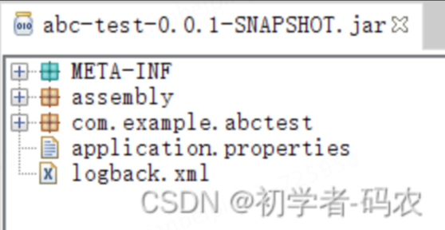
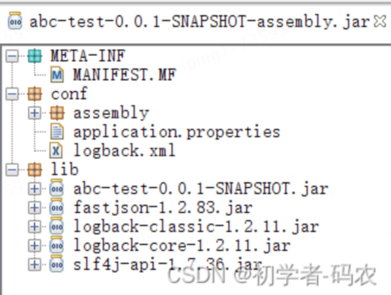
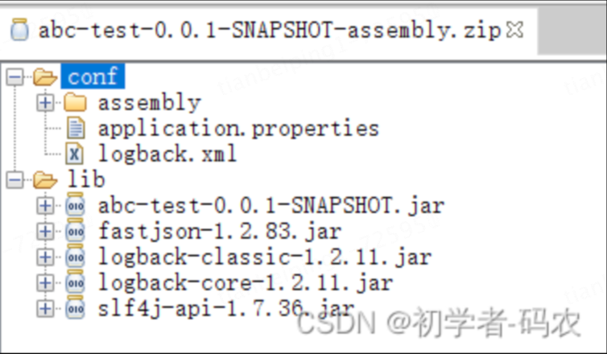

# 简单打包到可执行

### pom.xml

```xml
<build>
  <plugins>
    <!--主要用于将 Maven 项目打包成可执行的程序或分发包 -->
    <plugin>
      <artifactId>maven-assembly-plugin</artifactId>
      <version>3.3.0</version>
      <executions>
        <execution>
          <id>make-assembly</id><!--名字任意 -->
          <phase>package</phase><!-- 绑定到package生命周期阶段上 -->
          <goals>
            <goal>single</goal><!-- 只运行一次 -->
          </goals>
          <configuration>
            <appendAssemblyId>true</appendAssemblyId><!-- 设为 FALSE, 防止包名加入 assembly.xml 中的 id -->
            <attach>false</attach><!--指定是否将 Java 源代码附加到项目的构件列表中-->
            <descriptors>
              <descriptor>${project.basedir}/src/main/resources/assembly/assembly.xml</descriptor>
            </descriptors>
            <outputDirectory>${project.build.directory}</outputDirectory>
          </configuration>
        </execution>
      </executions>
    </plugin>
    
    <plugin>
      <groupId>org.apache.maven.plugins</groupId>
      <artifactId>maven-compiler-plugin</artifactId>
      <version>3.8.1</version>
      <configuration>
        <source>1.8</source>
        <target>1.8</target>
      </configuration>
    </plugin>
  </plugins>
</build>
```


### assembly.xml

```xml
<assembly>
    <id>assembly</id>
    <formats>
        <format>zip</format>
        <format>jar</format>
        <format>tar.gz</format>
    </formats>
    <includeBaseDirectory>false</includeBaseDirectory>
    <fileSets>
        <!-- 需要资源 -->
        <fileSet>
            <directory>src/main/resources</directory>
            <outputDirectory>conf</outputDirectory>
            <includes>
                <include>*.xml</include>
                <include>*.properties</include>
                <include>**/*.xml</include>
                <include>**/*.properties</include>
            </includes>
            <fileMode>0644</fileMode>
        </fileSet>
        <fileSet>
            <directory>assembly/bin</directory>
            <outputDirectory>bin</outputDirectory>
            <fileMode>0755</fileMode>
        </fileSet>
    </fileSets>
    <dependencySets>
        <dependencySet>
            <outputDirectory>lib</outputDirectory>
        </dependencySet>
    </dependencySets>
</assembly>
```

## 打包执行后的样式

xxx-SNAPSHOT.jar: 当前项目单独jar（不包含外部资源）



xxx-SNAPSHOT-assembly.jar：所有资源，项目jar和依赖jar都放在lib下



xxx-SNAPSHOT-assembly.zip : 项目所有资源打包成zip（同上面的jar）



### 