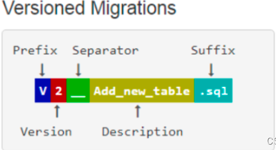

## 数据迁移

对比工具有： **Liquibase**

> 博客参考：https://pdai.tech/md/spring/springboot/springboot-x-mysql-flyway.html

### pom.xml

```xml
<dependency>
    <groupId>org.flywaydb</groupId>
    <artifactId>flyway-core</artifactId>
    <version>10.10.0</version>
</dependency>
```

### 代码执行迁移

```java
// 连接数据库
Flyway flyway = Flyway.configure().dataSource(url, user, password).load();
// 执行命令
flyway.migrate();
```

### 配置

```yaml
# flyway 配置
spring:
  flyway:
    # 启用或禁用 flyway
    enabled: true
    # flyway 的 clean 命令会删除指定 schema 下的所有 table, 生产务必禁掉。这个默认值是 false 理论上作为默认配置是不科学的。
    clean-disabled: true
    # SQL 脚本的目录,多个路径使用逗号分隔 默认值 classpath:db/migration
    locations: classpath:db/migration
    #  metadata 版本控制信息表 默认 flyway_schema_history
    table: flyway_schema_history
    # 如果没有 flyway_schema_history 这个 metadata 表， 在执行 flyway migrate 命令之前, 必须先执行 flyway baseline 命令
    # 设置为 true 后 flyway 将在需要 baseline 的时候, 自动执行一次 baseline。
    baseline-on-migrate: true
    # 指定 baseline 的版本号,默认值为 1, 低于该版本号的 SQL 文件, migrate 时会被忽略
    baseline-version: 1
    # 字符编码 默认 UTF-8
    encoding: UTF-8
    # 是否允许不按顺序迁移 开发建议 true  生产建议 false
    out-of-order: false
    # 需要 flyway 管控的 schema list,这里我们配置为flyway  缺省的话, 使用spring.datasource.url 配置的那个 schema,
    # 可以指定多个schema, 但仅会在第一个schema下建立 metadata 表, 也仅在第一个schema应用migration sql 脚本.
    # 但flyway Clean 命令会依次在这些schema下都执行一遍. 所以 确保生产 spring.flyway.clean-disabled 为 true
    schemas: flyway
    # 执行迁移时是否自动调用验证   当你的 版本不符合逻辑 比如 你先执行了 DML 而没有 对应的DDL 会抛出异常
    validate-on-migrate: true
```

### 注意

```markdown
注意clean-disabled！！！

- 表示是否要清除已有库下的表
- 即执行脚本V1__xxx.sql，会先清除已有库下的表！！然后再执行脚本
- 设置为true，即确定关掉clean功能
- 需要执行多次的，以大写"R"开头，命名如R__insertInfo.sql ，R的脚本只要改变了就会执行,R不带版本号。

SQL文件命名
举例：V2.0.1.7__create_core_table.sql

- V是前缀 表示这个文件只会被执行一次
- 2.0.1.7为版本号 ，高版本的执行后不会再执行低版本的SQL。如2.0.1.7先执行了，2.0.1.6就不会被执行了
- __ ： 两个下划线表示分隔符
- create_user_table :脚本功能表述
- .sql: 后缀

- 1.0.1.1 比 1.0.1 高
- 1.0.10.0 比 1.0.9.9 高
- 1.0.10 和 1.0.010 一样高
```

#### 版本控制规范

