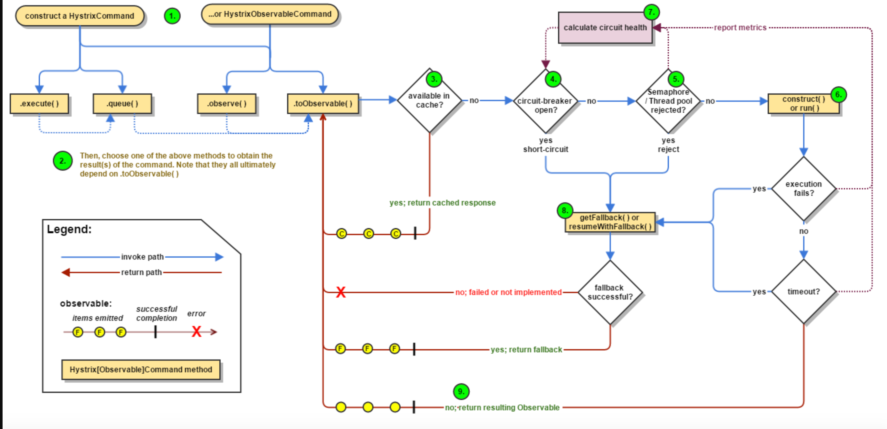
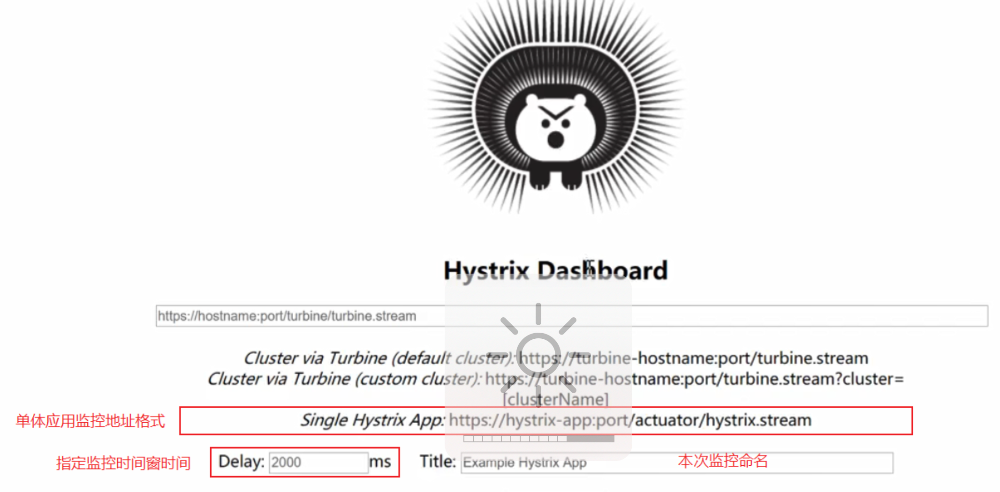
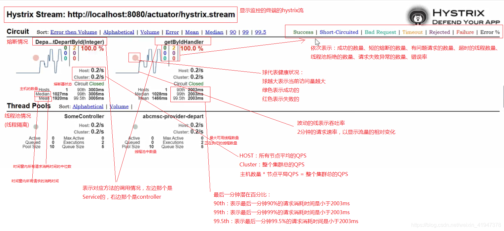
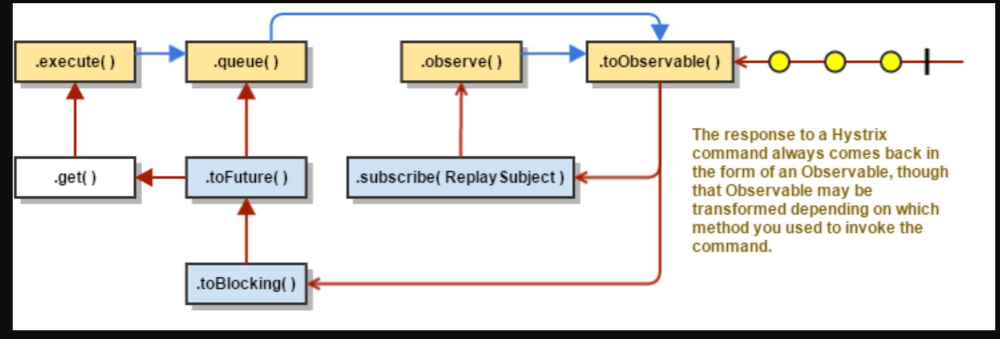

# hystrix 

## 熔断、容错、隔离

Hystrix的核心功能是提供容错和限流机制，主要包括以下功能：

- 资源隔离：Hystrix通过将每个服务的请求隔离在独立的线程池中，避免了因某个服务的异常导致整个系统的崩溃。

- 快速失败：当某个服务请求失败时，Hystrix会快速返回一个默认值或者执行备选方案，避免等待超时导致请求积压。

- 服务降级：当某个服务不可用时，Hystrix可以通过执行降级逻辑来提供类似但不同的功能，保证系统的可用性。

- 服务熔断：当某个服务的错误率超过设定的阈值时，Hystrix会中断对该服务的请求一段时间，避免对不可用的服务继续发送请求导致资源的浪费。

- 请求缓存：Hystrix支持对请求结果进行缓存，当下次请求相同的参数时，可以直接返回缓存中的结果，减少对服务的调用次数。

- 实时监控：Hystrix提供了实时的监控功能，可以查看每个服务的请求量、错误率、响应时间等指标，并提供图形化的监控界面。

- 自动恢复：当某个服务的错误率降低到设定的阈值后，Hystrix会自动恢复对该服务的请求。

## 工作流程


## pom xml

```xml
<dependency>
    <groupId>com.netflix.hystrix</groupId>
    <artifactId>hystrix-core</artifactId>
    <version>x.y.z</version>
</dependency>
```

## 配置

#### 官方网站

> https://github.com/Netflix/Hystrix/wiki/Configuration#CommandProperties

```yaml
hystrix:
  command:
    default:  #default全局有效，service id指定应用有效
      execution:
        timeout:
          #如果enabled设置为false，则请求超时交给ribbon控制,为true,则超时作为熔断根据
					#设置的超时时间应该满足：(1 + MaxAutoRetries) * （1 + MaxAutoRetriesNextServer） ReadTimeOut < hystrix 的 timeoutInMilliseconds*
          enabled: true
        isolation:
          thread:
            timeoutInMilliseconds: 10000 #断路器超时时间，默认1000ms
```



#### Hystrix参数详解

**hystrix.command.default和hystrix.threadpool.default中的default为默认CommandKey**

------

##### *Execution相关的属性的配置*：

**hystrix.command.default.execution.isolation.strategy** 隔离策略，默认是Thread, 可选Thread｜Semaphore

**hystrix.command.default.execution.isolation.thread.timeoutInMilliseconds** 命令执行超时时间，默认1000ms

**hystrix.command.default.execution.timeout.enabled** 执行是否启用超时，默认启用true

**hystrix.command.default.execution.isolation.thread.interruptOnTimeout**发生超时是是否中断，默认true

**hystrix.command.default.execution.isolation.semaphore.maxConcurrentRequests** 最大并发请求数，默认10，该参数当使用ExecutionIsolationStrategy.SEMAPHORE策略时才有效。如果达到最大并发请求数，请求会被拒绝。理论上选择semaphore size的原则和选择thread size一致，但选用semaphore时每次执行的单元要比较小且执行速度快（ms级别），否则的话应该用thread。semaphore应该占整个容器（tomcat）的线程池的一小部分。

------

##### *Fallback相关的属性*

这些参数可以应用于Hystrix的THREAD和SEMAPHORE策略

**hystrix.command.default.fallback.isolation.semaphore.maxConcurrentRequests** 如果并发数达到该设置值，请求会被拒绝和抛出异常并且fallback不会被调用。默认10
**hystrix.command.default.fallback.enabled** 当执行失败或者请求被拒绝，是否会尝试调用hystrixCommand.getFallback() 。默认true

------

##### *Circuit Breaker相关的属性*

**hystrix.command.default.circuitBreaker.enabled** 用来跟踪circuit的健康性，如果未达标则让request短路。默认true

**hystrix.command.default.circuitBreaker.requestVolumeThreshold** 一个rolling window内最小的请求数。如果设为20，那么当一个rolling window的时间内（比如说1个rolling window是10秒）收到19个请求，即使19个请求都失败，也不会触发circuit break。默认20

**hystrix.command.default.circuitBreaker.sleepWindowInMilliseconds** 触发短路的时间值，当该值设为5000时，则当触发circuit break后的5000毫秒内都会拒绝request，也就是5000毫秒后才会关闭circuit。默认5000

**hystrix.command.default.circuitBreaker.errorThresholdPercentage**错误比率阀值，如果错误率>=该值，circuit会被打开，并短路所有请求触发fallback。默认50

**hystrix.command.default.circuitBreaker.forceOpen** 强制打开熔断器，如果打开这个开关，那么拒绝所有request，默认false

**hystrix.command.default.circuitBreaker.forceClosed** 强制关闭熔断器 如果这个开关打开，circuit将一直关闭且忽略circuitBreaker.errorThresholdPercentage

------

##### *Metrics相关参数*

**hystrix.command.default.metrics.rollingStats.timeInMilliseconds** 设置统计的时间窗口值的，毫秒值，circuit break 的打开会根据1个rolling window的统计来计算。若rolling window被设为10000毫秒，则rolling window会被分成n个buckets，每个bucket包含success，failure，timeout，rejection的次数的统计信息。默认10000

**hystrix.command.default.metrics.rollingStats.numBuckets** 设置一个rolling window被划分的数量，若numBuckets＝10，rolling window＝10000，那么一个bucket的时间即1秒。必须符合rolling window % numberBuckets == 0。默认10
hystrix.command.default.metrics.rollingPercentile.enabled 执行时是否enable指标的计算和跟踪，默认true

**hystrix.command.default.metrics.rollingPercentile.timeInMilliseconds** 设置rolling percentile window的时间，默认60000

**hystrix.command.default.metrics.rollingPercentile.numBuckets** 设置rolling percentile window的numberBuckets。逻辑同上。默认6

**hystrix.command.default.metrics.rollingPercentile.bucketSize** 如果bucket size＝100，window＝10s，若这10s里有500次执行，只有最后100次执行会被统计到bucket里去。增加该值会增加内存开销以及排序的开销。默认100

**hystrix.command.default.metrics.healthSnapshot.intervalInMilliseconds** 记录health 快照（用来统计成功和错误绿）的间隔，默认500ms

------

##### *Request Context 相关参数*

**hystrix.command.default.requestCache.enabled** 默认true，需要重载getCacheKey()，返回null时不缓存
hystrix.command.default.requestLog.enabled 记录日志到HystrixRequestLog，默认true

------

##### *Collapser Properties 相关参数*

**hystrix.collapser.default.maxRequestsInBatch** 单次批处理的最大请求数，达到该数量触发批处理，默认Integer.MAX_VALUE

**hystrix.collapser.default.timerDelayInMilliseconds** 触发批处理的延迟，也可以为创建批处理的时间＋该值，默认10

**hystrix.collapser.default.requestCache.enabled** 是否对HystrixCollapser.execute() and HystrixCollapser.queue()的cache，默认true

------

*ThreadPool 相关参数*

> 线程数默认值10适用于大部分情况（有时可以设置得更小），如果需要设置得更大，那有个基本得公式可以follow：
> requests per second at peak when healthy × 99th percentile latency in seconds + some breathing room
> 每秒最大支撑的请求数 (99%平均响应时间 + 缓存值)
> 比如：每秒能处理1000个请求，99%的请求响应时间是60ms，那么公式是：
> 1000 （0.060+0.012）
> 基本得原则时保持线程池尽可能小，他主要是为了释放压力，防止资源被阻塞。
> 当一切都是正常的时候，线程池一般仅会有1到2个线程激活来提供服务

**hystrix.threadpool.default.coreSize** 并发执行的最大线程数，默认10

**hystrix.threadpool.default.maxQueueSize BlockingQueue**的最大队列数，当设为－1，会使用SynchronousQueue，值为正时使用LinkedBlcokingQueue。该设置只会在初始化时有效，之后不能修改threadpool的queue size，除非reinitialising thread executor。默认－1。

**hystrix.threadpool.default.queueSizeRejectionThreshold** 即使maxQueueSize没有达到，达到queueSizeRejectionThreshold该值后，请求也会被拒绝。因为maxQueueSize不能被动态修改，这个参数将允许我们动态设置该值。if maxQueueSize == -1，该字段将不起作用

**hystrix.threadpool.default.keepAliveTimeMinutes** 如果corePoolSize和maxPoolSize设成一样（默认实现）该设置无效。如果通过plugin（https://github.com/Netflix/Hystrix/wiki/Plugins）使用自定义实现，该设置才有用，默认1.

**hystrix.threadpool.default.metrics.rollingStats.timeInMilliseconds** 线程池统计指标的时间，默认10000

**hystrix.threadpool.default.metrics.rollingStats.numBuckets** 将rolling window划分为n个buckets，默认10


## 缓存（WEB）

```java
HystrixRequestContext context = HystrixRequestContext.initializeContext();
context.shutdown();

// 查看是否位缓存
CommandHelloWorld helloWord = new CommandHelloWorld("Bob")
String s =helloWord.execute();
// 判断，返回值是否位缓存
boolen  isCache = helloWord.isResponseFromCache()


public class HystrixRequestContextServletFilter implements Filter {

    public void doFilter(ServletRequest request, ServletResponse response, FilterChain chain) 
     throws IOException, ServletException {
        HystrixRequestContext context = HystrixRequestContext.initializeContext();
        try {
            chain.doFilter(request, response);
        } finally {
            context.shutdown();
        }
    }
}
```


## 值检测

```
// 是否，失败执行
command.isFailedExecution()
// 是否响应，从返回值
command.isResponseFromFallback()
```

# 图像监控（Hystrix Dashboard）

```yaml
# 开启actuator的hystrix.stream监控终端
management:
  endpoints:
    web:
      exposure:
        include: hystrix.stream
```

暴露的健康地址： http://localhost:8080/actuator/hystrix.stream



## 监控图介绍



## Turbine （聚合监控）

### pom xml

```xml
<!-- 单个 -->
<dependency>
	<groupId>org.springframework.cloud</groupId>
	<artifactId>spring-cloud-starter-hystrix</artifactId>
</dependency>
<!-- 集群 -->
<dependency>
  <groupId>org.springframework.cloud</groupId>
  <artifactId>spring-cloud-starter-turbine</artifactId>
 </dependency>
<dependency>
  <groupId>org.springframework.cloud</groupId>
  <artifactId>spring-cloud-netflix-turbine</artifactId>
 </dependency>
<!-- 页面 -->
<dependency>
  <groupId>org.springframework.cloud</groupId>
  <artifactId>spring-cloud-starter-hystrix-dashboard</artifactId>
</dependency>
<!-- 监控 -->
<dependency>
  <groupId>org.springframework.boot</groupId>
  <artifactId>spring-boot-starter-actuator</artifactId>
</dependency>
<!--eureka客户端依赖-->
<dependency>
    <groupId>org.springframework.cloud</groupId>
    <artifactId>spring-cloud-starter-netflix-eureka-client</artifactId>
</dependency>
```

### 基础配置

```properties
spring.application.name=hystrix-dashboard-turbine
server.port=8001
#配置Eureka中的serviceId列表，表明监控哪些服务
turbine.appConfig=node01,node02 # 指定集群组名称
#指定聚合哪些集群，多个使用”,”分割，默认为default。可使用http://.../turbine.stream?cluster={clusterConfig之一}访问
turbine.aggregator.clusterConfig= default 
turbine.clusterNameExpression= new String("default")
# 1. clusterNameExpression指定集群名称，默认表达式appName；
# 	此时：turbine.aggregator.clusterConfig需要配置想要监控的应用名称；
# 2. 当clusterNameExpression: default时，turbine.aggregator.clusterConfig可以不写，因为默认就是default；
# 3. 当clusterNameExpression: metadata[‘cluster’]时，假设想要监控的应用配置了
#			eureka.instance.metadata-map.cluster: ABC，则需要配置，同时turbine.aggregator.clusterConfig: ABC

# eureka server 集群地址
eureka.client.serviceUrl.defaultZone=http://localhost:8000/eureka/
# 区分集群，使用案列
# 指定要监控的微服务组
turbine.aggregator.clusterConfig= group1,group2
# 指定要监控微服务组名称来自于Eureka元数据cluster
turbine.clusterNameExpression= metadata['cluster'] 
# http://turbine-hostname:port/turbine.stream?cluster=group1
```

每个微服务启动配置

```properties
# eureka server 集群地址
eureka.client.serviceUrl.defaultZone=http://localhost:8000/eureka/
# 指定集群
eureka.instance.metadata-map.cluster =group1   # 自定义Eureka元数据
# 每个服务,开启Feign对Hystrix的支持
feign.hystrix.enabled=true
# 指定Feign客户端连接提供者的超时时限
feign.client.config.default.connectTimeout=5000
# 指定Feign客户端连接上提供者后，向提供者进行提交请求，从提交时刻开始，到接收到响应，这个时段的超时时限
feign.client.config.default.readTimeout=5000
# 隔离开启
hystrix.command.default.execution.isolation.thread.timeoutInMilliseconds=3000
# 开启actuator的hystrix.stream监控终端
management.endpoints.web.exposure.include=hystrix.stream

# @EnableFeignClients  // 开启Feign客户端

```


### java 启动类注解

#### 访问地址

> Cluster via Turbine (default cluster): http://turbine-hostname:port/turbine.stream
> Cluster via Turbine (custom cluster): http://turbine-hostname:port/turbine.stream?cluster=[clusterName]
> Single Hystrix App: http://hystrix-app:port/hystrix.stream

```java
@SpringBootApplication
@EnableHystrixDashboard  // 单个监控，只需求启动
@EnableTurbine
public class DashboardApplication {
	public static void main(String[] args) {
		SpringApplication.run(DashboardApplication.class, args);
	}
}
```


# demo 使用

### Java 代码

#### 构造线程（自定义参数设置）

```java
public class CommandHelloWorld extends HystrixCommand<String> {

  // 自定义配置
  private static final Setter cachedSetter = 
        Setter.withGroupKey(HystrixCommandGroupKey.Factory.asKey("ExampleGroup"))
            .andCommandKey(HystrixCommandKey.Factory.asKey("HelloWorld")
						//.andCommandPropertiesDefaults(   // 自定义
            //            HystrixCommandProperties.Setter()
            //                	 .withExecutionTimeoutInMilliseconds(600)	 // 隔离级别时间
            //                   .withExecutionIsolationStrategy(ExecutionIsolationStrategy.SEMAPHORE)) //
						.andThreadPoolKey(HystrixThreadPoolKey.Factory.asKey("HelloWorldPool")));    
  
 
    private final String name;

    public CommandHelloWorld(String name) {
        super(cachedSetter);
        // super(HystrixCommandGroupKey.Factory.asKey("ExampleGroup"));
        this.name = name;
    }
		// 执行
    @Override
    protected String run() {
        return "Hello " + name + "!";
    }
  	// 熔断， 返回结果
    @Override
    protected String getFallback() {
        return "Hello Failure " + name + "!";
    }
   // 失败， 会退
  	@Override
    protected Observable<Boolean> resumeWithFallback() {
        return Observable.just( true );
    }
  	// 缓存
    @Override
    protected String getCacheKey() {
        return String.valueOf(value);
    }
}
```

#### 构造

```java
public class CommandHelloWorld extends HystrixObservableCommand<String> {

    private final String name;

    public CommandHelloWorld(String name) {
        super(HystrixCommandGroupKey.Factory.asKey("ExampleGroup"));
        this.name = name;
    }

    @Override
    protected Observable<String> construct() {
        return Observable.create(new Observable.OnSubscribe<String>() {
            @Override
            public void call(Subscriber<? super String> observer) {
                try {
                    if (!observer.isUnsubscribed()) {
                        // a real example would do work like a network call here
                        observer.onNext("Hello");
                        observer.onNext(name + "!");
                        observer.onCompleted();
                    }
                } catch (Exception e) {
                    observer.onError(e);
                }
            }
         } ).subscribeOn(Schedulers.io());
    }
}
```


## 返回结果处理

```java
String s = new CommandHelloWorld("Bob").execute();
Future<String> s = new CommandHelloWorld("Bob").queue();
Observable<String> s = new CommandHelloWorld("Bob").observe(); //hot observable
Observable<String> s = new CommandHelloWorld("Bob").toObservable(); //cold observable
```

