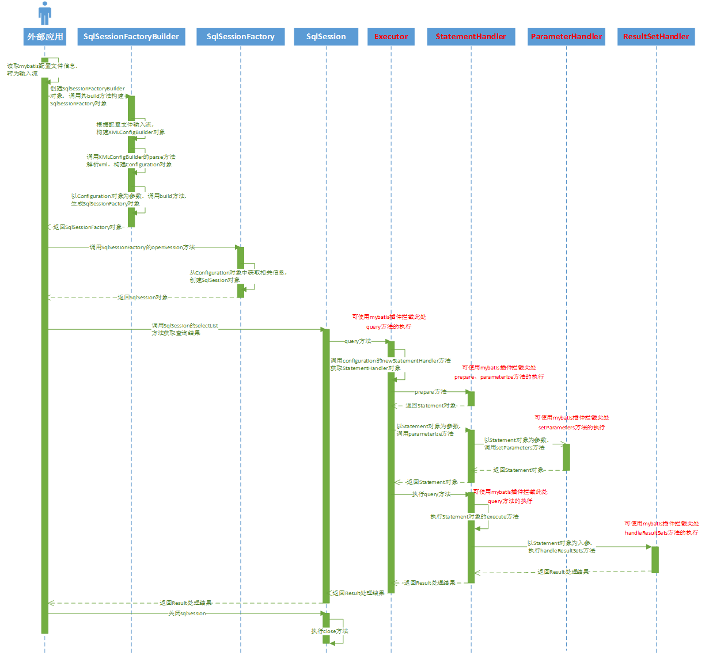

## 拦截方法

MyBatis 允许你在已映射语句执行过程中的某一点进行拦截调用。默认情况下，MyBatis允许使用插件来拦截的方法调用包括：

- 执行器Executor (update, query, flushStatements, commit, rollback, getTransaction, close, isClosed) 拦截执行器的方法
- 参数处理器ParameterHandler (getParameterObject, setParameters) 拦截参数的处理
- 结果集处理器ResultSetHandler (handleResultSets, handleOutputParameters) 拦截结果集的处理
- SQL语法构建器StatementHandler (prepare, parameterize, batch, update, query) 拦截Sql语法构建的处理


### 拦截接口（Interceptor）

```java
public interface Interceptor {
  Object intercept(Invocation invocation) throws Throwable;

  Object plugin(Object target);

  void setProperties(Properties properties);
}
```

### 拦截实现demo

> 分页查询参考：com.github.pagehelper.util.ExecutorUtil#pageQuery
>
> <dependency>
>     <groupId>com.github.pagehelper</groupId>
>     <artifactId>pagehelper</artifactId>
>     <version>5.3.1</version>
> </dependency>

```java
@Intercepts(
    {
      //@Signature(type= Executor.class, method = "update", args = {MappedStatement.class,Object.class})
        @Signature(type = Executor.class, method = "query", args = {MappedStatement.class, Object.class, RowBounds.class, ResultHandler.class}),
        @Signature(type = Executor.class, method = "query", args = {MappedStatement.class, Object.class, RowBounds.class, ResultHandler.class, CacheKey.class, BoundSql.class}),
    }
)
public class ExamplePlugin implements Interceptor {
  
  private DialectHelper dialectHelper;
  
  public Object intercept(Invocation invocation) throws Throwable {
    
//        Object[] args = invocation.getArgs();
//        MappedStatement ms = (MappedStatement) args[0];
//        Object parameter = args[1];
//        RowBounds rowBounds = (RowBounds) args[2];
//        ResultHandler resultHandler = (ResultHandler) args[3];
//        Executor executor = (Executor) invocation.getTarget();
    
    StatementHandler statementHandler=(StatementHandler)invocation.getTarget();
    
    MetaObject metaStatementHandler=
      MetaObject.forobject(
      statementHandler,
      new.DefaultobjectFactory(),
      new.DefaultObjectWrapperFactory(),
      new.DefaultReflectorFactory());
    
    RowBounds rowBounds=(RowBounds)metaStatementHandler.getValue("delegate.rowBounds")
      
    if(rowBounds == null&& rowBounds == RowBounds.DEFAULT){
     return invocation.proceed(); 
    }
    // 原始查询sql
    String originalSql =(String).metaStatementHandler.getValue("delegate.boundSql.sql");
    // 分页
    metaStatementHandler.setValue("delegate.boundSql.sql", dialectHelper.getDialect()
                                  .getLimitSqlString(originalSql,rowBounds.getoffset(),rowBounds.getLimit()));
    metaStatementHandler.setValue("delegate.rowBounds.offset",RowBounds.NO ROW OFFSET);
    metaStatementHandler.setValue("delegate.rowBounds.limit",RowBounds.NO_ROW LIMIT);
    return.invocation.proceed();
  }
  
  public Object plugin(Object target) {
    return Plugin.wrap(target, this);
  }
  
  public void setProperties(Properties properties) {
  }
}
```


### 配置生效

```xml
<plugins>
    <plugin interceptor="org.format.mybatis.cache.interceptor.ExamplePlugin"></plugin>
</plugins>
```


