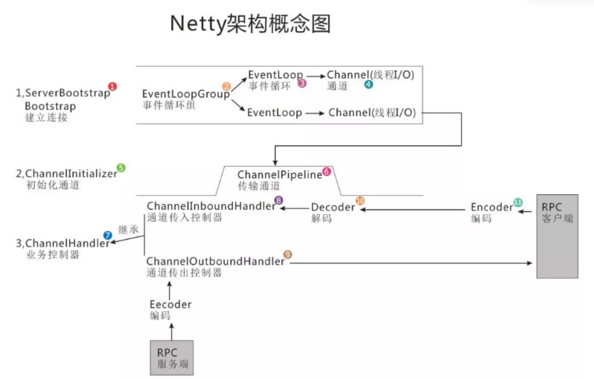

## [netty入门参考文章](https://www.toutiao.com/article/6859952200165425667/?app=news_article&group_id=6859952200165425667&req_id=202401181237032689F790DC845B00A68F&share_token=E8CF9D4A-0FA5-4D36-94D1-2A3AA4865D39&timestamp=1705552623&tt_from=copy_link&use_new_style=1&utm_campaign=client_share&utm_medium=toutiao_ios&utm_source=copy_link&source=m_redirect)

博客：

netty 管道和handler的加载和处理流程：https://blog.csdn.net/lipengyao2010/article/details/120223614  （包含自定义编码器）



## 创建服务端

```java

public class NettyOioServer {

    public void server(int port) throws Exception {
        ByteBuf buf = Unpooled.unreleasableBuffer(Unpooled.copiedBuffer("Hi!\r\n", Charset.forName("UTF-8")));
     
        //EventLoopGroup group = new OioEventLoopGroup();
       	NioEventLoopGroup bossGroup = new NioEventLoopGroup(1);
        NioEventLoopGroup workerGroup = new NioEventLoopGroup();
        try {
            ServerBootstrap b = new ServerBootstrap();        //1

            b.group(bossGroup, workerGroup)                        //2
             .channel(NioServerSocketChannel.class) //OioServerSocketChannel.class
             .localAddress(new InetSocketAddress(port)) //端口 port
             .childHandler(new ChannelInitializer<SocketChannel>() {//3
                 @Override
                 public void initChannel(SocketChannel ch) 
                     throws Exception {
                     ch.pipeline().addLast(new ChannelInboundHandlerAdapter() {            //4
                         @Override
                         public void channelActive(ChannelHandlerContext ctx) throws Exception {
                             ctx.writeAndFlush(buf.duplicate()).addListener(ChannelFutureListener.CLOSE);//5
                         }
                     });
                 }
             });
            ChannelFuture f = b.bind().sync();  //6   或 b.bind().sync()
            f.channel().closeFuture().sync();
        } finally {
            group.shutdownGracefully().sync();        //7
        }
    }
}
```


# Netty拆包/沾包

| 解码器                       | 描述                                                         |
| ---------------------------- | ------------------------------------------------------------ |
| LineBasedFrameDecoder        | 以行为单位进行数据包的解码，使用换行符`\n`或者`\r\n`作为依据，遇到`\n`或者`\r\n`都认为是一条完整的消息 |
| DelimiterBasedFrameDecoder   | 如果数据包中以自定义的分隔符作为分隔，Netty会自动使用分隔符分割数据包 |
| FixedLengthFrameDecoder      | 以固定长度进行数据包的解码                                   |
| LengthFieldBasedFrameDecoder | 一种灵活的基于长度的解码器。<br/> 解码器会根据数据包中的长度字段取出数据内容，丢弃不需要的数据 |
| StringDecoder                | 将ByteBuf二进制数据解码成字符串并向后传播                    |

### 详细使用说明

```java
// 使用LineBasedFrameDecoder解决粘包问题，其会根据"\n"或"\r\n"对二进制数据进行拆分，封装到不同的ByteBuf实例中，并且每次查找的最大长度为1024字节
new LineBasedFrameDecoder(1024, true, true)；

// 使用自定义分隔符处理拆包/沾包，并且每次查找的最大长度为1024字节
String delimiterStr = "##@##";
ByteBuf delimiter = Unpooled.copiedBuffer(delimiterStr.getBytes());
new DelimiterBasedFrameDecoder(1024, delimiter);

// 按固定100字节数拆分接收到的ByteBuf的解码器,  使用固定字节长度编码消息，字节长度不足时补0
new FixedLengthFrameDecoder(100);

// 请求头包含数据长度，根据长度进行沾包拆包处理
/**
 * @param maxFrameLength 
 *        发送的数据包的最大长度，如果超出此长度，将会被丢弃。
 * @param lengthFieldOffset
 *        长度字段的偏移量，指的是长度字段位于整个数据包内部字节数组中的下标值。
 * @param lengthFieldLength
 *        长度字段所占的字节。一般使用int作为长度字段的类型，那么该值就是4。
 * @param lengthAdjustment
 *        消息内容长度的矫正值。在传输协议比较复杂的时候（比如包含了长度字段、协议版本号等），在解码时就需要对长度进行矫正。
 *        公式：内容字段偏移量 - 长度字段偏移量 - 长度字段字节数。
 *        其实也就是在长度字段和在内容字段之间的字段所占的字节数。
 * @param initialBytesToStrip
 *        丢弃的起始字节数。其实这个就是内容字段的偏移量。
 */
LengthFieldBasedFrameDecoder(
            int maxFrameLength,
            int lengthFieldOffset, int lengthFieldLength,
            int lengthAdjustment, int initialBytesToStrip);
// 构造LengthFieldBasedFrameDecoder
// 这里设置最大字节数为1024
// 长度字段的偏移量为0，因为写的时候将长度字段第一个写入的，所以第一个字段就是长度字段
// 长度字段所在字节数为4，因为类型是int
// 长度的矫正值为2。因为在长度字段和内容字段之间夹了一个协议版本号，写入类型为char，占2个字节。
// 丢弃的起始字节数。长度字段字节数 + 协议版本号字节数 = 内容字段的偏移量 = 6，这些都是要丢弃的。
LengthFieldBasedFrameDecoder spilter = new LengthFieldBasedFrameDecoder(1024, 0, 4, 2, 6);
```

## ChannelHandler 处理器接口

```java
// 使用到，序列化和反序列化
ChannelDuplexHandler extends ChannelInboundHandlerAdapter implements ChannelOutboundHandler
  // 输入
  // 输出
// 添加注解类，表示共享类，实例
@Sharable  // 使用AttributeKey
```

### 代码中注解

```java
处理 I/O 事件或拦截 I/O 操作，并将其转发到ChannelPipeline中的下一个处理程序。
子类型
ChannelHandler本身并没有提供很多方法，但您通常必须实现它的子类型之一：
ChannelInboundHandler处理入站 I/O 事件，以及
ChannelOutboundHandler处理出站 I/O 操作。

或者，为了您的方便，还提供了以下适配器类：
ChannelInboundHandlerAdapter处理入站 I/O 事件，
ChannelOutboundHandlerAdapter处理出站 I/O 操作，以及
ChannelDuplexHandler用于处理入站和出站事件

有关更多信息，请参阅每个子类型的文档。
上下文对象
ChannelHandler配有ChannelHandlerContext对象。 ChannelHandler应该通过上下文对象与其所属的ChannelPipeline进行交互。使用上下文对象， ChannelHandler可以向上游或下游传递事件、动态修改管道或存储特定于处理程序的信息（使用AttributeKey ）。
状态管理
ChannelHandler通常需要存储一些状态信息。最简单且推荐的方法是使用成员变量：
  public interface Message {
      // your methods here
  }
 
  public class DataServerHandler extends SimpleChannelInboundHandler<Message> {
 
      private boolean loggedIn;
 
      @Override
      public void channelRead0(ChannelHandlerContext ctx, Message message) {
          if (message instanceof LoginMessage) {
              authenticate((LoginMessage) message);
              loggedIn = true;
          } else (message instanceof GetDataMessage) {
              if (loggedIn) {
                  ctx.writeAndFlush(fetchSecret((GetDataMessage) message));
              } else {
                  fail();
              }
          }
      }
      ...
  }
  
由于处理程序实例有一个专用于一个连接的状态变量，因此您必须为每个新通道创建一个新的处理程序实例，以避免未经身份验证的客户端可以获得机密信息的竞争条件：
  // Create a new handler instance per channel.
  // See ChannelInitializer.initChannel(Channel).
  public class DataServerInitializer extends ChannelInitializer<Channel> {
      @Override
      public void initChannel(Channel channel) {
          channel.pipeline().addLast("handler", new DataServerHandler());
      }
  }
 
  
使用AttributeKey
尽管建议使用成员变量来存储处理程序的状态，但出于某种原因，您可能不想创建许多处理程序实例。在这种情况下，您可以使用ChannelHandlerContext提供的AttributeKey ：
  public interface Message {
      // your methods here
  }
 
  @Sharable
  public class DataServerHandler extends SimpleChannelInboundHandler<Message> {
      private final AttributeKey<Boolean> auth =
            AttributeKey.valueOf("auth");
 
      @Override
      public void channelRead(ChannelHandlerContext ctx, Message message) {
          Attribute<Boolean> attr = ctx.attr(auth);
          if (message instanceof LoginMessage) {
              authenticate((LoginMessage) o);
              attr.set(true);
          } else (message instanceof GetDataMessage) {
              if (Boolean.TRUE.equals(attr.get())) {
                  ctx.writeAndFlush(fetchSecret((GetDataMessage) o));
              } else {
                  fail();
              }
          }
      }
      ...
  }
  
现在处理程序的状态已附加到ChannelHandlerContext ，您可以将相同的处理程序实例添加到不同的管道：
  public class DataServerInitializer extends ChannelInitializer<Channel> {
 
      private static final DataServerHandler SHARED = new DataServerHandler();
 
      @Override
      public void initChannel(Channel channel) {
          channel.pipeline().addLast("handler", SHARED);
      }
  }
  
@Sharable注释
在上面使用AttributeKey示例中，您可能已经注意到@Sharable注释。
如果ChannelHandler使用@Sharable注释进行注释，则意味着您只需创建一次处理程序的实例，然后将其多次添加到一个或多个ChannelPipeline中，而无需竞争条件。
如果未指定此注释，则每次将其添加到管道时都必须创建一个新的处理程序实例，因为它具有非共享状态，例如成员变量。
提供此注释是出于文档目的，就像JCIP 注释 一样。
值得一读的其他资源
请参阅ChannelHandler和ChannelPipeline以了解有关入站和出站操作的更多信息、它们有哪些根本区别、它们如何在管道中流动以及如何在应用程序中处理操作。
```

