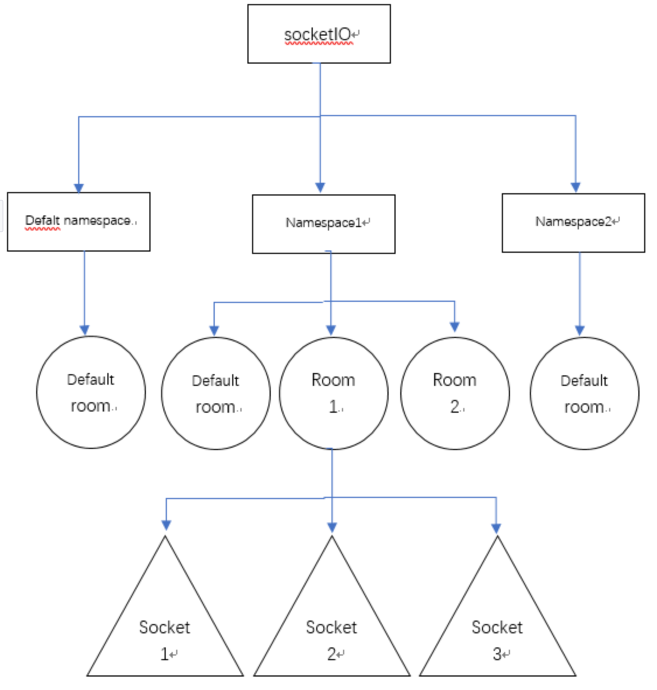

# 第一种，自带

## maven pom

```xml
<!-- netty -->
<dependency>
  <groupId>io.netty</groupId>
  <artifactId>netty-all</artifactId>
  <version>5.0.0.Alpha1</version>
</dependency>
```


## java代码创建socket连接

>  Spring整合Netty、WebSocket的互联网聊天系统，参考：https://segmentfault.com/a/1190000015681145


```java
// messageReceived(ChannelHandlerContext ctx, Object msg)
// msg 可以是FullHttpRequest、WebSocketFrame
FullHttpRequest // 传统的HTTP接入
  //获取url后置参数
  HttpMethod method=req.getMethod();
  String uri=req.getUri();
  QueryStringDecoder queryStringDecoder = new QueryStringDecoder(uri);
  Map<String, List<String>> parameters = queryStringDecoder.parameters();

WebSocketFrame	// WebSocket接入
  CloseWebSocketFrame // 判断是否关闭链路的指令
  PingWebSocketFrame //判断是否ping消息
  TextWebSocketFrame //仅支持文本消息

// 返回数据
TextWebSocketFrame tws = new TextWebSocketFrame("返回内容发送");
ctx.writeAndFlush(tws) // ChannelHandlerContext ctx

```

> HttpServerCodec()：添加HTTP服务器编解码器，用于将数据转换成HTTP协议格式进行传输。
> HttpObjectAggregator(65536)：添加HTTP对象聚合处理器，用于将HTTP请求或响应中的多个消息片段聚合成完整的消息。ChunkedWriteHandler()  // 分块，方便大文件传输，不过实质上都是短的文本数据， 向客户端发送HTML5文件
>
> // 建议以下都自定义
>
> WebSocketServerProtocolHandler("/websocket")：添加WebSocket协议处理器，用于处理WebSocket握手、消息传输等操作。
> 自定义处理：MyWebSocketServerHandler()：添加WebSocket处理器，用于处理客户端与服务器端之间的数据交换，实现自定义的业务逻辑

```java
@Slf4j
@Configuration
public class TcpServer {
    public static final CopyOnWriteArraySet<Channel> WEB_SOCKET_CHANNEL_SET = new CopyOnWriteArraySet<>();
    public static void main(String[] args) {
        TcpClient.start();
        start(new InetSocketAddress(19032));
    }
    public static void start(InetSocketAddress socketAddress) {
        // 主线程组
        NioEventLoopGroup bossGroup = new NioEventLoopGroup(1);
        //工作线程组
        NioEventLoopGroup workGroup = new NioEventLoopGroup(200);
        ServerBootstrap serverBootstrap = new ServerBootstrap()
                .group(bossGroup, workGroup)
                .channel(NioServerSocketChannel.class) //配置客户端的channel类型
		            .option(ChannelOption.SO_BACKLOG, 1024) //配置TCP参数，握手字符串长度设置
    	          .option(ChannelOption.TCP_NODELAY, true) //TCP_NODELAY算法，尽可能发送大块数据，减少充斥的小块数据
       	        .childOption(ChannelOption.SO_KEEPALIVE, true)//开启心跳包活机制，就是客户端、服务端建立连接处于ESTABLISHED状态，超过2小时没有交流，机制会被启动
          	    .childOption(ChannelOption.RCVBUF_ALLOCATOR, new FixedRecvByteBufAllocator(592048))//配置固定长度接收缓存区分配器
                .childHandler(new ChannelInitializer<SocketChannel>() {
                    @Override
                    protected void initChannel(SocketChannel ch) {
                        ChannelPipeline pipeline = ch.pipeline();
                        pipeline.addLast(new HttpServerCodec());
                        pipeline.addLast(new HttpObjectAggregator(64 * 1024));
                        pipeline.addLast(new ChunkedWriteHandler());
                        pipeline.addLast(new WebSocketServerProtocolHandler("/")); // 建议自定义使用
                        pipeline.addLast(new SimpleChannelInboundHandler<TextWebSocketFrame>() {
                            @Override
                            public void channelRead0(ChannelHandlerContext ctx, TextWebSocketFrame msg) throws Exception {
                              // 处理消息
                              System.out.println("Received message: " + msg.text());
                              ctx.channel().writeAndFlush(new TextWebSocketFrame("Server received: " + msg.text()));
                            }

                            @Override
                            public void channelActive(ChannelHandlerContext ctx) throws Exception {
                              // 添加连接
                              System.out.println("Client connected: " + ctx.channel());
                            }

                            @Override
                            public void channelInactive(ChannelHandlerContext ctx) throws Exception {
                              // 断开连接
                              System.out.println("Client disconnected: " + ctx.channel());
                            }

                            @Override
                            public void exceptionCaught(ChannelHandlerContext ctx, Throwable cause) throws Exception {
                              // 异常处理
                              cause.printStackTrace();
                              ctx.close();
                            }
                        });
                    }
                });
        try {
            ChannelFuture future = serverBootstrap.bind(socketAddress).sync();
            System.out.println("开启 port:" + socketAddress.getPort());
            future.channel().closeFuture().sync();
        } catch (InterruptedException e) {
            e.printStackTrace();
        }finally {
            bossGroup.shutdownGracefully();
            workGroup.shutdownGracefully();
        }
    }
}
```

### HTML前端代码

```html
<!-- index.html -->
<!DOCTYPE html>
<html>
<head>
    <meta charset="UTF-8">
    <title>WebSocket Test</title>
</head>
<body>
    <h1>WebSocket Test</h1>
    <div>
        <input type="text" id="message" placeholder="Message">
        <button onclick="send()">Send</button>
    </div>
    <div id="output"></div>
    <script>
        var socket = new WebSocket("ws://localhost:8080/websocket");
        socket.onopen = function(event) {
            console.log("WebSocket opened: " + event);
        };
        socket.onmessage = function(event) {
            console.log("WebSocket message received: " + event.data);
            var output = document.getElementById("output");
            output.innerHTML += "<p>" + event.data + "</p>";
        };
        socket.onclose = function(event) {
            console.log("WebSocket closed: " + event);
        };
        function send() {
            var message = document.getElementById("message").value;
            socket.send(message);
        }
    </script>
</body>
</html>
```


# 第二种(netty-socketio)

## maven

```xml
<dependency>
    <groupId>com.corundumstudio.socketio</groupId>
    <artifactId>netty-socketio</artifactId>
    <version>2.0.6</version>
</dependency>
```

## java使用

### 配置NettySocketioApplication

```java
@SpringBootApplication
@Slf4j
public class NettySocketioApplication implements CommandLineRunner {

    public static void main(String[] args) {
        SpringApplication.run(NettySocketioApplication.class, args);
    }

    @Autowired
    private SocketIOServer socketIOServer;

    @Override
    public void run(String... strings) {
        socketIOServer.start();
        log.info("socket.io启动成功！");
    }
}
```

### 配置NettySocketioConfig

```java
@Configuration
public class NettySocketioConfig {
    /**
     * netty-socketio服务器
     */
    @Bean
    public SocketIOServer socketIOServer() {
      
      	SocketConfig socketConfig = new SocketConfig();
        socketConfig.setTcpNoDelay(true);
        socketConfig.setAcceptBackLog(65535);
        socketConfig.setReuseAddress(true);
      	// 配置
        Configuration config = new Configuration();
        config.setSocketConfig(socketConfig);
				//config.setOrigin("http://www.jd.com");
        config.setMaxFramePayloadLength(1024 * 1024); //允许最大帧长度
        config.setMaxHttpContentLength(1024 * 1024); //允许下最大内容
        config.setBossThreads(1); // boss线程
      	// 允许服务自定义请求与 socket.io 协议不同。在这种情况下，有必要添加自己的处理程序来处理它们以避免挂起连接。默认为false
        config.setAllowCustomRequests(false);
        config.setUpgradeTimeout(10000);
        config.setPingTimeout(15000);
        config.setPingInterval(3000);
        config.setAuthorizationListener(HydraAuthorizationListener.authListener);
        config.setUseLinuxNativeEpoll(properties.getNativeEpoll());

        config.setWorkerThreads(100);
        // config.setStoreFactory(new HazelcastStoreFactory());
      	// config.setAuthorizationListener(handshakeData -> true); // 不做验证
        config.setAuthorizationListener(new AuthorizationListener() {
          public boolean isAuthorized(HandshakeData data) {
            String token = client.getHandshakeData().getSingleUrlParam("Authorization");
            return true;
          }
        });
      	config.setHostname("localhost");
        config.setPort(8080);
        SocketIOServer server = new SocketIOServer(config);
        return server;
    }

    /**
     * 用于扫描netty-socketio的注解，比如 @OnConnect、@OnEvent
     */
    @Bean
    public SpringAnnotationScanner springAnnotationScanner() {
        return new SpringAnnotationScanner(socketIOServer());
    }
}
```

### 消息处理器 MessageEventHandler

> 创建连接
>
> socketIOServer.addConnectListener(client->{})
>
> 断开连接
>
> socketIOServer.addDisconnectListener(client->{})
>
> 接收消息
>
> socketIOServer.addEventListener("messageevent(指令消息)", String.class, (client, data, ackSender) ->{})
>
> 心跳
>
> socketIOServer.addPingListener(client->{})

```java
@Component
@Slf4j
public class MessageEventHandler {

    @Autowired
    private SocketIOServer socketIoServer;

    public static ConcurrentMap<String, SocketIOClient> socketIOClientMap = new ConcurrentHashMap<>();

    /**
     * 客户端连接的时候触发
     *
     * @param client  // socketIOServer.addConnectListener(client->{})
     * socketIOServer.addPingListener(client->{})
     */
    @OnConnect
    public void onConnect(SocketIOClient client) {
        String mac = client.getHandshakeData().getSingleUrlParam("mac");
        //存储SocketIOClient，用于发送消息
        socketIOClientMap.put(mac, client);
        //回发消息
        client.sendEvent("message", "onConnect back");
        log.info("客户端:" + client.getSessionId() + "已连接,mac=" + mac);
    }

    /**
     * 客户端关闭连接时触发
     * @param client  // socketIOServer.addDisconnectListener(client->{})
     */
    @OnDisconnect
    public void onDisconnect(SocketIOClient client) {
        log.info("客户端:" + client.getSessionId() + "断开连接");
    }

    /**
     * 客户端事件
     *
     * @param client  　客户端信息
     * @param request 请求信息
     * @param data    　客户端发送数据
     * socketIOServer.addEventListener("messageevent(指令消息)", String.class, (client, data, ackSender) ->{})
     */
    @OnEvent(value = "messageevent")
    public void onEvent(SocketIOClient client, AckRequest request, Message data) {
        log.info("发来消息：" + data);
        //回发消息
        client.sendEvent("messageevent", "我是服务器都安发送的信息");
        //广播消息
        sendBroadcast();
    }

    /**
     * 广播消息
     */
    public void sendBroadcast() {
        for (SocketIOClient client : socketIOClientMap.values()) {
            if (client.isChannelOpen()) {
                client.sendEvent("Broadcast", "当前时间", System.currentTimeMillis());
            }
        }
    }
}
```

### html 页面

```html
<!doctype html>
<html lang="en">
<head>
    <meta charset="UTF-8">
    <meta name="viewport" content="width=device-width,initial-scale=1, maximum-scale=1, user-scalable=no">
    <title>websocket-java-socketio</title>
    <script src="https://cdn.bootcss.com/socket.io/2.2.0/socket.io.js"></script>
</head>
<body>
<h1>Socket.io Test</h1>
<div><p id="status">Waiting for input</p></div>
<div><p id="message">hello world!</p></div>
<button id="connect" onClick='connect()'/>Connect</button>
<button id="disconnect" onClick='disconnect()'>Disconnect</button>
<button id="send" onClick='send()'/>Send Message</button>
</body>
<script type="text/javascript">
    /**
     * 前端js的 socket.emit("事件名","参数数据")方法，是触发后端自定义消息事件的时候使用的,
     * 前端js的 socket.on("事件名",匿名函数(服务器向客户端发送的数据))为监听服务器端的事件
     **/
    var socket = io.connect("http://localhost:9092?mac=2");
    var firstconnect = true;

    function connect() {
        if(firstconnect) {
            //socket.on('reconnect', function(){ status_update("Reconnected to Server"); });
            //socket.on('reconnecting', function( nextRetry ){ status_update("Reconnecting in "
            //+ nextRetry + " seconds"); });
            //socket.on('reconnect_failed', function(){ message("Reconnect Failed"); });
            //firstconnect = false;
        } else {
            socket.socket.reconnect();
        }
    }

    //监听服务器连接事件
    socket.on('connect', function(){ status_update("Connected to Server"); });
    //监听服务器关闭服务事件
    socket.on('disconnect', function(){ status_update("Disconnected from Server"); });
    //监听服务器端发送消息事件
    socket.on('messageevent', function(data) {
        message(data)
        //console.log("服务器发送的消息是："+data);
    });

    //断开连接
    function disconnect() {
        socket.disconnect();
    }

    function message(data) {
        document.getElementById('message').innerHTML = "Server says: " + data;
    }

    function status_update(txt){
        document.getElementById('status').innerHTML = txt;
    }

    function esc(msg){
        return msg.replace(/</g, '<').replace(/>/g, '>');
    }
    //点击发送消息触发
    function send() {
        console.log("点击了发送消息，开始向服务器发送消息")
        var msg = "我很好的,是的．";
        socket.emit('messageevent', {msgContent: msg});
    };
</script>
</html>
```


## 多渠道namespace连接

> namespace 和room的概念其实用来同一个服务端socket多路复用的。namespace，room和socketio的关系如下:



> 每一个socket（每一个客户端）会属于某一个room，如果没有指定，那么会有一个default的room。这个room又会属于某个namespace，如果没有指定，那么就是默认的namespace /

### Netty-Socketio主要类和方法

### 使用的sdk

#### SocketIOClient

客户端接口，其实现类是NamespaceClient，主要方法如下

```scss
joinRoom() 加入到指定房间。
leaveRoom() 从指定房间离开。
getSessionId()方法，返回由UUID生成的唯一标识。
getAllRooms() 返回当前客户端所在的room名称列表。
sendEvent(eventname,data) 向当前客户端发送事件。
```

#### SocketIOServer

服务端实例，主要方法如下：

```scss
getAllClients() 返回默认名称空间中的所有客户端实例。
getBroadcastOperations() 返回默认名称空间的所有实例组成的广播对象。
getRoomOperations() 返回所有命名空间中指定房间的广播对象，如果命名空间只有一个，该方法到可以大胆使用。
getClient(uid) 返回默认名称空间的指定客户端。
getNamespace() 返回指定名称的命名空间。
```

#### Namespace

命名空间。netty-socketio忠实的重现了socketio的server–>namespace–>room三层嵌套关系。

从NamespacesHub的getRoomClients方法可以知道，SocketIOServer的getRoomOperations方法返回的是所有namespace中指定room中的客户端实例。而不是指定命名空间或者默认命名空间的，使用该方法的时候要小心。

###### 如果要获取指定命名空间的指定room中的客户端，一定要先拿到指定namespace对象。

Namespace中的主要方法如下：

```scss
getAllClients() 获得本namespace中的所有客户端。
getClient() 获得指定id客户端对象。
getRoomClients(room) 获得本空间中指定房间中的客户端。
getRooms() 获得本空间中的所有房间。
getRooms(client) 获得指定客户端所在的房间列表。
leave(room,uuid) 将指定客户端离开指定房间，如果房间中已无客户端，删除该房间。
getBroadcastOperations() 返回针对空间中所有客户端的广播对象。
getRoomOperations(room) 返回针对指定房间的广播对象。
```

#### BroadcastOperations

广播操作对象，通过对Namespace的了解我们知道，BroadcastOperations都是命名空间以指定room中的clients列表为参数创建的。
BroadcastOperations中最通用的方法便是sendEvent方法，该方法遍历clients，通过执行客户端的send方法实现广播目的。也可以设定一个排除对象，当然用于排除发送者自己了。

```scss
sendEvent(eventname,data) 向本广播对象中的全体客户端发送广播。
sendEvent(eventname,excludeSocketIOClient,data) 排除指定客户端广播。
```

### 案例使用

参考博客：https://blog.csdn.net/u011943534/article/details/115232123

> socket.io.port=8974 
>
> #命名空间，多个以逗号分隔，每个空间需要对应一个Bean的名字，XXXMessageEventHandler,如chatMessageEventHandler socket.io.namespaces=/chat,/test
>
> /chat对应，bean名字：chatMessageEventHandler 
>
> /test对应，bean名字：testMessageEventHandler 

```java
/@Configuration
public class SocketioConfig {
    @Value("${socket.io.port:8974}")
    private int socketIoPort;
    @Value("${socket.io.namespaces}")
    private String[] namespaces;

    @Bean
    public SocketIOServer socketIOServer() {
        com.corundumstudio.socketio.Configuration config =
                new com.corundumstudio.socketio.Configuration();
        config.setOrigin(null);   // 注意如果开放跨域设置，需要设置为null而不是"*"
        config.setPort(socketIoPort);
        config.setSocketConfig(new SocketConfig());
        config.setWorkerThreads(100);
        config.setAuthorizationListener(handshakeData -> true);
        //允许最大帧长度
        config.setMaxFramePayloadLength(1024 * 1024);
        //允许下最大内容
        config.setMaxHttpContentLength(1024 * 1024);
        final SocketIOServer server = new SocketIOServer(config);
      
      	// 增加namespace
        Optional.ofNullable(namespaces).ifPresent(nss ->
                Arrays.stream(nss).forEach(server::addNamespace));
//        server.start();
        return server;

    }
		// 注入OnConnect，OnDisconnect，OnEvent注解。 不写的话Spring无法扫描OnConnect，OnDisconnect等注解
    @Bean
    public SpringAnnotationScanner springAnnotationScanner(SocketIOServer socketIOServer){
        return new SpringAnnotationScanner(socketIOServer);
    }
}
```

#### 启动server

```java
@Component
public class ServerRunner implements CommandLineRunner {
    @Autowired(required = false)
    private SocketIOServer socketIOServer;

    @Value("${socket.io.namespaces}")
    private String[] namespaces;

    @Override
    public void run(String... args) throws Exception {
        if (socketIOServer != null) {
          	// 默认连接url处理如下：
            /*Optional.ofNullable(SpringService.getBean("messageEventHandler"))
                    .ifPresent(handler -> socketIOServer.getNamespace("/").addListeners(handler));*/
          	// 配置注入
            Optional.ofNullable(namespaces).ifPresent(nss ->
                    Arrays.stream(nss).forEach(ns -> {
                        //获取命名空间
                        SocketIONamespace socketIONamespace = socketIOServer.getNamespace(ns);
                        //获取期待的类名
                        String className = ns.substring(1) + "MessageEventHandler";
                        try {
                            Object bean = SpringService.getBean(className);
                            Optional.ofNullable(bean).ifPresent(socketIONamespace::addListeners);
                        } catch (Exception e) {
                        }
                    }));
          	// 也可以手动配置如下
						//socketIOServer.getNamespace("/chat").addListeners(messageEventHandler);
            socketIOServer.start();
          	// 页面连接如下：
          	// http://localhost:8974/chat?Authorization=
          	// http://localhost:8974/test?Authorization=
        }
    }
}

```

#### handler处理

```java
@Component(value= "chatMessageEventHandler")
@ConditionalOnClass(SocketIOServer.class)
@Slf4j
public class ChatMessageEventHandler implements IEventHandler {
    private final SocketIOServer socketIOServer;
    private static int testPushCount = 0;
    private String namespace = "/chat";

    public ChatMessageEventHandler(SocketIOServer socketIOServer) {
        this.socketIOServer = socketIOServer;
    }
  
    @Override
    @OnConnect
    public void onConnect(SocketIOClient client) {
      // 登陆验证
      // String token = client.getHandshakeData().getSingleUrlParam("Authorization");
      // 通过验证：加入缓存map里面
      // 没有验证通过，端口连接 client.disconnect(); 
      //   HandshakeData handshakeData = client.getHandshakeData();
	    //   String roomId = handshakeData.getSingleUrlParam("roomId");
			//   client.joinRoom(roomId);
        connect(client);
    }
  
    @Override
    @OnDisconnect
    public void onDisConnect(SocketIOClient client) {
      	// 断开连接，移除缓存map里面client
        disconnect(client);
    }

    @OnEvent(value = "aaaa")
    public void onEvent(SocketIOClient client, AckRequest request, String data) {
        log.debug("发来消息：" + data);
        UUID sessionId = client.getSessionId();
        socketIOServer.getNamespace(namespace).getClient(sessionId).sendEvent("bbbb", "点对点消息的返回" + Math.random());
    }

    /**
     * 测试无限推送
     * */
    @OnEvent(value = "testPush")
    public void onTestPushEvent(SocketIOClient client, AckRequest request, String data) {
        UUID sessionId = client.getSessionId();
        Runnable runnable = () -> {
            testPushCount++;
            int thisTestPushCount = testPushCount;
            for (; ; ) {
                if (thisTestPushCount < testPushCount) {
                    break;
                }
                socketIOServer.getNamespace(namespace).getClient(sessionId).sendEvent("testPush", RandomStringUtils.randomStr(1024 * 200));
                try {
                    TimeUnit.MILLISECONDS.sleep(900);
                } catch (InterruptedException e) {
                    e.printStackTrace();
                }
            }
        };
        new Thread(runnable).start();
    }

    /**
     * 测试加入房间
     * */
    @OnEvent(value = "joinRoom")
    public void onTestJoinRoomEvent(SocketIOClient client, AckRequest request, String data) {
      	// 离开房间，data是房间编号 room1
        client.leaveRoom(data);
      	// 加入房间
        client.joinRoom(data);
    }

    /**
     * 测试房间发送信息(类似于订阅式广播消息)
     * */
    @OnEvent(value = "testRoom")
    public void onTestRoomEvent(SocketIOClient client, AckRequest request, String data) {
        socketIOServer.getNamespace(namespace).getRoomOperations("room1").sendEvent("testRoom", "房间里的消息" + Math.random());
    }

    /**
     * 测试发送广播消息
     * */
    @OnEvent(value = "testBroadcast")
    public void onTestBroadcastEvent(SocketIOClient client, AckRequest request, String data) {
      	// 广播所有的连接
        socketIOServer.getNamespace(namespace).getBroadcastOperations().sendEvent("testBroadcast", "广播的消息" + Math.random());
    }

}
```

