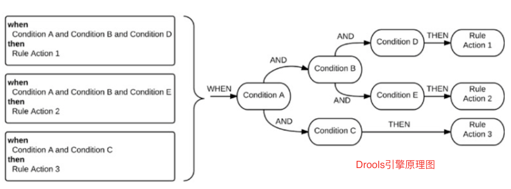

## Drools

> https://github.com/kiegroup/drools

## maven

```xml
<dependency>
  <groupId>org.drools</groupId>
  <artifactId>drools-core</artifactId>
  <version>7.37.0.Final</version>
</dependency>
<dependency>
  <groupId>org.drools</groupId>
  <artifactId>drools-compiler</artifactId>
  <version>7.37.0.Final</version>
</dependency>
<dependency>
  <groupId>org.drools</groupId>
  <artifactId>drools-decisiontables</artifactId>
  <version>7.37.0.Final</version>
</dependency>
<dependency>
  <groupId>org.drools</groupId>
  <artifactId>drools-templates</artifactId>
  <version>7.37.0.Final</version>
</dependency>

<!-- 打包时候，把资源也包含在其中 -->
<build>
  <sourceDirectory>src</sourceDirectory>
  <resources>
    <resource>
      <directory>src/main/resources</directory>
      <includes>
        <include>META-INF/kmodule.xml</include>
        <include>com/tbp/drool/rules/customer-category.drl</include>
      </includes>
      <targetPath>.</targetPath>
    </resource>
  </resources>
</build>
```

## Drools架构

> Drools架构的执行步骤如下：
>
> - 将规则加载到规则库中，该规则库始终保持可用。
> - 事实（Facts）被保存到工作内存(Working Memory)中，它们可以被修改或撤回。
> - Pattern Matcher将新的或现有的事实与规则进行匹配， 这个过程称为模式匹配，该过程由规则引擎执行。
> - agenda在冲突解决策略的帮助下管理冲突规则的执行顺序。

#### 规则引擎由三部分

- 事实（Fact）：就是用户输入的已经事实，可以理解为推理前的已知对象。
- LHS(Left Hand Side)：可以理解为规则执行需要满足的条件。
- RHS(Right Hand Sike)：可以理解为规则执行后的返回对象



两个重要模块：

- 规则管理：可以理解为逻辑上管理规则，主要涉及规则、事实对象和规则集三个实体。涉及到规则变更时，最好对规则加个版本，可通过规则版本控制，可以平滑灰度地方式改变规则，也便于更有信心在测试规则正确性。
- 规则执行：通过规则库数据，通过规则引擎的规则解析、规则编译将可执行代码缓存起来，避免每次和DB交互，然后每次规则的变更也通过ZK或者DCC实时通知给规则执行器。规则执行器的实现方式，可以多种多样，不依赖于规则库的存储方式，可以根据需求，选用Drools、Aviator等第三方引擎，甚至可以基于ANTLR定制

## 使用案例

```java
private static final String RULES_CUSTOMER_RULES_DRL = "rules/customer-category.drl"
@Bean
public KieContainer kieContainer() { 
  KieServices kieServices = KieServices.Factory.get();
  // 使用代码创建 kmodule.xml 
  // KieResources resources = kieServices.getResources();
  // KieModuleModel kieModuleModel = kieServices.newKieModuleModel();//1
	// KieBaseModel baseModel = kieModuleModel.newKieBaseModel(
	//                "FileSystemKBase").addPackage("rules");//2 包
  // baseModel.newKieSessionModel("FileSystemKSession");//3
  // KieFileSystem fileSystem = kieServices.newKieFileSystem();
	// String xml = kieModuleModel.toXML();
  // System.out.println(xml);//4
  // fileSystem.writeKModuleXML(xml);//5
  
  KieFileSystem kieFileSystem = kieServices.newKieFileSystem();
  kieFileSystem.write(ResourceFactory.newClassPathResource(RULES_CUSTOMER_RULES_DRL));
  // fileSystem.write("src/main/resources/rules/customer-rule.drl", 
  //              resources.newClassPathResource("rules/customer-category.drl"));
  KieBuilder kb = kieServices.newKieBuilder(kieFileSystem);
  kb.buildAll();
  KieModule kieModule = kb.getKieModule();
  return kieServices.newKieContainer(kieModule.getReleaseId());
}

// 执行规则
CustomerType customerType = new CustomerType();
// 从drl文件读取规则
// KieContainer kContainer = ks.getKieClasspathContainer();
// KieSession kieSession = kContainer.newKieSession("drl规则文件名");

KieSession kieSession = kieContainer.newKieSession();
kieSession.setGlobal("customerType", customerType);
kieSession.insert(customerRequest);
kieSession.fireAllRules();
kieSession.dispose();
```

### src/main/resources/rules

> customer-category.drl

```java

// 默认没有配置
// package com.tbp.drools.rules // 指定包名称
import com.praveen.drools.example.model.CustomerRequest
global com.praveen.drools.example.model.CustomerType customerType;

dialect "mvel"

rule "Categorize customer based on age"
    when
        CustomerRequest(age < 20)
    then
        customerType.setCustomerType(CustomerCategory.KIDS);
end
```

## 文件路径自定义加载

```java
KieFileSystem kieFileSystem = kieServices.newKieFileSystem();
// spring 扫描文件
ResourcePatternResolver resourcePatternResolver = new PathMatchingResourcePatternResolver();
Resource[] files = resourcePatternResolver.getResources("classpath*:rules/*.drl");
String path = null;
for (Resource file : files) {
  path = "rules/" + file.getFilename();
  kieFileSystem.write(ResourceFactory.newClassPathResource(path, "UTF-8"));
}

KieRepository kieRepository = kieServices.getRepository();
kieRepository.addKieModule(kieRepository::getDefaultReleaseId);
KieBuilder kieBuilder = kieServices.newKieBuilder(kieFileSystem);
kieBuilder.buildAll();
kieContainer = kieServices.newKieContainer(kieRepository.getDefaultReleaseId());
```

## 文本自定义写入

```java
// String path = "src/main/resources/rules/address.drl";
String path = "src/main/resources/" + RULE_PATH + "/" + drlName + ".drl";

KieFileSystem kieFileSystem = kieServices.newKieFileSystem();
kfs.write(path, "package plausibcheck.adress\n\n import com.neo.drools.model.Address;\n import com.neo.drools.model.fact.AddressCheckResult;\n\n rule \"Postcode 6 numbers\"\n\n    when\n  then\n        System.out.println(\"打印日志：更新rules成功!\");\n end");

Results results = kieBuilder.getResults();
KieBuilder kieBuilder = kieServices.newKieBuilder(kieFileSystem).buildAll();
kieContainer = kieServices.newKieContainer(kieServices.getRepository().getDefaultReleaseId());
```

### [drools动态增加、修改、删除规则 ](https://www.cnblogs.com/huan1993/p/16319931.html)

### 第二种方式(待补充)

> /src/resources/META-INF/kmodule.xml

```xml
<?xml version="1.0" encoding="UTF-8"?>
<kmodule xmlns="http://jboss.org/kie/6.0.0/kmodule">
    <kbase name="rules" packages="com.tbp.drools.rules">
        <ksession name="myAgeSession"/>
    </kbase>
</kmodule>
```

> 默认读取 myAgeSession

```java
// 默认导入：/src/resources/META-INF/kmodule.xml 文件


CustomerType customerType = new CustomerType();
container = kieServices.getKieClasspathContainer();
KieSession kieSession = container.newKieSession("myAgeSession");
kieSession.setGlobal("customerType", customerType);
kieSession.insert(customerRequest);
kieSession.fireAllRules();
kieSession.dispose();
```

