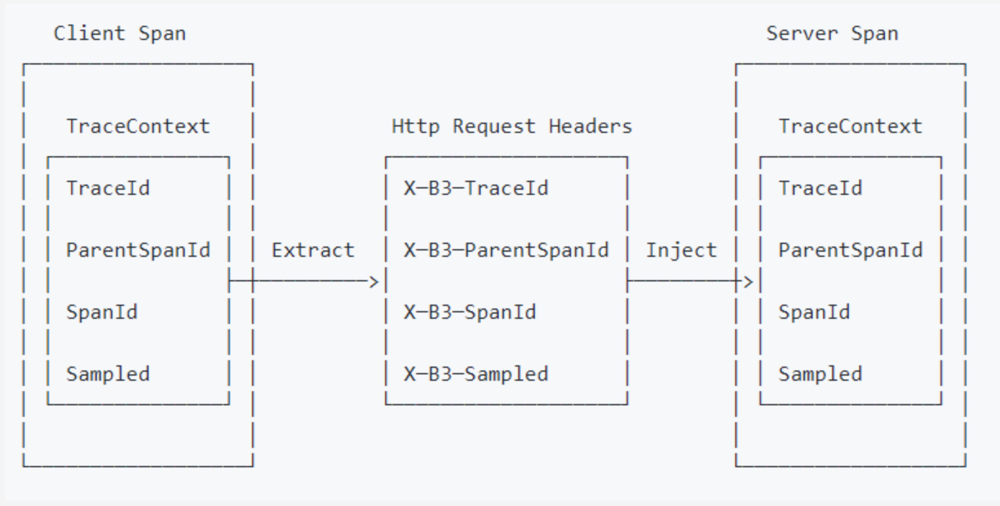

## 需要的dependencyManagement

```xml
<dependencies>
  <dependency>
    <groupId>org.springframework.cloud</groupId>
    <artifactId>spring-cloud-starter-sleuth</artifactId>
  </dependency>
</dependencies>

<dependencyManagement>
  <dependencies>
    <dependency>
      <groupId>io.zipkin.brave</groupId>
      <artifactId>brave-bom</artifactId>
      <version>5.8.0</version>
      <type>pom</type>
      <scope>import</scope>
    </dependency>
    <dependency>
      <groupId>org.springframework.cloud</groupId>
      <artifactId>spring-cloud-dependencies</artifactId>
      <version>${spring-cloud.version}</version>
      <type>pom</type>
      <scope>import</scope>
    </dependency>
    <dependency>
      <groupId>org.springframework.boot</groupId>
      <artifactId>spring-boot-dependencies</artifactId>
      <version>${spring-boot.version}</version>
      <type>pom</type>
      <scope>import</scope>
    </dependency>
  </dependencies>
</dependencyManagement>
```

## spring bean 配置

```xml
<dependency>
    <groupId>io.zipkin.brave</groupId>
    <artifactId>brave-spring-beans</artifactId>
</dependency>


<bean id="sender" class="zipkin2.reporter.beans.OkHttpSenderFactoryBean">
    <property name="endpoint" value="http://localhost:9411/api/v2/spans"/>
</bean>

<bean id="tracing" class="brave.spring.beans.TracingFactoryBean">
    <property name="localServiceName" value="my-service"/>
    <property name="spanReporter">
        <bean class="zipkin2.reporter.beans.AsyncReporterFactoryBean">
            <property name="sender" ref="sender"/>
        </bean>
    </property>
    <property name="currentTraceContext">
        <bean class="brave.spring.beans.CurrentTraceContextFactoryBean">
            <property name="scopeDecorators" ref="correlationScopeDecorator"/>
        </bean>
    </property>
</bean>

<!-- 配置slf4j  -->
<bean id="correlationScopeDecorator" class="brave.spring.beans.CorrelationScopeDecoratorFactoryBean">
    <property name="builder">
        <bean class="brave.context.slf4j.MDCScopeDecorator" factory-method="newBuilder"/>
    </property>
</bean>
<!-- 配置 HTTP 协议链路追踪 -->
<bean id="httpTracing" class="brave.spring.beans.HttpTracingFactoryBean">
    <property name="tracing" ref="tracing"/>
</bean>

```


## 参考博客

```
brave使用： https://www.freesion.com/article/8770637784/

https://codeleading.com/article/12572317349/
```


### 常用的组件

```xml
<dependency>
  <groupId>io.zipkin.brave</groupId>
  <artifactId>brave-instrumentation-spring-web</artifactId>
</dependency>
<!-- Adds the MVC class and method names to server spans -->
<dependency>
  <groupId>io.zipkin.brave</groupId>
  <artifactId>brave-instrumentation-spring-webmvc</artifactId>
</dependency>
<!-- Instruments the underlying HttpClient requests that call the backend -->
<dependency>
  <groupId>io.zipkin.brave</groupId>
  <artifactId>brave-instrumentation-httpclient</artifactId>
</dependency>
<!-- Integrates so you can use log patterns like %X{traceId}/%X{spanId} -->
<dependency>
  <groupId>io.zipkin.brave</groupId>
  <artifactId>brave-context-slf4j</artifactId>
</dependency>
<!-- The below are needed to report traces to http://localhost:9411/api/v2/spans -->
<dependency>
  <groupId>io.zipkin.brave</groupId>
  <artifactId>brave</artifactId>
</dependency>
<dependency>
  <groupId>io.zipkin.reporter2</groupId>
  <artifactId>zipkin-sender-okhttp3</artifactId>
</dependency>
```


### 自定义配置(1)

```java
# 发给zipkin的服务器名称
zipkin.serviceName=service8081
# zipkin的url地址
zipkin.url=http://localhost:9411
# 连接超时时间
zipkin.connectTimeout=6000
# 读取超时时间
zipkin.readTimeout=6000
# 上传 span 的间隔时间
zipkin.flushInterval=1
# 是否启动压缩
zipkin.compressionEnabled=true
# 采样率，默认为0.1，值越大收集越及时，但性能影响也越大
zipkin.samplerRate=1

/**
 * 配置Span收集器 设置收集器的详细参数，包含超时时间、上传span间隔、以及配置采集率等，进而对收集器进行初始化。 
 */
@Configuration
public class SpanCollectorConfig {
    // zipkin的url地址
    @Value("${zipkin.url}")
    private String url;
    // 发给zipkin的服务器名称
    @Value("${zipkin.serviceName}")
    private String serviceName;
    // 连接超时时间
    @Value("${zipkin.connectTimeout}")
    private int connecTimeout;
    // 是否启动压缩
    @Value("${zipkin.compressionEnabled}")
    private boolean compressionEnabled;
    // 上传 span 的间隔时间
    @Value("${zipkin.flushInterval}")
    private int flushInterval;
    // 读取超时时间
    @Value("${zipkin.readTimeout}")
    private int readTimeout;
    // 采样率，默认为0.1，值越大收集越及时，但性能影响也越大
    @Value("${zipkin.samplerRate}")
    private float samplerRate;
    
    /**
     * 配置 span 收集器
     */
    @Bean
    public SpanCollector spanCollector() {
        Config config = Config.builder()
                //连接超时时间
                .connectTimeout(connecTimeout)
                //是否启动压缩
                .compressionEnabled(compressionEnabled)
                //上传 span 的间隔时间
                .flushInterval(flushInterval)
                //读取超时时间
                .readTimeout(readTimeout).build();
                //url:zipkin的url地址
        return HttpSpanCollector.create(url, config, new EmptySpanCollectorMetricsHandler());
    }
    
    /**
     * 配置采集率
     * 作为各调用链路，只需要负责将指定格式的数据发送给zipkin
     */
    @Bean
    public Brave brave(SpanCollector spanCollector) {
        //被采集的服务名称
        Builder builder = new Builder(serviceName);
        //采集器
        builder.spanCollector(spanCollector)
                //采样率，默认为0.1，值越大收集越及时，但性能影响也越大
                .traceSampler(Sampler.create(samplerRate)).build();
        return builder.build();
    }
    
    /**
     * @Description: 设置server的（服务端收到请求和服务端完成处理，并将结果发送给客户端）过滤器
     * @return: 过滤器
     */
    @Bean
    public BraveServletFilter braveServletFilter(Brave brave) {
        BraveServletFilter filter = new BraveServletFilter(brave.serverRequestInterceptor(),
                brave.serverResponseInterceptor(), new DefaultSpanNameProvider());
        return filter;
    }
    
    /**
     * @Description: 设置client的 rs（表示服务端收到请求）和cs（表示客户端发起请求）的拦截器
     * @return: OkHttpClient 返回请求实例
     */
    @Bean
    public OkHttpClient okHttpClient(Brave brave) {
        OkHttpClient httpClient = new OkHttpClient.Builder()
                .addInterceptor(new BraveOkHttpRequestResponseInterceptor(brave.clientRequestInterceptor(),
                        brave.clientResponseInterceptor(), new DefaultSpanNameProvider()))
                .build();
        return httpClient;
    }
}
```


### 自定义配置(2)

```java
/**
 * This adds tracing configuration to any web mvc controllers or rest template
 * clients.
 */
@Configuration
@Import(SpanCustomizingAsyncHandlerInterceptor.class)
@AutoConfigureAfter(LoadBalancerAutoConfiguration.class) //①要考虑其他的拦截器，比如负载均衡的拦截器
public class TracingConfiguration extends WebMvcConfigurerAdapter {
/** Configuration for how to send spans to Zipkin */
@Value("${spring.zipkin.baseUrl:http://127.0.0.1:9411/api/v2/spans}")
    private String baseUrl;
    
  	@Value("${spring.zipkin.turnOn:false}")
    private boolean turnOn;
    
  	@Value("${spring.application.name}")
    private String serviceName;
    
  	@Bean
    Sender sender() {
        return OkHttpSender.create(baseUrl);
    }
  
    /** Configuration for how to buffer spans into messages for Zipkin */
    @Bean
    AsyncReporter<Span> spanReporter() {
        return AsyncReporter.create(sender());
    }
  
    /** Controls aspects of tracing such as the name that shows up in the UI */
    @Bean
    Tracing tracing() {
        return Tracing.newBuilder()
          .localServiceName(serviceName)
          .propagationFactory(ExtraFieldPropagation.newFactory(B3Propagation.FACTORY, "user-name"))
          .currentTraceContext(ThreadLocalCurrentTraceContext
                               .newBuilder()
                               .addScopeDecorator(MDCScopeDecorator.create())
                               .build())
          .spanReporter(spanReporter())
          .build();
    }
  
    /**
     * decides how to name and tag spans. By default they are named the same as the
     * http method.
     */
    @Bean
    HttpTracing httpTracing(Tracing tracing) {
        return HttpTracing.create(tracing);
    }
  
    /** Creates client spans for http requests */
    // We are using a BPP as the Frontend supplies a RestTemplate bean prior to this
    // configuration
    @Bean
    BeanPostProcessor connectionFactoryDecorator(final BeanFactory beanFactory) {
        if (turnOn) {
           return new BeanPostProcessor() {
               @Override
               public Object postProcessBeforeInitialization(Object bean, String beanName) {
                   return bean;
               }
               @Override
               public Object postProcessAfterInitialization(Object bean, String beanName) {
                   if (!(bean instanceof RestTemplate))
                       return bean;
                   RestTemplate restTemplate = (RestTemplate) bean;
                   List<ClientHttpRequestInterceptor> interceptors = new ArrayList<>(restTemplate.getInterceptors());
                   //② 如果之前添加了 loadBalancerInterceptor负载均衡拦截器或者其他的拦截器，这里只能在原来的基础上添加新的拦截器，属于Spring AOP设计。
                   //③不放第一个位置也行
                   interceptors.add(0, getTracingInterceptor());
                   restTemplate.setInterceptors(interceptors);
                   return bean;
               }
               // Lazy lookup so that the BPP doesn't end up needing to proxy anything.
               ClientHttpRequestInterceptor getTracingInterceptor() {
                   return TracingClientHttpRequestInterceptor.create(beanFactory.getBean(HttpTracing.class));
               }
           };
        } else {
           return null;
        }
    }
  
    /** Creates server spans for http requests */
    @Bean
    Filter tracingFilter(HttpTracing httpTracing) {
        return TracingFilter.create(httpTracing);
    }
  
    @Autowired
    SpanCustomizingAsyncHandlerInterceptor webMvcTracingCustomizer;
  
    /** Decorates server spans with application-defined web tags */
    @Override
    public void addInterceptors(InterceptorRegistry registry) {
        registry.addInterceptor(webMvcTracingCustomizer);
    }
}
```

## 本地答应不上报

要在 Java 应用程序中实现分布式链路追踪，你可以使用 Brave 框架。以下是一个简单的示例，演示了如何在 Java 应用程序中使用 Brave 框架进行分布式链路追踪：

首先，你需要在你的项目中引入 Brave 相关的依赖，通常是通过 Maven 或 Gradle 进行引入：

```xml
<dependency>
    <groupId>io.zipkin.brave</groupId>
    <artifactId>brave</artifactId>
    <version>5.12.5</version>
</dependency>
<dependency>
    <groupId>io.zipkin.reporter2</groupId>
    <artifactId>zipkin-reporter</artifactId>
    <version>2.15.0</version>
</dependency>
```

接下来，你可以创建一个配置类来配置 Brave 框架：

```java
import brave.Tracing;
import brave.context.log4j2.ThreadContextScopeDecorator;
import brave.propagation.B3Propagation;
import brave.propagation.CurrentTraceContext;
import brave.propagation.TraceContext;
import brave.sampler.Sampler;
import org.springframework.context.annotation.Bean;
import org.springframework.context.annotation.Configuration;

@Configuration
public class BraveConfig {

    @Bean
    public Tracing tracing() {
        return Tracing.newBuilder()
                .localServiceName("your-service-name")
                .sampler(Sampler.ALWAYS_SAMPLE)
                .propagationFactory(B3Propagation.FACTORY)
                .currentTraceContext(CurrentTraceContext.Default.create())
                .addScopeDecorator(ThreadContextScopeDecorator.create())
                .build();
    }
}
```

在这个配置类中，我们创建了一个名为 `tracing` 的 Bean，用于配置 Brave 框架的追踪信息。

最后，你可以在你的业务代码中使用 Brave 框架提供的 API 来创建和管理追踪信息。例如：

```java
import brave.Span;
import brave.Tracer;
import org.springframework.beans.factory.annotation.Autowired;
import org.springframework.stereotype.Service;

@Service
public class YourService {

    @Autowired
    private Tracer tracer;

    public void performBusinessOperation() {
        // 创建一个新的 span
        Span newSpan = tracer.newTrace().name("your-operation").start();

        try {
            // 在这里执行你的业务逻辑
            // ...

            // 结束 span
            newSpan.finish();
        } catch (Exception e) {
            // 如果发生异常，记录错误信息到 span
            newSpan.error(e);
        }
    }
}
```

在这个示例中，我们使用了 Brave 框架的 `Tracer` 来创建一个新的 span，并在业务逻辑中执行操作。在实际的业务代码中，你还需要在合适的地方创建和管理 span，以便进行分布式链路追踪。

希望这个示例能够帮助你开始在 Java 应用程序中使用 Brave 框架实现分布式链路追踪！

## 举例

### 自定义发送

```java
Span currentSpan = Tracing.currentTracer().currentSpan(); // 获取当前 span
if (currentSpan != null) {
    String traceId = currentSpan.context().traceIdString();
    String spanId = currentSpan.context().spanIdString();
}

// 自定义 tag
Span currentSpan = Tracing.currentTracer().currentSpan(); // 获取当前 span
if (currentSpan != null) {
    currentSpan.tag("biz.k1", "v1").tag("biz.k2", "v2");
}

// 创建新 span
// 如果使用了某些组件访问外部服务，找不到官方或开源的 instrumentation，或者有一个本地的耗时任务，也想通过创建一个 span 来记录任务的运行时间和结果，可以自己创建一个新的 span
ScopedSpan span = Tracing.currentTracer().startScopedSpan("span name");
try {
    // 访问外部服务 或 本地耗时任务
} catch (Exception e) {
    span.error(e); // 任务出错
    throw e;
} finally {
    span.finish(); // 必须记得结束 span
}

// 另外一种方式
Tracer tracer = Tracing.currentTracer();
Span span = tracer.nextSpan().name("span name").start();
try (Tracer.SpanInScope ws = tracer.withSpanInScope(span)) { // SpanInScope 对象需要关闭
    // 访问外部服务 或 本地耗时任务
} catch (Exception e) {
    span.error(e); // 任务出错
    throw e;
} finally {
    span.finish(); // 必须记得结束 span
}


//跨线程追踪
Runnable runnable = ...; // 原始的 Runnable 对象
Runnable tracingRunnable = Tracing.current().currentTraceContext().wrap(runnable); // 包装过的 Runnable 对象

// 使用包装过的线程池
ExecutorService service = ....;
ExecutorService proxiedService = tracing.currentTraceContext().executorService(service);

```

### 基础使用

#### 单向跟踪

有时你需要创建一个异步操作，有Request，但是没有Response.在通常的RPC tracing中，使用`span.finish()`表明接受到Response。在单向tracing中，使用`span.flush()`，因为你不期望响应。

```java
// 请求类: request
// start a new span representing a client request
oneWaySend = tracer.newSpan(parent).kind(Span.Kind.CLIENT);

// Add the trace context to the request, so it can be propagated in-band
tracing.propagation().injector(Request::addHeader)
                     .inject(oneWaySend.context(), request);

// 执行请求
request.execute();

// start the client side and flush instead of finish
oneWaySend.start().flush();
```

#### server处理单向跟踪

```java
// pull the context out of the incoming request
extractor = tracing.propagation().extractor(Request::getHeader);

// convert that context to a span which you can name and add tags to
oneWayReceive = nextSpan(tracer, extractor.extract(request))
    .name("process-request")
    .kind(SERVER)
    ... add tags etc.

// start the server side and flush instead of finish
oneWayReceive.start().flush();

// you should not modify this span anymore as it is complete. However,
// you can create children to represent follow-up work.
next = tracer.newSpan(oneWayReceive.context()).name("step2").start();
```

### 采样

#### 声明式采样

```java
// derives a sample rate from an annotation on a java method
DeclarativeSampler<Traced> sampler = DeclarativeSampler.create(Traced::sampleRate);

// java aop
@Around("@annotation(traced)")
public Object traceThing(ProceedingJoinPoint pjp, Traced traced) throws Throwable {
  Span span = tracing.tracer().newTrace(sampler.sample(traced))...
  try {
    return pjp.proceed();
  } finally {
    span.finish();
  }
}
```

#### 自定义采样

```java
// tracing.tracer().newTrace(sampler.sample(traced))
Span newTrace(Request input) {
  SamplingFlags flags = SamplingFlags.NONE;
  if (input.url().startsWith("/experimental")) {
    flags = SamplingFlags.SAMPLED;
  } else if (input.url().startsWith("/static")) {
    flags = SamplingFlags.NOT_SAMPLED;
  }
  return tracer.newTrace(flags);
}
```

### B3 Propagation 传递、

#### 客户端

```java
// configure a function that injects a trace context into a request
injector = tracing.propagation().injector(Request.Builder::addHeader);

// before a request is sent, add the current span's context to it
injector.inject(span.context(), request);
```

#### 服务端

```java
// configure a function that extracts the trace context from a request
extracted = tracing.propagation().extractor(Request::getHeader);

// when a server receives a request, it joins or starts a new trace
span = tracer.nextSpan(extracted, request);
```

#### 传播额外的字段

```java
// when you initialize the builder, define the extra field you want to propagate
tracingBuilder.propagationFactory(
  ExtraFieldPropagation.newFactory(B3Propagation.FACTORY, "x-vcap-request-id")
);

// later, you can tag that request ID or use it in log correlation
requestId = ExtraFieldPropagation.current("x-vcap-request-id");
```

#### 提取PROPAGATED的上下文

```
TraceContext.Extractor<C> 从传入请求或消息中读取跟踪标识符和采样状态。carrier通常是一个请求对象或头信息（headers）。
上面方式可以用于像HttpServletHandler这样的标准工具，也可用于自定义RPC或消息传递代码。
TraceContextOrSamplingFlags通常只用于Tracer.nextSpan(extracted),除非你在客户端和服务端之间共享spanID。
```

### span内容

```json
// 每个服务的处理跟踪是一个Span，可以理解为一个基本的工作单元，如下：
//一个Span
{
 
  //标记一次请求的跟踪，相关的Spans都有相同的traceId 
  "traceId": "bd7a977555f6b982",
  //span的名称，一般是接口方法的名称
  "name": "get-traces",
  //span id
  "id": "ebf33e1a81dc6f71",
  //当前Span的父Span id，通过parentId来保证Span之间的依赖关系，如果没有parentId，表示当前Span为根Span；
  "parentId": "bd7a977555f6b982",
  //Span创建时的时间戳。单位是微秒，可能服务器有时钟偏差导致时间错误
  "timestamp": 1458702548478000,
  //持续时间,单位是微秒 
  "duration": 354374,
  //注解用于及时记录事件；有一组核心注解用于定义RPC请求的开始和结束 
  "annotations": [
    {
      "endpoint": {
        "serviceName": "zipkin-query",
        "ipv4": "192.168.1.2",
        "port": 9411
      },
      "timestamp": 1458702548786000,
      "value": "cs"
    }
  ],
  //二进制注释，旨在提供有关RPC的额外信息。
  "binaryAnnotations": [
    {
      "key": "lc",
      "value": "JDBCSpanStore",
      "endpoint": {
        "serviceName": "zipkin-query",
        "ipv4": "192.168.1.2",
        "port": 9411
      }
    }
  ]
}

```

### 单元测试

```java
ConcurrentLinkedDeque<Span> spans = new ConcurrentLinkedDeque<>();

Tracing tracing = Tracing.newBuilder()
  .currentTraceContext(new StrictCurrentTraceContext())
  .spanReporter(span -> spans.add(span))
  .build();


Tracing current = Tracing.current();
if (current != null) current.close();

```

