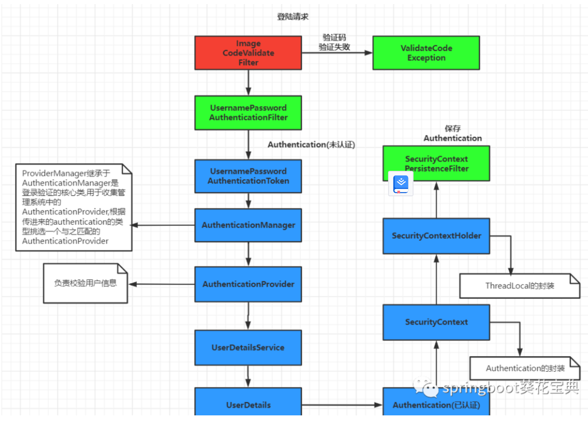
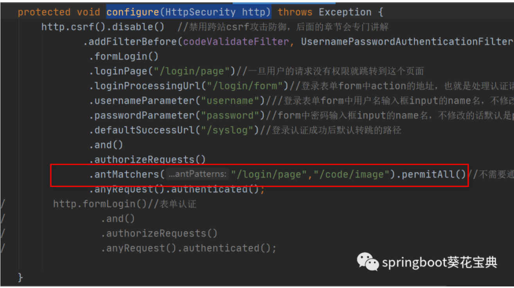
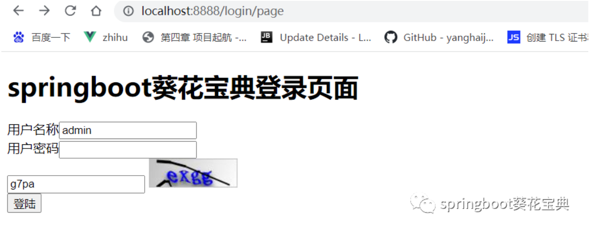
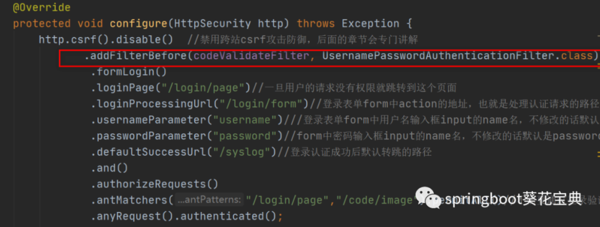
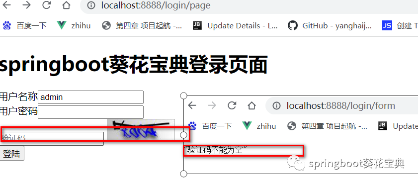
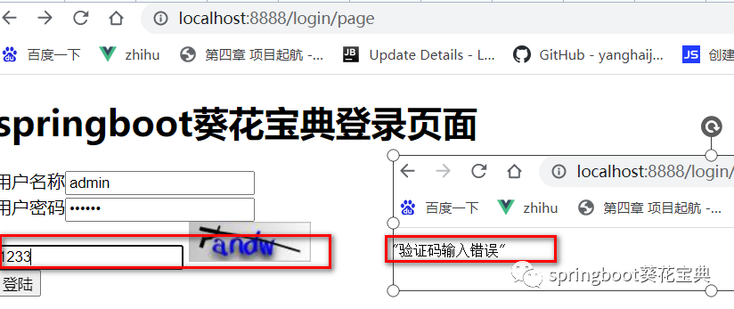

# SpringSecurity-6-基于Filter实现图形验证码

SpringSecurity中有多种方式实现图像验证码，使用自定义过滤器去处理验证码逻辑是最简单的方式，只要将过滤器添加到合适的位置，当登录的时候，对验证码进行校验，成功就放行，失败则抛出异常。

## 图形验证流程

流程图如下



## 使用kaptcha生成图形验证码 

kaptcha是谷歌提供的一款开源验证码jar包，只需简单配置就可以生成图片，源码地址：https://github.com/penggle/kaptcha

### 添加kaptcha依赖

在项目的**pom.xml**中添加相关依赖

```java
        <!-- https://mvnrepository.com/artifact/com.github.penggle/kaptcha -->
        <dependency>
            <groupId>com.github.penggle</groupId>
            <artifactId>kaptcha</artifactId>
            <version>2.3.2</version>
        </dependency>
```

#### 验证码生成配置类

在`config``包`下创建一个`KaptchaCodeConfig`类作为验证码生成配置类，代码如下

```java
@Component
public class KaptchaCodeConfig {
    @Bean
    public DefaultKaptcha getDefaultKaptcha(){
        DefaultKaptcha defaultKaptcha = new DefaultKaptcha();
        Properties properties = new Properties();
        properties.setProperty(Constants.KAPTCHA_BORDER, "yes");
        properties.setProperty(Constants.KAPTCHA_BORDER_COLOR, "192,192,192");
        properties.setProperty(Constants.KAPTCHA_IMAGE_WIDTH, "110");
        properties.setProperty(Constants.KAPTCHA_IMAGE_HEIGHT, "36");
        properties.setProperty(Constants.KAPTCHA_TEXTPRODUCER_FONT_COLOR, "blue");
        properties.setProperty(Constants.KAPTCHA_TEXTPRODUCER_FONT_SIZE, "28");
        properties.setProperty(Constants.KAPTCHA_TEXTPRODUCER_FONT_NAMES, "宋体");
        properties.setProperty(Constants.KAPTCHA_TEXTPRODUCER_CHAR_LENGTH, "4"); // 图片效果
        properties.setProperty(Constants.KAPTCHA_OBSCURIFICATOR_IMPL, "com.google.code.kaptcha.impl.ShadowGimpy");
        Config config = new Config(properties);
        defaultKaptcha.setConfig(config); return defaultKaptcha;
    }
}
```

#### 抽取属性

当然了这是一个死配置，我们一般会使用`xxx.properties`+@PropertySource将配置属性抽取出来，如果不了解这个注解的，可以查看我之前对[SpringBoot常用注解汇总](https://mp.weixin.qq.com/s?__biz=MzIzMjIyNTYwNg==&mid=2247484649&idx=1&sn=338c95599586870976b7c039d884d6af&scene=21#wechat_redirect)里面对这些注解都有介绍,具体实现如下：

- kaptcha.properties的 实现

```properties
kaptcha.BORDER=yes
kaptcha.BORDER_COLOR=192,192,192
kaptcha.IMAGE_WIDTH=110
kaptcha.IMAGE_HEIGHT=36
kaptcha.FONT_COLOR=blue
kaptcha.FONT_SIZE=28
kaptcha.FONT_NAMES=宋体,楷体,微软雅黑
kaptcha.CHAR_LENGTH=4
kaptcha.OBSCURIFICATOR_IMPL=com.google.code.kaptcha.impl.ShadowGimpy
```

- 重新实现KaptchaCodeConfig类

```java
@Component
@PropertySource("classpath:kaptcha.properties")
public class KaptchaCodeConfig {
    @Value("${kaptcha.BORDER}")
    private String BORDER ;
    @Value("${kaptcha.BORDER_COLOR}")
    private String BORDER_COLOR ;
    @Value("${kaptcha.IMAGE_WIDTH}")
    private String IMAGE_WIDTH ;
    @Value("${kaptcha.IMAGE_HEIGHT}")
    private String IMAGE_HEIGHT ;
    @Value("${kaptcha.FONT_COLOR}")
    private String FONT_COLOR ;
    @Value("${kaptcha.FONT_SIZE}")
    private String FONT_SIZE ;
    @Value("${kaptcha.FONT_NAMES}")
    private String FONT_NAMES ;
    @Value("${kaptcha.CHAR_LENGTH}")
    private String CHAR_LENGTH ;
    @Value("${kaptcha.OBSCURIFICATOR_IMPL}")
    private String OBSCURIFICATOR_IMPL ;


    @Bean
    public DefaultKaptcha getDefaultKaptcha(){
        DefaultKaptcha defaultKaptcha = new DefaultKaptcha();
        Properties properties = new Properties();
        properties.setProperty(Constants.KAPTCHA_BORDER, BORDER);
        properties.setProperty(Constants.KAPTCHA_BORDER_COLOR, BORDER_COLOR);
        properties.setProperty(Constants.KAPTCHA_IMAGE_WIDTH, IMAGE_WIDTH);
        properties.setProperty(Constants.KAPTCHA_IMAGE_HEIGHT, IMAGE_HEIGHT);
        properties.setProperty(Constants.KAPTCHA_TEXTPRODUCER_FONT_COLOR, FONT_COLOR);
        properties.setProperty(Constants.KAPTCHA_TEXTPRODUCER_FONT_SIZE, FONT_SIZE);
        properties.setProperty(Constants.KAPTCHA_TEXTPRODUCER_FONT_NAMES, FONT_NAMES);
        properties.setProperty(Constants.KAPTCHA_TEXTPRODUCER_CHAR_LENGTH,CHAR_LENGTH); // 图片效果
        properties.setProperty(Constants.KAPTCHA_OBSCURIFICATOR_IMPL, OBSCURIFICATOR_IMPL);
        Config config = new Config(properties);
        defaultKaptcha.setConfig(config); return defaultKaptcha;
    }
}
```

#### 生成图片的接口实现

使用CaptchaController实现验证码接口

```java
@Slf4j
@RestController
public class CaptchaController {
    public static final String SESSION_KEY = "SESSION_KEY_IMAGE_CODE";

    @Autowired
    private DefaultKaptcha defaultKaptcha; /**
     * 获取图形验证码
     */
    @RequestMapping("/code/image")
    public void imageCode(HttpServletRequest request, HttpServletResponse response) throws IOException {

        response.setHeader("Cache-Control", "no-store, no-cache, must-revalidate");
        response.addHeader("Cache-Control", "post-check=0, pre-check=0");
        response.setHeader("Pragma", "no-cache");
        response.setContentType("image/jpeg");
        // 1. 获取验证码字符串
        String code = defaultKaptcha.createText();
        log.info("生成的图形验证码是：" + code);
        // 2. 字符串把它放到session中
        request.getSession().setAttribute(SESSION_KEY , code);
        // 3. 获取验证码图片
        BufferedImage image = defaultKaptcha.createImage(code);
        // 4. 将验证码图片把它写出去
        ServletOutputStream out = response.getOutputStream();
        ImageIO.write(image, "jpg", out);
    }
}
```

#### /code/image接口免验证

因为这是登录页面使用的，所以要免登录，因此需要在`LearnSrpingSecurity.configure(HttpSecurity http)`

中放行 /code/image 资源权限



#### 重构login.html 

把如下代码加入到登录页面合适的位置，注意图片img标签放到登录表单中。

```html
<!--suppress ALL-->
<!DOCTYPE html>

<html xmlns:th="http://www.thymeleaf.org" lang="en">
<head>
    <meta charset="utf-8">
    <meta http-equiv="X-UA-Compatible" content="IE=edge">
    <title>springboot葵花宝典登录页面</title>
    <!-- Tell the browser to be responsive to screen width -->
    <meta name="viewport" content="width=device-width, initial-scale=1">

</head>
<body>
<h1>springboot葵花宝典登录页面</h1>
<form  th:action="@{/login/form}" action="index.html" method="post">
    <span>用户名称</span><input type="text" name="username" /> <br>
    <span>用户密码</span><input type="password" name="password" /> <br>
    <div >
        <input name="code" type="text" class="form-control" placeholder="验证码">
        
    </div>


    <div th:if="${param.error}">
        <span th:text="${session.SPRING_SECURITY_LAST_EXCEPTION.message}" style="color:#ff0000">用户名或 密码错误</span>
    </div>
    <input type="submit" value="登陆">

</form>
</body>
</html>
```

#### 实现效果

重新启动项目，得到的登录页面效果如下



## **实现验证码校验过滤器** 

- 编写自己的过滤器`ImageCodeValidateFilter`，让其继承`OncePerRequestFilter`（可以保证每一次请求只使用一次该过滤器）
- 添加@Component注解
- 在`ImageCodeValidateFilter`过滤器中从seesion获取验证码文字与用户输入比对，比对通过执行其他过滤器链
- 比对不通过，抛出SessionAuthenticationException异常，交给AuthenticationFailureHandler处理，提示信息通过自定义异常 ValidateCodeExcetipn 抛出
- 最后将`ImageCodeValidateFilter`放在UsernamePasswordAuthenticationFilter表单过滤器之前执行

```java
@Component
public class ImageCodeValidateFilter extends OncePerRequestFilter {


    @Autowired
    private MyAuthenticationFailureHandler failureHandler;

    @Override
    protected void doFilterInternal(HttpServletRequest request, HttpServletResponse response, FilterChain filterChain) throws ServletException, IOException {

        // 必须是登录的post请求才能进行验证，其他的直接放行
        if(StringUtils.equals("/login/form",request.getRequestURI())
                && StringUtils.equalsIgnoreCase(request.getMethod(),"post")){
            try{
                //1.验证谜底与用户输入是否匹配
                validate(request);
            }catch(AuthenticationException e){
                //2.捕获步骤1中校验出现异常，交给失败处理类进行进行处理
                failureHandler.onAuthenticationFailure(request,response,e);
                return;
            }
        }
        //通过校验，就放行
        filterChain.doFilter(request,response);
    }

    private void validate(HttpServletRequest request) throws ServletRequestBindingException {

        String sessionCode = (String)request.getSession().getAttribute(CaptchaController.SESSION_KEY);
        String inpuCode = request.getParameter("code");
        if(StringUtils.isEmpty(inpuCode)){
            throw new SessionAuthenticationException("验证码不能为空");
        }
        if(!inpuCode.equalsIgnoreCase(sessionCode)){
            throw new ValidateCodeException("验证码不能为空");
        }
    }
}
```

## **创建验证码异常类**

在exception包下创建ValidateCodeException，继承AuthenticationException

**注**：**org.springframework.security.core.AuthenticationException**

```java
import org.springframework.security.core.AuthenticationException;

public class ValidateCodeException extends AuthenticationException {
    public ValidateCodeException(String msg, Throwable cause) {
        super(msg, cause);
    }

    public ValidateCodeException(String msg) {
        super(msg);
    }
}
```

- 修改MyAuthenticationFailureHandler类

```java
@Component
public class MyAuthenticationFailureHandler implements AuthenticationFailureHandler {
    private  static ObjectMapper objectMapper = new ObjectMapper();
    @Override
    public void onAuthenticationFailure(HttpServletRequest request, HttpServletResponse response, AuthenticationException exception) throws IOException, ServletException {
        // 当认证失败后，响应 JSON 数据给前端
        response.setContentType("application/json;charset=UTF-8");
        response.getWriter().write(objectMapper.writeValueAsString(exception.getMessage()));
    }
}
```

## **重构** **LearnSrpingSecurity**

1. 将ImageCodeValidateFilter过滤器添加到UsernamePasswordAuthenticationFilter过滤器前面，需要在configure(HttpSecurity http)方法中进行修改

具体步骤：

- 注入ImageCodeValidateFilter

```java
@Autowired
private ImageCodeValidateFilter codeValidateFilter;
```

- 把 ImageCodeValidateFilter 添加 UsernamePasswordAuthenticationFilter 实例前



```java
  http.csrf().disable()  //禁用跨站csrf攻击防御，后面的章节会专门讲解
               .addFilterBefore(codeValidateFilter, UsernamePasswordAuthenticationFilter.class)
```

## 测试

- 不输入验证码



- 输入错误验证码



- 输入正确验证码

