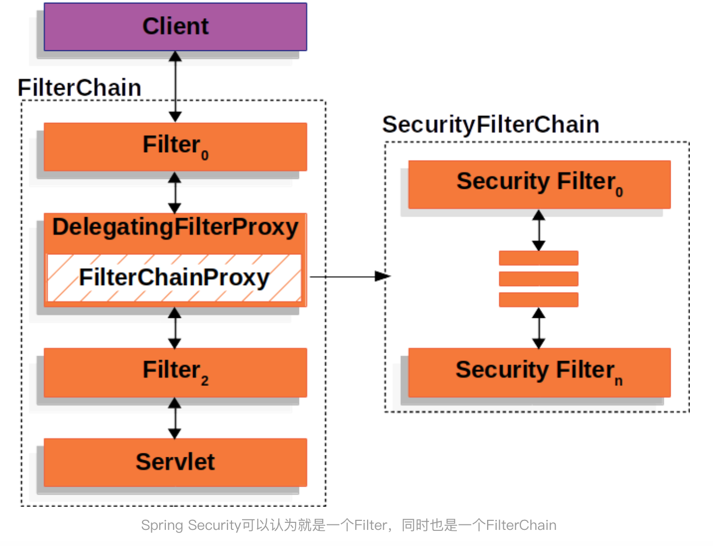
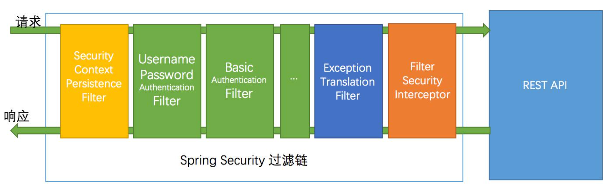
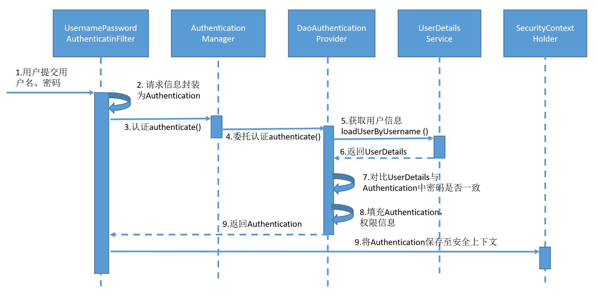
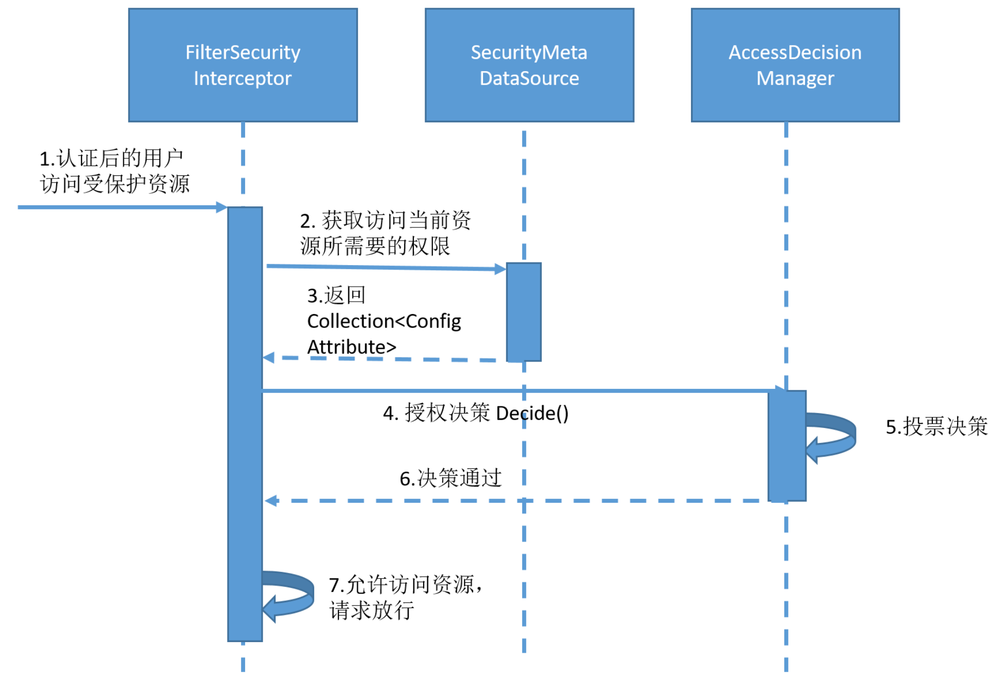

# SpringSecurity认证授权框架流程解析


## maven配置

```xml
<dependency>
	<groupId>org.springframework.boot</groupId>
	<artifactId>spring-boot-starter-security</artifactId>
</dependency>
```

## 基本配置

```java
@Configuration
@EnableWebSecurity // 注解开启Spring Security的功能
public class WebSecurityConfig extends WebSecurityConfigurerAdapter {
  @Override
  protected void configure(HttpSecurity http) throws Exception {
        http
          .authorizeRequests()  //定义哪些url需要保护，哪些url不需要保护
              .antMatchers("/", "/home").permitAll()    //定义不需要认证就可以访问
              .anyRequest().authenticated()
              .and()
          .formLogin()
              .loginPage("/login")  //定义当需要用户登录时候，转到的登录页面
              .permitAll()
              .and()
          .logout()
              .permitAll();
      http.csrf().disable();
  }
	@Override
	public void configure(WebSecurity web) throws Exception {
		   web.ignoring().antMatchers("/static/**");
	}
	@Override
    public void configure(AuthenticationManagerBuilder auth) throws Exception {
        auth.inMemoryAuthentication()
          .passwordEncoder(new BCryptPasswordEncoder())
          .withUser("user")
          .password(new BCryptPasswordEncoder().encode("password")).roles("USER");
      }  
}

// WebSecurityConfigurerAdapter类的三个configure()方法来实现。
//  configure(WebSecurity)：通过重载该方法，可配置Spring Security的Filter链。
//  configure(HttpSecurity)：通过重载该方法，可配置如何通过拦截器保护请求。
//  configure(AuthenticationManagerBuilder)：通过重载该方法，可配置基于用户详情（User Details）的权限
```

## 核心的流程




关于Spring Security认证授权框架，前面曾经写过两篇文章，分别介绍了Spring Security框架的基本用法及如何自定义权限过滤器**FilterSecurityInterceptor**。本文从时序角度来讲一下Spring Security的认证流程和鉴权流程。




### Spring Security的过滤器链

如上图所示，Spring Security由一个过滤器链来处理请求并返回响应，当我们使用账号密码登录某一个网站进行认证时，过滤器中的
UsernamePasswordAuthenticaitonFilter就会起作用，在这个过滤器内部，有登录成功和登录失败后的处理器。

UsernamePasswordAuthenticaitonFilter 类的定义在包org.springframework.security.web.authentication 下面。我们就从UsernamePasswordAuthenticaitonFilter类开始，来看一下整个认证过程。

# 认证流程



## 账号密码登录的认证流程

用户提交用户名、密码以后的认证过程如下：

（1）首先会调用UserPasswordAuthenticaitonFilter的方法 attemptAuthentication()。

```java
public Authentication attemptAuthentication(HttpServletRequest request, HttpServletResponse response) throws AuthenticationException {
    if (this.postOnly && !request.getMethod().equals("POST")) {
        throw new AuthenticationServiceException("Authentication method not supported: " + request.getMethod());
    } else {
        String username = this.obtainUsername(request);
        String password = this.obtainPassword(request);
        ... ...
        username = username.trim();
        UsernamePasswordAuthenticationToken authRequest = new UsernamePasswordAuthenticationToken(username, password);
        this.setDetails(request, authRequest);
        return this.getAuthenticationManager().authenticate(authRequest);
    }
}
```

（2）UserPasswordAuthenticaitonFilter将请求信息封装为UsernamePasswordAuthenticationToken对象，这个Token类继承自接口Authentication。Authentication接口是在org.springframework.security.core包中定义的。

（3）UserPasswordAuthenticaitonFilter接下来会调用方法 getAuthenticationManager().authenticate()来做认证。如果认证失败就抛出异常，如果认证成功就返回Authentication对象。

（4）authenticate()方法的实现在AbstractUserDetailsAuthenticationProvider类中，会委托其继承类 DaoAuthenticationProvider 获取用户信息并验证。他们都是在org.springframework.security.authentication.dao 包中定义的。

```java
public Authentication authenticate(Authentication authentication) throws AuthenticationException {
        ... ...
            try {
                user = this.retrieveUser(username, (UsernamePasswordAuthenticationToken)authentication);
            } 
        ... ...
        return this.createSuccessAuthentication(principalToReturn, authentication, user);
    }
```

（5）DaoAuthenticationProvider 实现了接口 retrieveUser()，来获取用户信息并校验是否通过。具体地讲，是通过调用 UserDetailService的 loadUserByUsername(）实现的。

```java
protected final UserDetails retrieveUser(String username, UsernamePasswordAuthenticationToken authentication) throws AuthenticationException {
    this.prepareTimingAttackProtection();
    try {
        UserDetails loadedUser = this.getUserDetailsService().loadUserByUsername(username);
        if (loadedUser == null) {
            throw new InternalAuthenticationServiceException("UserDetailsService returned null, which is an interface contract violation");
        } else {
            return loadedUser;
        }
    ... ...
}
```

（6）loadUserByUsername() 会返回UserDetails类型的对象。

```java
public interface UserDetailsService { 
    UserDetails loadUserByUsername(String var1) throws UsernameNotFoundException; 
}
```

（7）接下来authenticate()方法对比UserDetails对象与Authentication中的密码是否一致。

（8）如果一致，则填充Authentication的权限信息。

（9）最后将Authentication 保存至上下文。

用户在注册的时候填写的密码，一般都会用加密算法处理后再存入数据库，如md5,BCryptPasswordEncoder等，当我们用SpringSecurity去比对密码时，要告诉它用的是什么算法.

```java
@Bean public PasswordEncoder passwordEncoder() 
{ 
    BCryptPasswordEncoder bCryptPasswordEncoder = new BCryptPasswordEncoder(); 
    return bCryptPasswordEncoder; 
}
```

# 鉴权流程

如果用户已经认证成功，接下来用户在访问一些涉及到访问权限的资源时，我们就需要检查它是否拥有与资源相匹配的权限。



## 验证权限的流程如下：

（1）校验权限主要是在 FilterSecurityInterceptor 中完成.

（2）由securityMetadataSource的子接口

FilterInvocationSecurityMetadataSource的默认实现类DefaultFilterInvocationSecurityMetadataSource去获取该资源需要的权限.

```java
public class DefaultFilterInvocationSecurityMetadataSource implements FilterInvocationSecurityMetadataSource {
    protected final Log logger = LogFactory.getLog(this.getClass());
    private final Map<RequestMatcher, Collection<ConfigAttribute>> requestMap;
    public DefaultFilterInvocationSecurityMetadataSource(LinkedHashMap<RequestMatcher, Collection<ConfigAttribute>> requestMap) {
        this.requestMap = requestMap;
    }
    public Collection<ConfigAttribute> getAllConfigAttributes() {
        ……
```

（3）getAllConfigAttributes() 方法用来获取权限，是在FilterSecurityInterceptor 父类方法中调用的。

```java
public class FilterSecurityInterceptor extends AbstractSecurityInterceptor implements Filter {
	  //调用父类AbstractSecurityInterceptor的beforeInvocation()
    InterceptorStatusToken token = super.beforeInvocation(fi);
```


AbstractSecurityInterceptor 的 beforeInvocation() 方法调用了getAllConfigAttributes()。

```java
public abstract class AbstractSecurityInterceptor implements InitializingBean,
	ApplicationEventPublisherAware, MessageSourceAware {
        ……
        protected InterceptorStatusToken beforeInvocation(Object object) {
         	……
            //获取资源所需要的权限
        	Collection<ConfigAttribute> attributes = this.obtainSecurityMetadataSource()
                .getAttributes(object);
            ……
            Authentication authenticated = authenticateIfRequired();
            try {
                this.accessDecisionManager.decide(authenticated, object, attributes);
            }
            ……
```

（4）获取权限后，调用AccessDecisionManager.decide() 来比对权限。参数含义如下：

- authenticated：要访问资源的访问者的身份
- object：要访问的受保护资源
- attributes：是受保护资源的访问策略，就是前面通过SecurityMetadataSource获取的

（5）接下来由AccessDecisionManager投票决定是否放行请求。

（6）如果决策通过，则允许请求访问。

最后我们再来看看AccessDecisionManager类是如何进行投票决策的。

# AccessDecisionManager实现类

Spring Security内置了三个基于投票的**AccessDecisionManager实现类**如下，它们分别是 AffirmativeBased、ConsensusBased和UnanimousBased。

## **AffirmativeBased**的逻辑是：

- 只要有AccessDecisionVoter的投票为ACCESS_GRANTED，则同意用户进行访问；
- 如果全部弃权也表示通过；
- 如果没有一个人投赞成票，但是有人投反对票，则将抛出AccessDeniedException。 Spring security**默认使用**的是AffirmativeBased。

## **ConsensusBased**的逻辑是：

- 如果赞成票多于反对票则表示通过。
- 反过来，如果反对票多于赞成票则将抛出AccessDeniedException。
- 如果赞成票与反对票相同且不等于0，并且属性allowIfEqualGrantedDeniedDecisions的值为true，则表示通过，否则将抛出异常AccessDeniedException。参数allowIfEqualGrantedDeniedDecisions的值默认为true。
- 如果所有的AccessDecisionVoter都弃权了，则将视参数allowIfAllAbstainDecisions的值而定，如果该值 为true则表示通过，否则将抛出异常AccessDeniedException。参数allowIfAllAbstainDecisions的值默认为false。

## **UnanimousBased**的逻辑具体来说是这样的：

- 如果受保护对象配置的某一个ConfigAttribute被任意的AccessDecisionVoter反对了，则将抛出 AccessDeniedException。
- 如果没有反对票，但是有赞成票，则表示通过。
- 如果全部弃权了，则将视参数allowIfAllAbstainDecisions的值而定，true则通过，false则抛出 AccessDeniedException。

## 总结

最后简单总结下三种AccessDecisionManager实现类的区别：**AffirmativeBased** 是一票通过，**ConsensusBased**是少数服从多数，**UnanimousBased** 是一票否决

## 重要

基于Spring Security框架实现资源访问的权限控制，我们要重点关注三个接口：

- AbstractSecurityInterceptor接口：实现权限认证的整体流程。
- SecurityMetadataSource接口：决定请求url所需要的的权限。
- AccessDecisionManager接口：根据url所需权限以及用户角色，判断是否允许请求访问资源。


