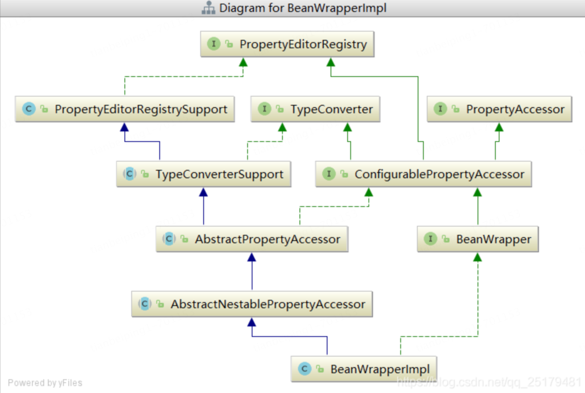
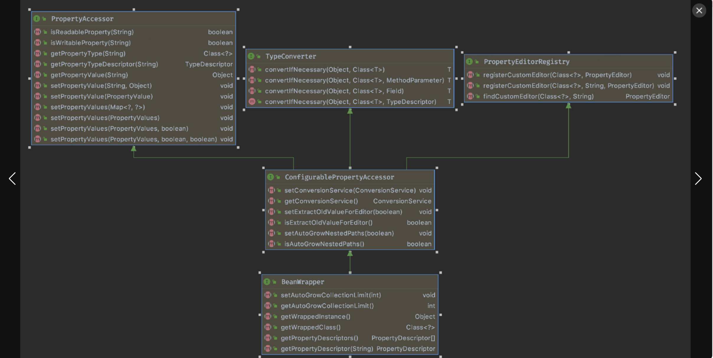
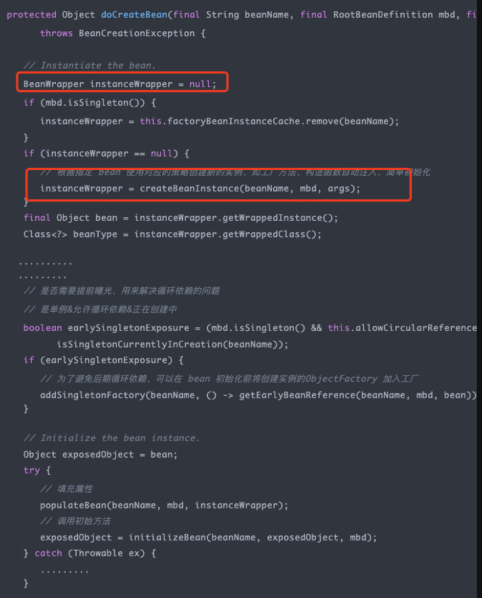
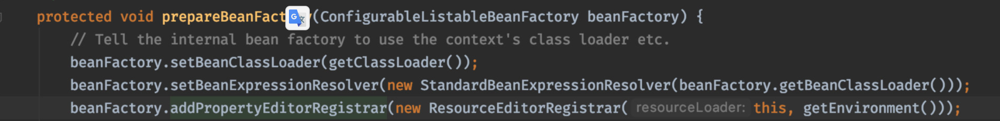
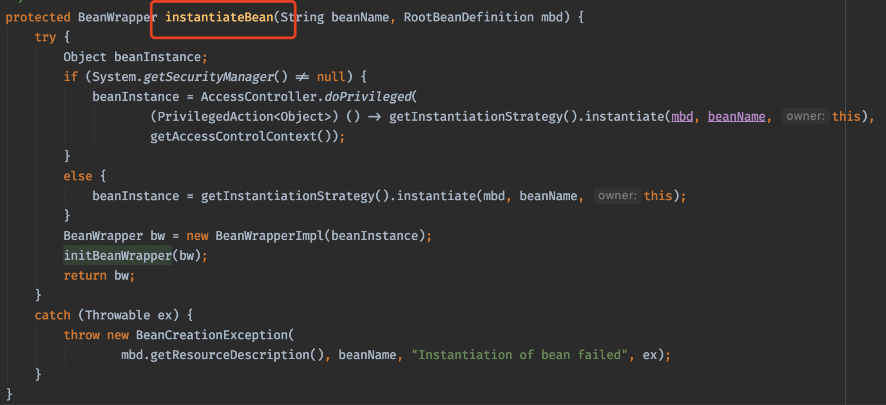
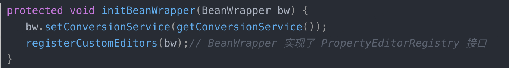

# BeanWrapper

## 架构图



## 分解图




### 实例化方法调用



### 详解方法

#### PropertyEditorSupport

> PropertyEditor 的子类、JDK 提供。方便我们继承该基础类、可以方便的扩展属性编辑器
>
> CustomNumberEditor 数字
>
> CustomDateEditor 日期

#### PropertyEditorRegistry

> 属性编辑器注册器。Spring 提供

#### PropertyEditorRegistrySupport(自定义都继承这个类) implements  PropertyEditorRegistry

> 该类是继承 PropertyEditorRegistry 并在里面帮我们注册了一些常用的类型以及对应的属性编辑器
>
> 默认注册方法：   createDefaultEditors

#### ResourceEditorRegistrar 

> ApplicationContext 的 refresh 的 prepareBeanFactory 中被创建赋值到 BeanFactory 中
>
> 而 org.springframework.beans.PropertyEditorRegistrar#registerCustomEditors 方法在每次创建 bean 的时候都会被调起。








## 基础使用案例（参考网上）

```java
public class AppTest {
    @Test
    public void shouldAnswerWithTrue() {
        Staff staff = new Staff();
        BeanWrapper staffWrapper = new BeanWrapperImpl(staff);
        //设置属性
        staffWrapper.setPropertyValue("id", "1001");
        //设置属性
        staffWrapper.setPropertyValue(new PropertyValue("name", "小王"));
        //设置属性
        staffWrapper.setPropertyValue("hobbies[0]", "羽毛球");
        staffWrapper.setPropertyValue("hobbies[1]", "篮球");
        System.out.println("================");
        //获取属性
        Object id = staffWrapper.getPropertyValue("id");
        System.out.println("id="+id);
        //获取属性
        Object name = staffWrapper.getPropertyValue("name");
        System.out.println("name="+name);
        //获取属性
        Object hobbies = staffWrapper.getPropertyValue("hobbies");
        System.out.println("hobbies="+hobbies);
        //获取属性
        Object hobbies_0 = staffWrapper.getPropertyValue("hobbies[0]");
        System.out.println("hobbies[0]="+hobbies_0);
        System.out.println("================");
        System.out.println("staff="+staff.toString());
        System.out.println("================");
        Company company = new Company();
        BeanWrapper companyWrapper = new BeanWrapperImpl(company);
        companyWrapper.setPropertyValue("staffs[" + staff.getId() + "]", staff);
        System.out.println(company.getStaffs().get(staff.getId()));
    }
}


class Staff {
    private String id;
    private String name;
    private List<String> hobbies = new ArrayList<>();
		public void setId(String id) {
    System.out.println("setId 方法被调用");
    this.id = id;
}
public void setName(String name) {
    System.out.println("setName 方法被调用");
    this.name = name;
}
public String getId() {
    System.out.println("getId 方法被调用");
    return id;
}
public String getName() {
    System.out.println("getName 方法被调用");
    return name;
}
public List<String> getHobbies() {
    System.out.println("getHobbies 方法被调用");
    return hobbies;
}
public void setHobbies(List<String> hobbies) {
    System.out.println("getHobbies 方法被调用");
    this.hobbies = hobbies;
}
@Override
public String toString() {
    return "Staff{" +
            "id='" + id + '\'' +
            ", name='" + name + '\'' +
            ", hobbies=" + Arrays.toString(hobbies.toArray()) +
            '}';
}
}

class  Company{
    private Map<String, Staff> staffs = new HashMap<>();
    public Map<String, Staff> getStaffs() {
        return staffs;
    }
    public void setStaffs(Map<String, Staff> staffs) {
        this.staffs = staffs;
    }
}

```

