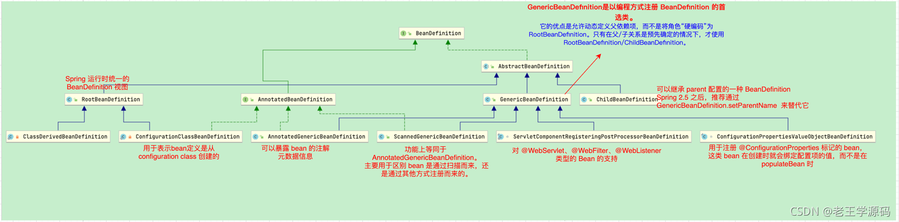

# ben



### 扫描定义BeanDefinition

```java
启动拦截：如：EnableFeignClients 等
接口： ImportBeanDefinitionRegistrar

扫描文件，创建BeanDefinition：
	ClassPathScanningCandidateComponentProvider
	ClassPathBeanDefinitionScanner
	// bean前置处理注入bean
	BeanDefinitionRegistryPostProcessor
```

### BeanDefinitionRegistry 和 BeanDefinitionHolder

> 两种方式创建类
>
> 继承实现，BeanDefinitionRegistryPostProcessor 注入BeanDefinitionRegistry

```java
// 自定义创建类 FeignClientFactoryBean
// BeanDefinitionHolder
BeanDefinitionBuilder definition = BeanDefinitionBuilder.genericBeanDefinition(FeignClientFactoryBean.class);
BeanDefinitionHolder definitionHolder=new BeanDefinitionHolder(
  																					beanDefinition,
   																					beanName,
  																					aliases)
BeanDefinitionReaderUtils.registerBeanDefinition(definitionHolder, registry);

// 自定义获取Bean FeignClientSpecification
BeanDefinitionBuilder builder = BeanDefinitionBuilder.genericBeanDefinition(FeignClientSpecification.class);
BeanDefinition beanDefinition =builder.getBeanDefinition()
registry.registerBeanDefinition(beanName,beanDefinition)
  
```

### RootBeanDefinition、ChildBeanDefinition

```java
StaticApplicationContext parent = new StaticApplicationContext();
StaticApplicationContext child = new StaticApplicationContext(parent);

RootBeanDefinition pbd = new RootBeanDefinition();
pbd.setBeanClass(FooService.class);
pbd.setScope(BeanDefinition.SCOPE_SINGLETON);
pbd.getPropertyValues().add("id", "123");
pbd.getPropertyValues().add("name", "zhangsan");
parent.registerBeanDefinition("fooService", pbd);

ChildBeanDefinition cbd = new ChildBeanDefinition("fooService");
cbd.setBeanClass(FooService.class);
cbd.setScope(BeanDefinition.SCOPE_PROTOTYPE);
cbd.getPropertyValues().add("id", "456");
child.registerBeanDefinition("fooService", cbd);

// 通过子容器来获取 bean
FooService bean1 = child.getBean(FooService.class);
FooService bean2 = child.getBean(FooService.class);
System.out.println(bean1 + ",id=" + bean1.getId() + ",name=" + bean1.getName());
System.out.println(bean2 + ",id=" + bean2.getId() + ",name=" + bean2.getName());
```

> Spring 2.5 之后，推荐通过 GenericBeanDefinition#setParentName() 的方式来替代 ChildBeanDefinition。


# 基础bean的Property

## Java PropertyDescriptor使用

```
PropertyDescriptor propertyDescriptor =new PropertyDescriptor("name",Person.class);
Method writeMethod = propertyDescriptor.getWriteMethod();
Method readMethod = propertyDescriptor.getReadMethod();

writeMethod.invoke(obj,"参数名称");
```

## BeanInfo

```java
BeanInfo  bf = Introspector.getBeanInfo(Person.class)

// bean转map
public static Map<String, Object> beanToMap(Object obj) {
  Map<String, Object> map = new HashMap<>();
  BeanInfo beanInfo = Introspector.getBeanInfo(obj.getClass());
  PropertyDescriptor[] propertyDescriptors = beanInfo.getPropertyDescriptors();
  for (PropertyDescriptor property : propertyDescriptors) {
    String key = property.getName();
    // 过滤 class 属性
    if (!key.equals("class")) {
      // 得到 property 的 getter 方法
      Method getter = property.getReadMethod();
      Object value = getter.invoke(obj);
      map.put(key, value);
    }
  }
  return map;
}
```


## PropertyEditor

```
PropertyEditorSupport implements PropertyEditor

common jar包类
BeanUtilsBean
BeanUtils

```


BeanWrapper

​	org.springframework.beans.CachedIntrospectionResults#buildGenericTypeAwarePropertyDescriptor

​		GenericTypeAwarePropertyDescriptor

