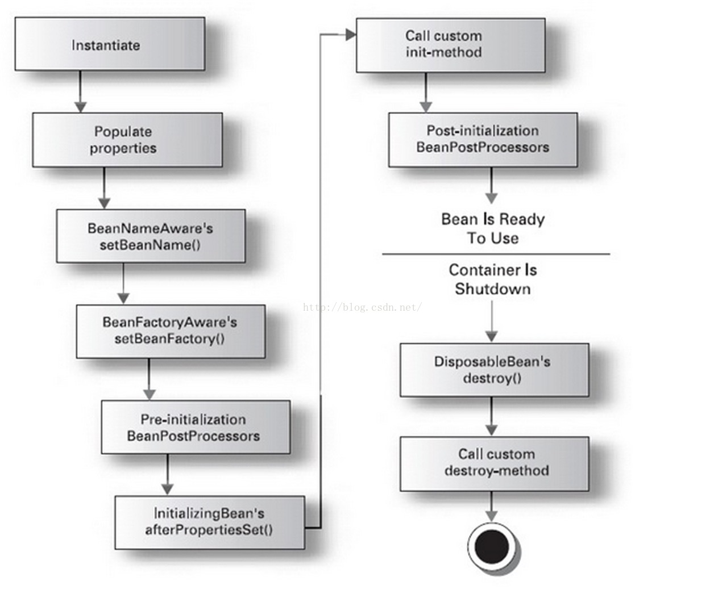

## spring-init-method 初始化

参考地址：https://www.cnblogs.com/aigeileshei/articles/6601503.html


##### 常用的设定方式有以下三种：

>通过实现 InitializingBean/DisposableBean 接口来定制初始化之后/销毁之前的操作方法；
通过 <bean> 元素的 init-method/destroy-method属性指定初始化之后 /销毁之前调用的操作方法；
在指定方法上加上@PostConstruct 或@PreDestroy注解来制定该方法是在初始化之后还是销毁之前调用。 


```java
public class InitSequenceBean implements InitializingBean {    
     
    public InitSequenceBean() {    
       System.out.println("InitSequenceBean: constructor");    
    }    
       
    @PostConstruct    
    public void postConstruct() {    
       System.out.println("InitSequenceBean: postConstruct");    
    }    
       
    public void initMethod() {    
       System.out.println("InitSequenceBean: init-method");    
    }    
       
    @Override    
    public void afterPropertiesSet() throws Exception {    
       System.out.println("InitSequenceBean: afterPropertiesSet");    
    }    
}
```

##### 并且在配置文件中添加如下Bean定义：

> <bean **class="InitSequenceBean" init-method="initMethod"></bean>**  
>
> 输出结果：
>
> InitSequenceBean: constructor
> InitSequenceBean: postConstruct
> InitSequenceBean: afterPropertiesSet
> InitSequenceBean: init-method

##### 通过上述输出结果，说明三种初始化的顺序是：

> Constructor > @PostConstruct > InitializingBean > init-method

##### 原因：

>  @PostConstruct注解后的方法在BeanPostProcessor前置处理器中就被执行了。我们知道BeanPostProcessor接口是一个回调的作用，[spring](http://lib.csdn.net/base/javaee)容器的每个受管Bean在调用初始化方法之前，都会获得BeanPostProcessor接口实现类的一个回调。在BeanPostProcessor的方法中有一段逻辑就是会判断当前被回调的bean的方法中有没有被initAnnotationType/destroyAnnotationType注释，如果有，则添加到init/destroy队列中，后续一一执行。initAnnotationType/destroyAnnotationType注解就是@PostConstruct/@PreDestroy。所以@PostConstruct当然要先于InitializingBean和init-method执行了

##### 从图中，我们可以看到实例化Bean的过程中有以下几个节点：

> 1）设置属性值；
> 2）调用Bean中的BeanNameAware.setBeanName()方法，如果该Bean实现了BeanNameAware接口；
> 3）调用Bean中的BeanFactoryAware.setBeanFactory()方法，如果该Bean实现了BeanFactoryAware接口；
> 4）调用BeanPostProcessors.postProcessBeforeInitialization()方法；@PostConstruct注解后的方法就是在这里被执行的
> 5）调用Bean中的afterPropertiesSet方法，如果该Bean实现了InitializingBean接口；
> 6）调用Bean中的init-method，通常是在配置bean的时候指定了init-method，例如：<bean class="beanClass" init-method="init"></bean>
> 7）调用BeanPostProcessors.postProcessAfterInitialization()方法；
> 8）如果该Bean是单例的，则当容器销毁并且该Bean实现了DisposableBean接口的时候，调用destory方法；如果该Bean是prototype，则将准备好的Bean提交给调用者，后续不再管理该Bean的生命周期


##### 初始化流程图




