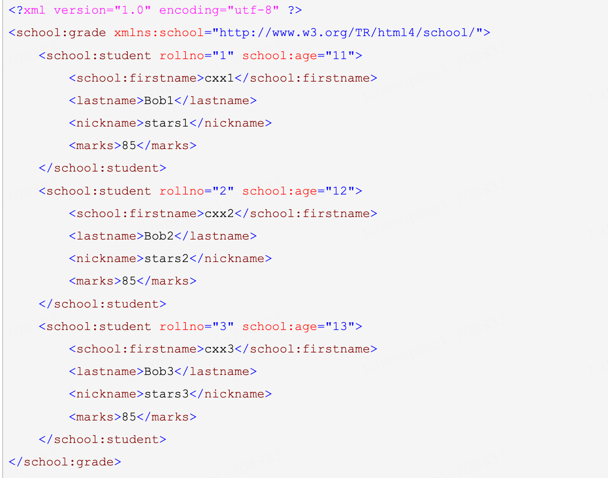

- DOM ：全称是 Document Object Model，也即文档对象模型（不适于处理大型XML文档）
- DOM4J：一款非常优秀的解析器
- Jsoup：Jsoup是一款Java的HTML解析器，支持DOM思想。可直接解析某个URL地址、HTML文本内容。它提供了一套非常省力的API，可通过CSS以及类似于jQuery的操作方法来取出和操作数据

## DOM

### xml、xpath

```java
package com.abc.demo.general.xml;
// dom方式处理xml
public class DomCase {
    private static Logger logger = LoggerFactory.getLogger(DomCase.class);
		// 解析xml
    @Test
    public void parse() throws Exception {
        DocumentBuilderFactory factory = DocumentBuilderFactory.newInstance();
        //支持命名空间
        factory.setNamespaceAware(true);
        DocumentBuilder builder = factory.newDocumentBuilder();
        //解析xml文件为文档
        Document document = builder.parse(DomCase.class.getResourceAsStream("student.xml"));
      	// 解析元素
        Element rootElement = document.getDocumentElement();
        NodeList list = rootElement.getChildNodes();//所有学生
//        NodeList list = document.getElementsByTagName("school:student"); //第1个学生
//        NodeList list = document.getElementsByTagName("student"); //第2、3的学生
//        NodeList list = document.getElementsByTagNameNS("http://www.w3.org/TR/html4/school/", "student");//第1个学生
        for (int i = 0; i < list.getLength(); i++) {
            Node node = list.item(i);
            if (node.getNodeType() != Node.ELEMENT_NODE) {
                continue;
            }
            logger.info("学生编号" + node.getAttributes().getNamedItem("rollno").getTextContent());
            if (node.getAttributes().getNamedItem("school:age") != null) {
                logger.info("age=" + node.getAttributes().getNamedItem("school:age").getTextContent());
            }
        }
    }

 		// xpath使用
    @Test
    public void xpath() throws Exception {
        DocumentBuilderFactory factory = DocumentBuilderFactory.newInstance();
        //支持命名空间
        factory.setNamespaceAware(true);
        DocumentBuilder builder = factory.newDocumentBuilder();
        //解析xml文件为文档
        Document document = builder.parse(DomCase.class.getResourceAsStream("student.xml"));

        XPathFactory xPathFactory = XPathFactory.newInstance();
        XPath xpath = xPathFactory.newXPath();
        xpath.setNamespaceContext(new NamespaceContext() {
            @Override
            public String getNamespaceURI(String prefix) {
                if ("school".equals(prefix)) {
                    return "http://www.w3.org/TR/html4/school/";
                }
                return null;
            }

            @Override
            public String getPrefix(String namespaceURI) {
                return null;
            }

            @Override
            public Iterator getPrefixes(String namespaceURI) {
                return null;
            }
        });

        logger.info("查找所有的存在rollno属性的student节点，取出lastname的值");
        XPathExpression expr = xpath.compile("//student[@rollno]/lastname/text()");//第2、3位学生
//        XPathExpression expr = xpath.compile("//student[@rollno]/child::lastname/text()");//效果同上
//        XPathExpression expr = xpath.compile("//school:student[@rollno]/lastname/text()");//第1位学生
        Object result = expr.evaluate(document, XPathConstants.NODESET);
        NodeList nodes = (NodeList) result;
        for (int i = 0; i < nodes.getLength(); i++) {
            logger.info(nodes.item(i).getNodeValue());
        }
    }

    /**
     * 生成xml
     */
    @Test
    public void toXml() throws Exception {
        DocumentBuilderFactory factory = DocumentBuilderFactory.newInstance();
        DocumentBuilder builder = factory.newDocumentBuilder();
        //新建一个文档对象
        Document document = builder.newDocument();
        Element elementClass = document.createElementNS("http://www.w3.org/TR/html4/school/", "school:class");

        //第一个学生
        Element elementStudent1 = document.createElement("student");
        elementStudent1.setAttribute("rollno", "1");
        elementStudent1.setAttributeNS("http://www.w3.org/TR/html4/school/", "school:age", "10");

        Element elementFirstname1 = document.createElement("school:firstname");
        elementFirstname1.setTextContent("cxx1");
        Element elementLastname1 = document.createElement("lastname");
        elementLastname1.setTextContent("Bob1");
        Element elementNickname1 = document.createElement("nickname");
        elementNickname1.setTextContent("stars1");
        Element elementMarks1 = document.createElement("marks");
        elementMarks1.setTextContent("85");

        elementStudent1.appendChild(elementFirstname1);
        elementStudent1.appendChild(elementLastname1);
        elementStudent1.appendChild(elementNickname1);
        elementStudent1.appendChild(elementMarks1);
        elementClass.appendChild(elementStudent1);

        //第二个学生
        Element elementStudent2 = document.createElement("student");
        elementStudent2.setAttribute("rollno", "2");

        Element elementFirstname2 = document.createElement("firstname");
        elementFirstname2.setTextContent("cxx2");
        Element elementLastname2 = document.createElement("lastname");
        elementLastname2.setTextContent("Bob2");
        Element elementNickname2 = document.createElement("nickname");
        elementNickname2.setTextContent("stars2");
        Element elementMarks2 = document.createElement("marks");
        elementMarks2.setTextContent("85");

        elementStudent2.appendChild(elementFirstname2);
        elementStudent2.appendChild(elementLastname2);
        elementStudent2.appendChild(elementNickname2);
        elementStudent2.appendChild(elementMarks2);
        elementClass.appendChild(elementStudent2);
				// 添加到文档中
        document.appendChild(elementClass);
				// 构建对象生成器
        TransformerFactory transformerFactory = TransformerFactory.newInstance();
        Transformer transformer = transformerFactory.newTransformer();
        transformer.setOutputProperty(OutputKeys.ENCODING,"utf-8");
        //换行
        transformer.setOutputProperty(OutputKeys.INDENT, "yes");
        DOMSource domSource = new DOMSource(document);

        //xml输出到的地方
        ByteArrayOutputStream out = new ByteArrayOutputStream();
        StreamResult streamResult = new StreamResult(out);
        transformer.transform(domSource, streamResult);
        logger.info(out.toString()); // 打印输出文档
    }
}
```

## DOM4J

### xml、xpath

```java
// 使用dom4j处理xml
public class Dom4jCase {
    private static Logger logger = LoggerFactory.getLogger(Dom4jCase.class);

		// 解析xml
    @Test
    public void parse() throws Exception {
        SAXReader reader = new SAXReader();
      	// student.xml和Dom4jCase.java位于同一目录
        Document document = reader.read(Dom4jCase.class.getResourceAsStream("student.xml"));
        //Document document = DocumentHelper.parseText(xmlString);//解析字符串
        Element root = document.getRootElement();
        List<Element> list = root.elements("student");
        for (int i = 0; i < list.size(); i++) {
            Element student = list.get(i);
            logger.info("学生编号{}", student.attributeValue("rollno"));
            logger.info("age:{}", student.attributeValue("age"));
            logger.info("firstname:{}", student.elementText("firstname"));
            logger.info("lastname:{}", student.elementText("lastname"));
            logger.info("nickname:{}", student.elementText("nickname"));
            logger.info("marks:{}", student.elementText("marks"));
        }
    }
		// xpath使用
    @Test
    public void xpath() throws Exception {
        SAXReader reader = new SAXReader();
      	// student.xml和Dom4jCase.java位于同一目录
        Document document = reader.read(Dom4jCase.class.getResourceAsStream("student.xml"));
        logger.info("查找存在rollno属性的student节点，找到的节点再查找lastname子节点，找到的节点再查找文本节点");
        List<Node> list = document.selectNodes("//student[@rollno]/lastname/text()");//第二、三位学生
        // List<Node> list = document.selectNodes("//student[@rollno]/child::lastname/text()");//效果同上
        for (int i = 0; i < list.size(); i++) {
            Node node = list.get(i);
            logger.info(node.getText());
        }
        logger.info("查找存在rollno属性的school:student节点");
        list = document.selectNodes("//school:student[@rollno]");//第一位学生
        for (int i = 0; i < list.size(); i++) {
            Node node = list.get(i);
            //获取rollno的属性值
            logger.info(node.valueOf("@rollno"));
        }
    }
		// 生成xml
    @Test
    public void toXml() throws Exception {
        Document document = DocumentHelper.createDocument();
        Element root = document.addElement("school:grade", "http://www.w3.org/TR/html4/school/");
        //第一个学生
        Element student = root.addElement("school:student");
        student.addAttribute("rollno", "1");
        student.addAttribute("school:age", "10");
        student.addElement("school:firstname").setText("cxx1");
        student.addElement("lastname").setText("Bob1");
        student.addElement("nickname").setText("stars1");
        student.addElement("marks").setText("85");
        //第二个学生
        student = root.addElement("student");
        student.addAttribute("rollno", "2");
        student.addElement("school:firstname").setText("cxx2");
        student.addElement("lastname").setText("Bob2");
        student.addElement("nickname").setText("stars2");
        student.addElement("marks").setText("85");

        //直接转成字符串
//        logger.info(document.asXML());

        //格式化并输出到输出流
        ByteArrayOutputStream out = new ByteArrayOutputStream();
        OutputFormat format = OutputFormat.createPrettyPrint();
        XMLWriter writer = new XMLWriter(out, format);
        writer.write(document);
        logger.info(out.toString()); // 输出结果
    }
}
```


## jsoup

### 常用方法

#### 1、获取资源

- static Document parse(File in, String charsetName)：解析本地文件
- static Document parse(String html)：解析html或xml字符串
- static Document parse(URL url, int timeoutMillis)：解析网页源文件

#### 2、获取元素

- Element getElementById(String id)：根据id获取元素
- Elements getElementsByTag(String tagName)：根据标签名获取元素
- Elements getElementsByAttribute(String key)：根据属性获取元素
- Elements getElementsByAttributeValue(String key,String value)：根据属性名=属性值获取元素。
- Elements select(Sting cssQuery)：根据选择器选取元素。
- **Element: 元素对象下方法**
  - String text()：获取元素包含的纯文本。
  - String html()：获取元素包含的带标签的文本。
  - String attr(String attributeKey)：获取元素的属性值。

```java
Document document = Jsoup.parse(new File("file-path.xml"), "utf-8");
//3.获取对应的标签Element
Elements names = document.getElementsByTag("name");
//4.获取数据
for (Element name : names) {
  String text = name.text();
  System.out.println(text);
}
```

## JAXB

- **JAXBContext类** 应用的入口，用于管理XML/Java绑定信息。
- **Marshaller接口** 将Java对象序列化为XML数据。
- **Unmarshaller接口** 将XML数据反序列化为Java对象。

参考博客：https://www.cnblogs.com/wuyongyin/p/14317489.html

### 类构建和注解

#### 1、班级类

```java
@XmlRootElement(name = "grade", namespace = "http://www.w3.org/TR/html4/school/")
@XmlAccessorType(XmlAccessType.FIELD)
public class GradeJaxb {
    @XmlElement(name = "student", namespace = "http://www.w3.org/TR/html4/school/")
    private List<StudentJaxb> students;
}
```

#### 2、学生类

```java
@XmlType(propOrder = {"marks", "firstname", "lastname", "nickname"})
@XmlAccessorType(XmlAccessType.FIELD)
public class StudentJaxb {
    @XmlAttribute
    private int rollno;
    @XmlAttribute(namespace = "http://www.w3.org/TR/html4/school/")
    private int age;
    @XmlElement(namespace = "http://www.w3.org/TR/html4/school/")
    private String firstname;
    private String lastname;
    private String nickname;
    private String marks;
}
```

#### 3、package-info.java

```java
/**
 * 设置命名空间对应的前缀
 */
@XmlSchema(xmlns = {@XmlNs(prefix = "school", namespaceURI = "http://www.w3.org/TR/html4/school/")})
package com.abc.demo.general.xml;
```

### 验证测试类

```java
// jaxb使用
public class JaxbCase {
    // java对象转成xml
    @Test
    public void javaToXml() throws Exception {
        List<StudentJaxb> students = new ArrayList<>();
        StudentJaxb student1 = new StudentJaxb(1, 11,"cxx1", "Bob1", "stars1", "85");
        StudentJaxb student2 = new StudentJaxb(2, 12, "cxx2", "Bob2", "stars2", "85");
        StudentJaxb student3 = new StudentJaxb(3, 13, "cxx3", "Bob3", "stars3", "85");
        students.add(student1);
        students.add(student2);
        students.add(student3);
        GradeJaxb grade = new GradeJaxb();
        grade.setStudents(students);

        //获取JAXB的上下文环境
        JAXBContext context = JAXBContext.newInstance(GradeJaxb.class);
        //创建Marshaller实例
        Marshaller marshaller = context.createMarshaller();
        //设置转换参数 -> 是否格式化输出
        marshaller.setProperty(Marshaller.JAXB_FORMATTED_OUTPUT, Boolean.TRUE);
        //是否隐藏xml声明
        marshaller.setProperty(Marshaller.JAXB_FRAGMENT, false);
        //构建输出环境 -> 这里输出到控制台Console
        PrintStream out = System.out;
        //将所需对象序列化 -> 该方法没有返回值
        marshaller.marshal(grade, out);
    }
    // xml转成java对象
    @Test
    public void xmlToJava() throws Exception {
        //获取JAXB的上下文环境
        JAXBContext context = JAXBContext.newInstance(GradeJaxb.class);
        //创建UnMarshaller实例
        Unmarshaller unmarshaller = context.createUnmarshaller();
        InputStream in = JaxbCase.class.getResourceAsStream("student2.xml");
        //将XML数据序列化
        GradeJaxb grade = (GradeJaxb) unmarshaller.unmarshal(in);
        System.out.println(grade);
    }
}
```

### 生效xml对象

