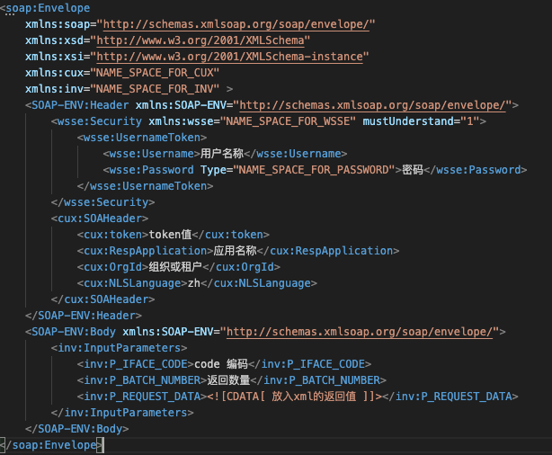

## soap请求响应

xml机构由【Envelope、Header、Body】三部分组成

### 1、构建请求

```java
/** 创建连接 */
SOAPConnectionFactory soapConnFactory = SOAPConnectionFactory.newInstance();
SOAPConnection connection = soapConnFactory.createConnection();

/** 创建消息对象 */
MessageFactory messageFactory = MessageFactory.newInstance();
SOAPMessage message = messageFactory.createMessage();
message.setProperty(SOAPMessage.CHARACTER_SET_ENCODING, "UTF-8");

/** 创建soap消息主体 */
SOAPPart soapPart = message.getSOAPPart();
SOAPEnvelope envelope = soapPart.getEnvelope();
//删除默认的前缀
envelope.removeNamespaceDeclaration("SOAP-ENV");
// 设置SOAP Envelope的命名空间
envelope.addNamespaceDeclaration("soap", "http://schemas.xmlsoap.org/soap/envelope/");
envelope.addNamespaceDeclaration("xsi", "http://www.w3.org/2001/XMLSchema-instance");
envelope.addNamespaceDeclaration("xsd", "http://www.w3.org/2001/XMLSchema");
// <soap:Envelope 
//			xmlns:soap="http://schemas.xmlsoap.org/soap/envelope/" 
// 			xmlns:xsd="http://www.w3.org/2001/XMLSchema" 
//			xmlns:xsi="http://www.w3.org/2001/XMLSchema-instance" > 中间存放header、body </soap:Envelope>
envelope.setPrefix("soap");
SOAPHeader header = envelope.getHeader();
//去掉头节点 header
//header.detachNode();
// 参考header增加token
SOAPElement userToken = wsseHeader.addChildElement("UsernameToken", "wsse");
userToken.removeNamespaceDeclaration("wsse");
userToken.addChildElement("Username", "wsse").addTextNode("用户名称");
SOAPElement psdElement  =userToken.addChildElement("Password", "wsse");
psdElement.setAttribute("Type", "NAME_SPACE_FOR_PASSWORD");
psdElement.addTextNode("密码");

SOAPElement cuxHeader = header.addChildElement("SOAHeader", "cux");           cuxHeader.addChildElement("token","cux").addTextNode("token值");         cuxHeader.addChildElement("RespApplication","cux").addTextNode("应用名称");
cuxHeader.addChildElement("OrgId","cux").addTextNode("组织或租户");
cuxHeader.addChildElement("NLSLanguage","cux").addTextNode("zh");

SOAPBody body = envelope.getBody();
// InputParameters参数，inv是前缀，如：<inv:InputParameters>
SOAPElement invRequest = body.addChildElement("InputParameters", "inv");
invRequest.addChildElement("P_IFACE_CODE", "inv").addTextNode("code 编码");
invRequest.addChildElement("P_BATCH_NUMBER", "inv").addTextNode("返回数量");
invRequest.addChildElement("P_REQUEST_DATA", "inv").addTextNode("<![CDATA[" + "放入xml的返回值" + "]]>");

message.saveChanges();

ByteArrayOutputStream outputStream = new ByteArrayOutputStream();
message.writeTo(outputStream);
System.out.println("请求报文："+ new String (outputStream.toByteArray(), "UTF-8"));
```

打印结果如下图



### 2、发送请求处理及响应

```java
String urlString=""
URL url = new URL(new URL(urlString), "", new URLStreamHandler() {
   @Override
   protected URLConnection openConnection(URL url) throws IOException {
     URL target = new URL(url.toString());
     URLConnection connection = target.openConnection();
     // Connection settings
     connection.setConnectTimeout(10 * 60 * 1000);
     connection.setReadTimeout(10 * 60 * 1000);
     return (connection);
   }
 });
SOAPMessage reply = connection.call(message, url);

//判断返回的SOAPMessage 对象不为空，防止发生异常连接，出现阻断性错误！
if (null != reply) {
  // 只获取body部分
  SOAPBody ycBody = reply.getSOAPBody();
  //                outputStream = new ByteArrayOutputStream();
  //                reply.writeTo(outputStream); 这里必须通过output转换为流才能打印出来
  //                System.out.println("返回报文信息："+ new String (outputStream.toByteArray(), "UTF-8"));

  Node ycResp = ycBody.getFirstChild();
  NodeList nlist = ycResp.getChildNodes();
  String recode = nlist.item(0).getTextContent();
  String redata = nlist.item(1).getTextContent();
  if (nlist.getLength() > 2) {
    String rxml = nlist.item(2).getTextContent();
    rxml = StringEscapeUtils.unescapeXml(rxml); //转义返回的xml类文件
    System.out.println(rxml); // 打印出xml结果
    log.info("调用接口结束");
  } else {
    log.info("调用ESB接口返回的[SOAPMessage]对象为空，连接异常！");
  }
}
connection.close();

```

### 3、处理响应（*从返回的soap中提取(body)-xml*）

```java
 // 创建SOAP消息工厂
MessageFactory factory = MessageFactory.newInstance();
// 创建SOAP消息
ByteArrayInputStream inputStream = new ByteArrayInputStream(soapXml.getBytes());
SOAPMessage message = factory.createMessage(null, inputStream);
// 提取SOAP消息的Body部分
SOAPBody body = message.getSOAPBody();
// soap为xml
String soap = body.getTextContent();
```

### 4、xml序列化和反序列化

#### 序列化

```java
// 
JAXBContext jc = JAXBContext.newInstance("object.class");
StringWriter out = new StringWriter();
Marshaller m = jc.createMarshaller();
// formatOutput  输出的xml是否为格式化过的：true为格式化过后
// fragment 数据为true，将生成：<?xml version="1.0" encoding="UTF-8" standalone="yes"?>
bool formatOutput,fragment=true,true;
m.setProperty(Marshaller.JAXB_FORMATTED_OUTPUT, formatOutput);
m.setProperty(Marshaller.JAXB_FRAGMENT, fragment);
m.setProperty(Marshaller.JAXB_ENCODING, "utf-8");
m.marshal(serObj, out); //  serObj 需要序列化的对象
String tmp = out.toString();
```

#### 反序列化

```java
// xml 字符串，反序列化
JAXBContext jc = JAXBContext.newInstance("object.class");
Unmarshaller u = jc.createUnmarshaller();
// 注意一下，code 编码
u.setProperty(Marshaller.JAXB_ENCODING, "utf-8");
InputStream is = new ByteArrayInputStream("xml结构的字符".getBytes("UTF-8"));
Object  object = u.unmarshal(is)
// 数据流中，反序列化
JAXBContext jc = JAXBContext.newInstance("object.class");
Unmarshaller unmarshaller = jc.createUnmarshaller();
Object obj = unmarshaller.unmarshal(xmlIs);
```

#### 注解到类上面

```java
@Data
@XmlType(name="DATA")
@XmlRootElement(name = "DATA")
@XmlAccessorType(XmlAccessType.FIELD)
@ToString
public class ESBReturn {
 
    @XmlElement(name = "RET_CODE")
    private String ret_code;
    @XmlElement(name = "RET_MSG")
    private String ret_msg;
    @XmlElement(name = "EBILL" ,type = Ebill.class)
    @XmlElementWrapper(name = "EBILLS") // 添加包装元素
    private List<Ebill> ebills;
}

@Data
@XmlRootElement(name = "EBILL")
@XmlAccessorType(XmlAccessType.FIELD)
public class Ebill {
 
    @XmlElement(name = "ORDER_NO")
    private String order_no;
    @XmlElement(name = "ELECTRON_NO")
    private String electron_no;
    @XmlElement(name = "AMOUNT")
    private BigDecimal amount;
    @XmlElement(name = "RET_CODE")
    private Integer ret_code;
    @XmlElement(name = "RET_MSG")
    private String ret_msg;    
}
```

