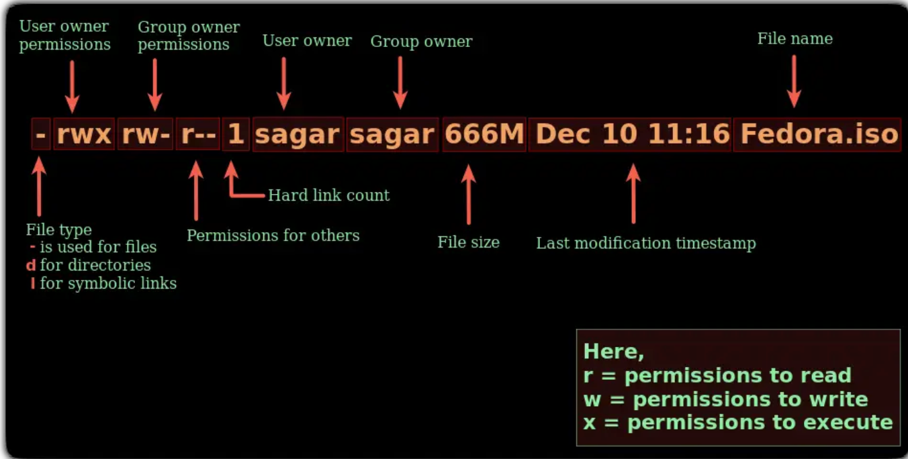

# 分组、人员

```shell
groupadd elk 	#创建分组
useradd admin #创建人员
passwd admin	#设置密码
usermod -G elk admin #人员分配组  将admin用户添加到elk组
# 分配权限
# chown将指定文件的拥有者改为指定的用户或组 -R处理指定目录以及其子目录下的所有文件
chown -R admin:elk /usr/local
chown -R admin:elk /usr/upload
# 切换用户
su admin
# 切换root权限
sudo -s
# 文件目录权限修改
chmod -R 775 /export/Logs
```

# 文件分组

chgrp [-R] [新组] [文件]    

>  chgrp group1 myfile.txt
>
>  `-R` 为可选参数，表示递归修改指定目录下所有文件的所属组

chown [-R] [分组:用户] [文件]    

> chown group1:user1 myfile.txt
>
> `-R` 为可选参数，表示递归修改指定目录下所有文件的所属组


## ls -l 查看

