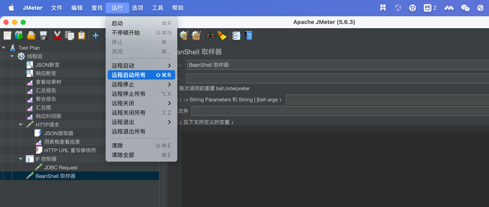

## 配置服务器启动

```shell
  # 修改JMeter批处理文件的环境变量：HEAP="-Xms1g -Xmx1g -XX:MaxMetaspaceSize=256m"
jmeter -n -t [jmx file] -l [results file] -e -o [Path to web report folder]
```

### 案例

```shell
jmeter -n -t testplan/RedisLock.jmx -l testplan/result/result.txt -e -o testplan/webreport
```

说明：

testplan/RedisLock.jmx 为测试计划文件路径
testplan/result/result.txt 或testplan/result/result.jtl 为测试结果文件路径
testplan/webreport 为web报告保存路径


## 分布式部署

### 系统参数调整

> linux系统参数优化。linux默认最大连接数1024，在压测过程中经常会出现连接数不足导致的异常，需要先调整系统参数再做测试。 修改 /etc/sysctl.conf 配置文件

```shell
vm.max_map_count=655360
vm.swappiness=1

fs.file-max=655356000
fs.nr_open=104857600

net.ipv4.tcp_fin_timeout = 30
net.ipv4.tcp_keepalive_time = 1200
net.ipv4.tcp_syncookies = 1
net.ipv4.tcp_tw_reuse = 1
net.ipv4.tcp_tw_recycle = 1
net.ipv4.ip_local_port_range = 1024 65000
net.ipv4.tcp_max_syn_backlog = 8192
net.ipv4.tcp_max_tw_buckets = 5000
```

> 让 sysctl 配置生效

```
sysctl -p
```

> /etc/security/limits.conf 可以在文件末尾添加以下行：
>
> /etc/security/limits.d/ 目录
> 			该目录下默认有 *-nproc.conf 文件，该文件是用于限制用户的线程限制。我们也可以在该目录创建配置文件在/etc/security/limits.d/ 下，以 .conf 结尾
>
> ​		Centos7:  /etc/security/limits.d/20-nproc.conf 可以在文件末尾添加以下行：
>
> 上面两个地方都配置了，最后的取值是会取 /etc/security/limits.d/20-nofile.conf里面的值
>
> ulimit -Sn 查看软限制文件数量，ulimit -Hn 硬限制文件数量

```
root    soft    nofile    1048576
root    hard    nofile    67108864
root    soft    nproc     102400
root    hard    nproc     655360
*       soft    memlock   unlimited
*       hard    memlock   unlimited
```

> 查看系统最大文件打开数量：cat /proc/sys/fs/file-max

```shell

#永久性设置，需要在/etc/sysctl.conf中设置，并让它生效：
echo "fs.file-max = 1000000" >> /etc/sysctl.conf 
sysctl -p
#fs.file-max = 1000000
```

### 服务配置相同

#### 证书生成

> ./create-rmi-keystore.sh #生成证书,生成rmi_keystore.jdk,分发到各个服务上，目录中的 bin中
>
> ```sh
> # 脚本默认指令，有效期只有7天
> keytool -genkey -keyalg RSA -alias rmi -keystore rmi_keystore.jks -storepass changeit -validity 7 -keysize 2048 "$@"
> ```
>
> ​		修改 jmeter.properties 配置文件，关闭 SSL 认证
>
> ​		server.rmi.ssl.disable=true

#### 配置和启动

```shell
#jmeter.properties #配置文件内容如下：
#server_port=10955
#server.rmi.ssl.disable=true

# 启动，满足hostname名字和IP一样，java.rmi.server.hostname
./jmeter-server -Djava.rmi.server.hostname=192.168.56.21 -Dserver.rmi.ssl.disable=true -Dserver_port=10955
```

### 客户端配置，控制远程

jmeter.properties

```shell
remote_hosts=192.168.56.21:10955,192.168.56.22:10955,192.168.56.23:10955
server_port=10950
server.rmi.ssl.disable=true
```

### 客户端分布式启动GUI



### 客户端-分布式启动

```sh
# 执行压测脚本,-r 表示启动所有压力机；-R:IP:PORT 启动指定压力机
jmeter -n -t ${jmx_file_path} -r -l ${jtl_result_path}
# 生成报告
jmeter -g ${jtl_result_path} -e -o ${output_dir_path}

# 指定压力机执行压测脚本
jmeter -n -t /home/test/test.jmx -R 192.168.56.21:10955,192.168.56.22:10955 -l /home/test/test_result.jtl
# 创建目录
mkdir -p /home/test/results
# 生成报告
jmeter -g /home/test/test_result.jtl -e -o /home/test/results
```

