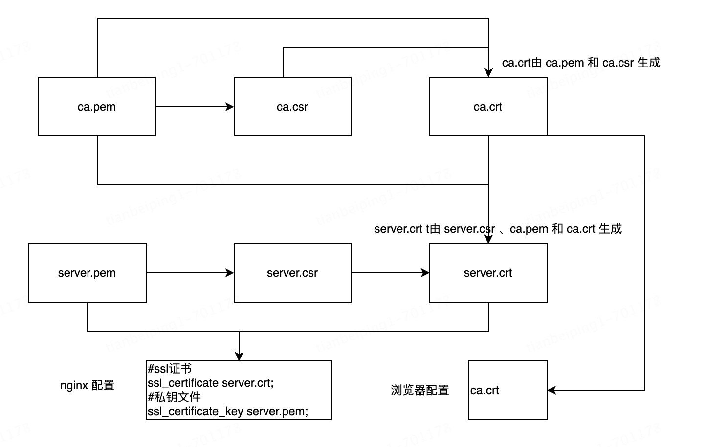

## Https-Ssl

#### Ngix配置ssl

```js
打开文件编辑
vim /etc/nginx/nginx.conf
使用 nginx -t 命令对文件对配置文件进行校验
配置完成如下：重启 nginx -s reload
加上 -c /etc/nginx/nginx.conf 指定配置文件路径
变成配置内容如下：

http{
  
  	# 开启gzip压缩
    gzip on;
    gzip_min_length 10k;
    gzip_buffers 4 16k;
    #gzip_http_version 1.0;
    gzip_comp_level 2;
    gzip_types text/plain application/x-javascript text/css application/xml text/javascript image/jpeg image/gif image/png image/jpg;
    gzip_vary off;
    gzip_disable "MSIE [1-6]\.";
  
    #http节点中可以添加多个server节点
    server{
        #监听443端口
        listen 443;
        #对应的域名，beipingdengni.com改成你们自己的域名就可以了
        server_name beipingdengni.com;
        ssl on;
        #从腾讯云获取到的第一个文件的全路径（签名证书）
        ssl_certificate /etc/ssl/beipingdengni.com.crt;
        #从腾讯云获取到的第二个文件的全路径（私有key）
        ssl_certificate_key /etc/ssl/beipingdengni.com.key;
        ssl_session_timeout 5m;
        ssl_protocols TLSv1 TLSv1.1 TLSv1.2;
        ssl_ciphers ECDHE-RSA-AES128-GCM-SHA256:HIGH:!aNULL:!MD5:!RC4:!DHE;
        ssl_prefer_server_ciphers on;
        #这是我的主页访问地址，因为使用的是静态的html网页，所以直接使用location就可以完成了。
        location / {
                #文件夹
                root /usr/local/service/ROOT;
                #主页文件
                index index.html;
        }
    }
    server{
        listen 80;
        server_name beipingdengni.com;
        rewrite ^/(.*)$ https://beipingdengni.com:443/$1 permanent;
    }
}

```


### 参考博客(自签名证书)：

https://blog.csdn.net/m0_52440465/article/details/130713591

自签名流程




图片备注说明： 

ca.pem 证书私有key，ca.csr证书公有key，ca.crt根证书；

server.pem 服务私有key，server.csr服务公有key，server.crt服务签名证书；


#### 自签名安全证书，操作步骤

##### 第一种

```sh
使用 openssl

第一步，为服务器端和客户端准备公钥、私钥

# 生成服务器端私钥
openssl genrsa -out server.key 1024
# openssl genpkey -algorithm RSA -out server.pem -pkeyopt rsa_keygen_bits:2048
# 生成服务器端公钥
openssl rsa -in server.key -pubout -out server.pem

=============================================================================

第二步，生成 CA 证书
# 生成 CA 私钥
openssl genrsa -out ca.key 1024
# X.509 Certificate Signing Request (CSR) Management.
openssl req -new -key ca.key -out ca.csr
# X.509 Certificate Data Management.
openssl x509 -req -in ca.csr -signkey ca.key -out ca.crt
=============================================================================

第三步，生成服务器端证书和客户端证书
# 服务器端需要向 CA 机构申请签名证书，在申请签名证书之前依然是创建自己的 CSR 文件
openssl req -new -key server.key -out server.csr
# 把信息带入到福建信息中
# openssl req -new -key server.pem -out server.csr -subj "/C=CN/ST=Beijing/L=Beijing/O=local/OU=local/CN=localhost" -addext "subjectAltName = DNS:localhost,IP:127.0.0.1,IP:127.0.0.2"
# 向自己的 CA 机构申请证书，签名过程需要 CA 的证书和私钥参与，最终颁发一个带有 CA 签名的证书
openssl x509 -req -CA ca.crt -CAkey ca.key -CAcreateserial -in server.csr -out server.crt
=============================================================================

生成文件如下
CA证书：			ca.crt     ca.csr     ca.key     ca.srl
服务器端证书：server.crt server.csr server.key server.pem

ngix 配置：server.key、server.crt
浏览器配置：ca.crt
```


##### 第二种

```
使用：Java JDK下的：keytool.exe
=============================================================================
命令help
密钥和证书管理工具
命令:
 -certreq            生成证书请求
 -changealias        更改条目的别名
 -delete             删除条目
 -exportcert         导出证书
 -genkeypair         生成密钥对
 -genseckey          生成密钥
 -gencert            根据证书请求生成证书
 -importcert         导入证书或证书链
 -importpass         导入口令
 -importkeystore     从其他密钥库导入一个或所有条目
 -keypasswd          更改条目的密钥口令
 -list               列出密钥库中的条目
 -printcert          打印证书内容
 -printcertreq       打印证书请求的内容
 -printcrl           打印 CRL 文件的内容
 -storepasswd        更改密钥库的存储口令
=============================================================================

生成keystore
keytool -genkey -alias tomcat  -storetype PKCS12 -keyalg RSA -keysize 2048  -keystore d:\mykeystore\keystore.p12 -validity 3650  -ext san=ip:192.168.100.132 -dname "CN=garyyan, OU=mycompany, O=mycompany, L=gd, ST=gd, C=china"

1、keystore可理解为一个数据库，可以存很多个组数据
	 每组数据主要包含下面两种数据：
	 		a:密钥实体（Key entity）——密钥（secret key）又或者是私钥和配对公钥（采用非对称加密）
	 		b:可信任的证书实体（trusted certificate entries）——只包含公钥 
2、-keystore /mykeystore/keystore.p12，指定在/mykeystore（先要手动创建此文件夹），生成keystore:keystore.p12
3、-alias tomcat，为其指明在keystore中的唯一的别名：tomcat ，因为keystore中可能还存有其它的别名，如：tomcat 2 
4、-storetype PKCS12指明密钥仓库类型是PKCS12
5、-keyalg RSA，指定加密算法,本例中的采用通用的RAS加密算法 
6、-keysize 2048指定密钥的长度为2048 
7、-validity 3650 指定证书的有效期为3650天
8、-ext san=ip:192.168.100.132请根据你的服务器的IP地址设置，如果不进行设置，客户端在访问的时候可能会报错
9、-dname “CN=tbp, OU=mycompany,O=myorganization,L=cd, ST=sc, C=china” 
其中：”CN=(名字与姓氏), OU=(组织单位名称), O=(组织名称), L=(城市或区域名称), ST=(州或省份名称), C=(单位的两字母国家代码)”，可以随便填就行
=============================================================================

导出公钥证书
keytool -export -keystore /mykeystore/keystore.p12 -alias tomcat -file mycer.cer -storepass 123456

1、-keystore d:\mykeystore\keystore.p12 是指上面的keystore文件 
2、-alias tomcat是指定别名为tomcat的那一组 
3、-file mycer.cer指定在当前目录生成名为mycer.cer的证书 
4、-storepass 123456是上面生成keystore 所用的密码

=============================================================================
```

