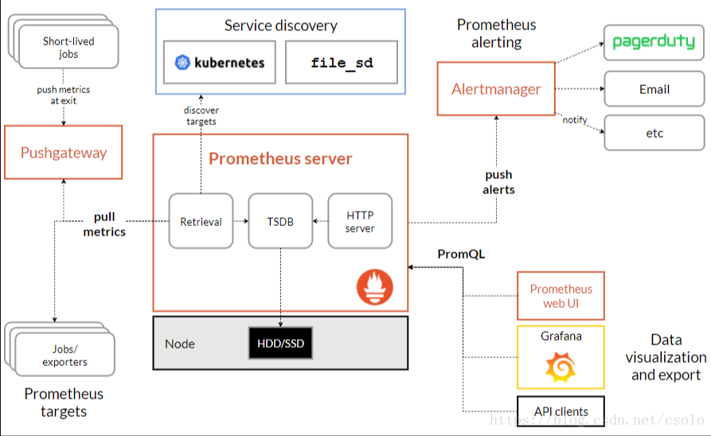

# prometheus

## 安装运行docker

```shell
docker run -d \
    -p 9090:9090 \
    -v ~/Documents/coding/python/prometheus/prometheus.yml:/etc/prometheus/prometheus.yml \
    --name my-prometheus \
    prom/prometheus

# Save your Prometheus data:    -v prometheus-data:/prometheus 
docker run -d -p 9090:9090 --name my-prometheus prom/prometheus
# docker run --name 容器名字 --rm -it -d -p [ip:]主机端口:容器端口 -v 主机文件:容器文件 --dns=ip 镜像名称 [命令
# --dns-search=DOMAIN 
# 设置容器的主机名: -h hostname 或 --h=hostname 
# 设置环境变量: -e key1=value1
# 指定文件读取环境配置: --env-file=[]
# 设置运行的用户: -u 用户名
# 设置容器可使用的最大内存: -m 内存大小值
# 设置工作目录: -w 目录
# 也可以复用其他容器的卷的设置: -volumes-from 其他容器名或id
```

## 架构图



## 配置文件参数解释

> prometheus.yml
>
> global 属于全局的默认配置，它主要包含 4 个属性，
>
> > scrape_interval: 拉取 targets 的默认时间间隔，即拉取业务监控数据的间隔时间。
> > scrape_timeout: 拉取一个 target 的超时时间，即拉取业务监控数据接口的超时时间。
> > evaluation_interval: 执行 rules 的时间间隔。即多久遍历一次告警规则列表，判断每个规则是否触发告警。和rule_files的加载没关系
> > external_labels: 额外的属性，会添加到拉取的数据并存到数据库中。
>
> scrape_configs 主要用于配置拉取数据节点，每一个拉取配置主要包含以下参数：
>
> > job_name：任务名称
> > honor_labels： 用于解决拉取数据标签有冲突，当设置为 true, 以拉取数据为准，否则以服务配置为准
> > params：数据拉取访问时带的请求参数
> > scrape_interval： 拉取时间间隔
> > scrape_timeout: 拉取超时时间
> > metrics_path： 拉取节点的 metric 路径
> > static_configs：配置访问路径前缀，如ip+port，或者域名地址，或者通过服务发现，类似alertmanager.prom-alert.svc:9093
> > scheme： 拉取数据访问协议，如http
> > sample_limit： 存储的数据标签个数限制，如果超过限制，该数据将被忽略，不入存储；默认值为0，表示没有限制
> > relabel_configs： 拉取数据重置标签配置
> > metric_relabel_configs：metric 重置标签配置

```yaml
global: # my global config
  scrape_interval: 15s # Set the scrape interval to every 15 seconds. Default is every 1 minute.
  evaluation_interval: 15s # Evaluate rules every 15 seconds. The default is every 1 minute.
  # scrape_timeout is set to the global default (10s).

alerting: # Alertmanager configuration
  alertmanagers:
    - static_configs:
        - targets:
          # - alertmanager:9093
# Load rules once and periodically evaluate them according to the global 'evaluation_interval'.
rule_files:
  # - "first_rules.yml"
  # - "second_rules.yml"
scrape_configs:
  - job_name: "prometheus"
    static_configs:
      - targets: ["localhost:9090"]
  - job_name: "sentinel-dashboard"
    static_configs:
      - targets: ["10.254.168.36:12345"]
```

## Metrics类型

> Prometheus定义了4中不同的指标类型(metric type)：Counter（计数器）、Gauge（仪表盘）、Histogram（直方图）、Summary（摘要）
>
> 使用可以参考：https://prometheus.github.io/client_java/getting-started/metric-types/

1. Counter：只增不减的计数器
2. Gauge：可增可减的仪表盘
3. Histogram：直方图，内置分析样本的分布情况
4. Summary：摘要 自定义样本分布情况

## 三方集成

### 如：mysql、go、python

官方查看： https://prometheus.io/docs/instrumenting/exporters/

## client_java（有指导意义）

### 官方指导文档

https://prometheus.github.io/client_java/getting-started/quickstart/

GitHub地址：https://github.com/prometheus/client_java

#### maven xml

```xml
<dependency>
    <groupId>io.prometheus</groupId>
    <artifactId>prometheus-metrics-core</artifactId>
    <version>1.0.0</version>
</dependency>
<dependency>
    <groupId>io.prometheus</groupId>
    <artifactId>prometheus-metrics-instrumentation-jvm</artifactId>
    <version>1.0.0</version>
</dependency>
<dependency>
    <groupId>io.prometheus</groupId>
    <artifactId>prometheus-metrics-exporter-httpserver</artifactId>
    <version>1.0.0</version>
</dependency>
<!-- 兼容：Prometheus Java 客户端库 1.0.0 完全重写了底层数据模型，并且由于多种原因不向后兼容 0.16.0 及更早版本-->
<dependency>
    <groupId>io.prometheus</groupId>
    <artifactId>prometheus-metrics-simpleclient-bridge</artifactId>
    <version>1.0.0</version>
</dependency>
```

#### Java代码实现二

```java
import io.prometheus.metrics.core.metrics.Counter;
import io.prometheus.metrics.exporter.httpserver.HTTPServer;
import io.prometheus.metrics.instrumentation.jvm.JvmMetrics;
import java.io.IOException;

public class App {
    public static void main(String[] args) throws InterruptedException, IOException {
      	// 默认使用：PrometheusRegistry.defaultRegistry 
        JvmMetrics.builder().register(); // initialize the out-of-the-box JVM metrics
      	// 使用自定义
        // PrometheusRegistry myRegistry = new PrometheusRegistry();
      	// JvmMetrics.builder().register(myRegistry);
      	
      	// 取消注册
      	// PrometheusRegistry.defaultRegistry.unregister(eventsTotal);

        Counter counter = Counter.builder()
                .name("my_count_total")
                .help("example counter")
                .labelNames("status") // .labelNames("type", "status")
                .register();

        counter.labelValues("ok").inc();
        counter.labelValues("ok").inc();
        counter.labelValues("error").inc();

        HTTPServer server = HTTPServer.builder()
                .port(9400)
                .buildAndStart();
        System.out.println("HTTPServer listening on port http://localhost:" + server.getPort() + "/metrics");
        Thread.currentThread().join(); // sleep forever
    }
}
```


### github文档（老版本分支）

https://github.com/prometheus/client_java/tree/simpleclient

#### maven xml

```xml
<!-- The client -->
<dependency>
  <groupId>io.prometheus</groupId>
  <artifactId>simpleclient</artifactId>
  <version>0.16.0</version>
</dependency>
<!-- Hotspot JVM metrics-->
<dependency>
  <groupId>io.prometheus</groupId>
  <artifactId>simpleclient_hotspot</artifactId>
  <version>0.16.0</version>
</dependency>
<!-- Exposition HTTPServer-->
<dependency>
  <groupId>io.prometheus</groupId>
  <artifactId>simpleclient_httpserver</artifactId>
  <version>0.16.0</version>
</dependency>
<!-- Pushgateway exposition-->
<dependency>
  <groupId>io.prometheus</groupId>
  <artifactId>simpleclient_pushgateway</artifactId>
  <version>0.16.0</version>
</dependency>
```

#### Java代码实现一

```java
DefaultExports.initialize(); // initialize the out-of-the-box JVM metrics

Counter counter = Counter.build()
        .name("my_count_total")
        .help("举例计算总数")
        .labelNames("status") // .labelNames("type", "status")
        .register();

counter.labels("ok").inc();
counter.labels("ok").inc();
counter.labels("error").inc();

HTTPServer server = new HTTPServer.Builder()
        .withPort(9400)
        .build();
System.out.println("HTTPServer listening on port http://localhost:" + server.getPort() + "/metrics");
Thread.currentThread().join(); // sleep forever
```

## 使用案例

### JMX 接入（java）

GitHub: https://github.com/prometheus/jmx_exporter

> 搜索布局：https://grafana.com/grafana/dashboards/?search=jmx
>
> 面板id： 14845 验证可以使用、4701 （测试没有加载出数据，可能是需要tomcat服务）
>
> 面板id：11131 （k8s使用）

运行增加agent

>  java -javaagent:./jmx_prometheus_javaagent-0.20.0.jar=12345:config.yaml -jar yourJar.jar
>
> 启动后可访问： http://localhost:12345/metrics

config.yaml

```yaml
rules:
- pattern: ".*"


# 参加项目部署
java -javaagent:./jmx_prometheus_javaagent-0.20.0.jar=12345:jmx_config.yaml \
-Dserver.port=8081 \
-Dcsp.sentinel.dashboard.server=localhost:8081 \
-Dproject.name=sentinel-dashboard \
-jar ./sentinel-dashboard-1.3.0.jar
```


