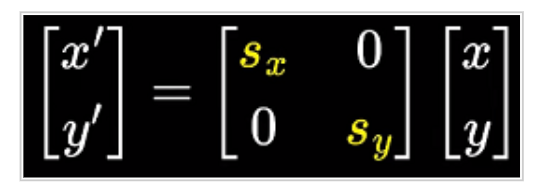
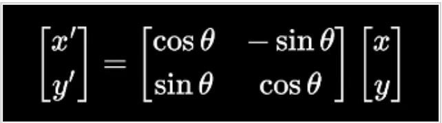
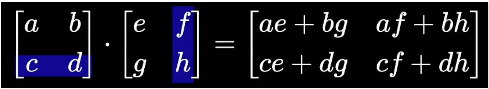

### 缩放

x’=Sx * x
y’=Sy * y



### 旋转

x’=xcosθ-ysinθ
y’=xsinθ+ycosθ



### 矩阵乘法




### 2.1创建矩阵：

```java
public int[][] createMatric(int row,int colum){
  @SuppressWarnings("resource")
  Scanner input=new Scanner(System.in);
  int array[][]=new int[row][colum];
  for(int i=0;i<array.length;i++)
    for(int j=0;j<array[i].length;j++){
      array[i][j]=input.nextInt();
    }
  return array;
}
```

### 矩阵加法：

```java
public int[][] matricAdd(int matric1[][],int matric2[][] ){
  int matric3[][]=new int[matric1.length][matric1[0].length];
  if(matric1.length!=matric2.length||matric1[0].length!=matric2[0].length){			
    System.out.println("输入格式有误");
    System.exit(0);
  }else{
    for(int i=0;i<matric1.length;i++)
      for(int j=0;j<matric1[0].length;j++)
        matric3[i][j]=matric1[i][j]+matric2[i][j];
  }
  return matric3;
}
```

### 矩阵加法：

```java
public int[][] matricAdd(int matric1[][],int matric2[][] ){
  int matric3[][]=new int[matric1.length][matric1[0].length];
  if(matric1.length!=matric2.length||matric1[0].length!=matric2[0].length){			
    System.out.println("输入格式有误");
    System.exit(0);
  }else{
    for(int i=0;i<matric1.length;i++)
      for(int j=0;j<matric1[0].length;j++)
        matric3[i][j]=matric1[i][j]+matric2[i][j];
  }
  return matric3;
}
```

### 矩阵减法：

```java
public int[][] matricJian(int matric1[][],int matric2[][] ){
  int matric3[][]=new int[matric1.length][matric1[0].length];
  if(matric1.length!=matric2.length||matric1[0].length!=matric2[0].length){
    System.out.println("输入格式有误");
    System.exit(0);
  }else{
    for(int i=0;i<matric1.length;i++)
      for(int j=0;j<matric1[0].length;j++){
        matric3[i][j]=matric1[i][j]-matric2[i][j];
      }
  }
  return matric3;
}
```


### 矩阵乘法：

```java
public int[][] matricCheng(int matric1[][],int matric2[][]){
  int matric3[][]=new int[matric1.length][matric1[0].length];
  if(matric1.length!=matric2[0].length||matric1[0].length!=matric2.length){
    System.out.println("输入格式有误");
    System.exit(0);//退出虚拟机
  }else {
    for(int i=0;i<matric1.length;i++)
      for(int j=0;j<matric2[0].length;j++)
        for(int k=0;k<matric2.length;k++)
          matric3[i][j]+=matric1[i][k]*matric2[k][j];
  }
  return matric3;
}
```

### 矩阵的转置

```java
public int[][] matricReserve(int matric[][]){
  int matric3[][]=new int[matric[0].length][matric.length];
  for(int i=0;i<matric.length;i++) {
    for(int j=0;j<matric[0].length;j++) {
      matric3[j][i]=matric[i][j];
    }
  }
  return matric3;
}
```

### 矩阵和数字相乘

```java
public int[][] matricShuCheng(int matric[][],int x){
  for(int i=0;i<matric.length;i++)
    for(int j=0;j<matric[0].length;j++) {
      matric[i][j]=matric[i][j]*x;
    }
  return matric;
}
```

### 矩阵的输出

```java
public void inputMatric(int matric[][]) {
  System.out.println("运算结果为:");
  for(int i=0;i<matric.length;i++) {
    for(int j=0;j<matric[0].length;j++) {
      System.out.print(matric[i][j]+" ");
    }
    System.out.println("");
  }
}
```

