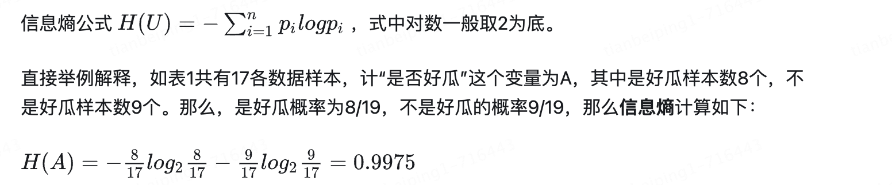
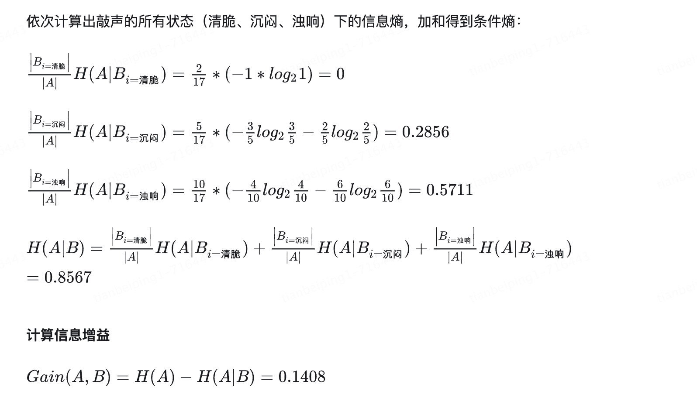
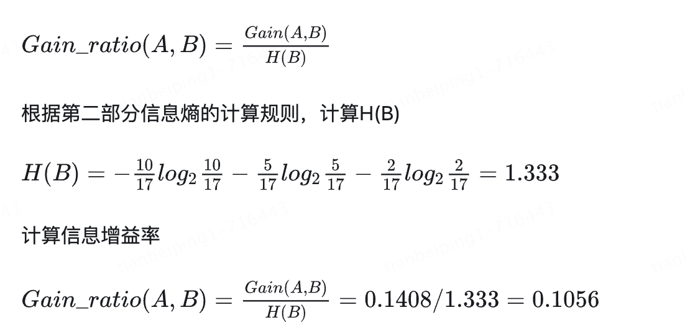

# 决策树之信息熵、信息增益、信息增益率、基尼指数分析

**更加完成的介绍：https://blog.csdn.net/m0_58475958/article/details/118735363**

决策树0 知识图谱：https://zhuanlan.zhihu.com/p/457027052

决策树1-信息熵、信息增益和信息增益率：https://zhuanlan.zhihu.com/p/456025594

决策树2 基尼系数、基尼系数增益：https://zhuanlan.zhihu.com/p/456351465

## 如何计算信息熵

## 信息增益

熵表示随机变量的不确定性。

条件熵表示在一个条件下，随机变量的不确定性。

***信息增益：熵 - 条件熵。***表示在一个条件下，信息不确定性减少的程度

## 信息增益率

信息增益率=信息增益/条件的信息熵，至于为何引入信息增益率，在介绍分支处理C4.5算法时会讲到

