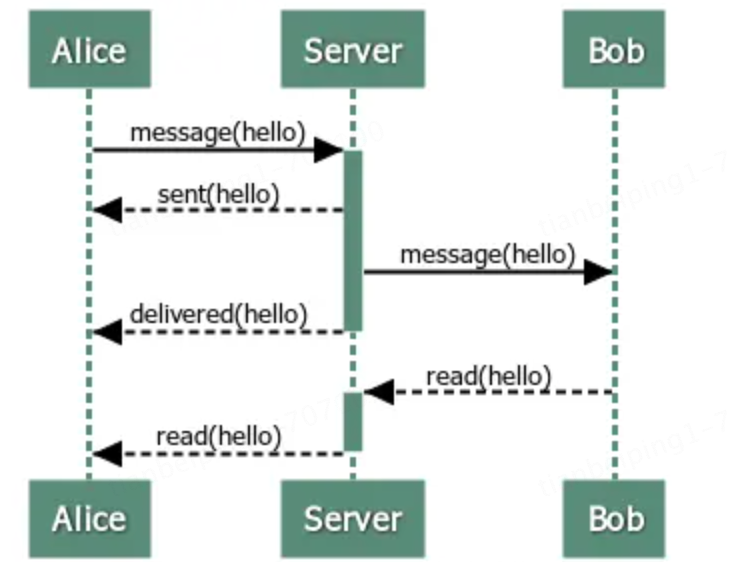
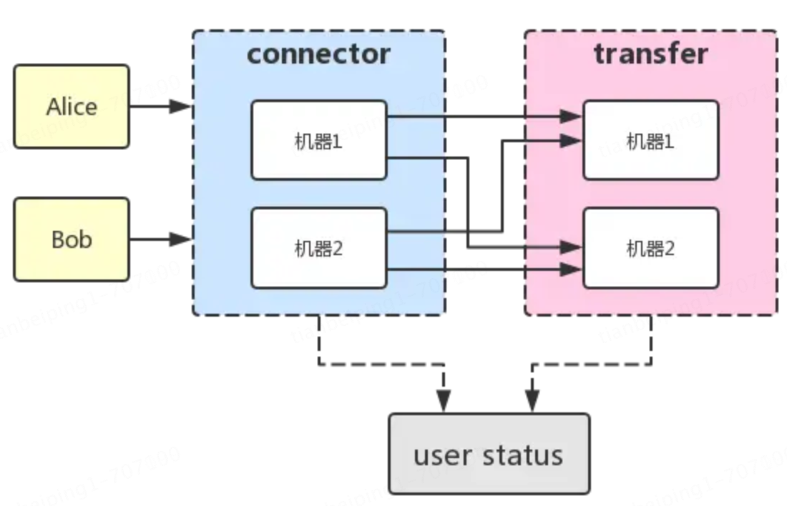
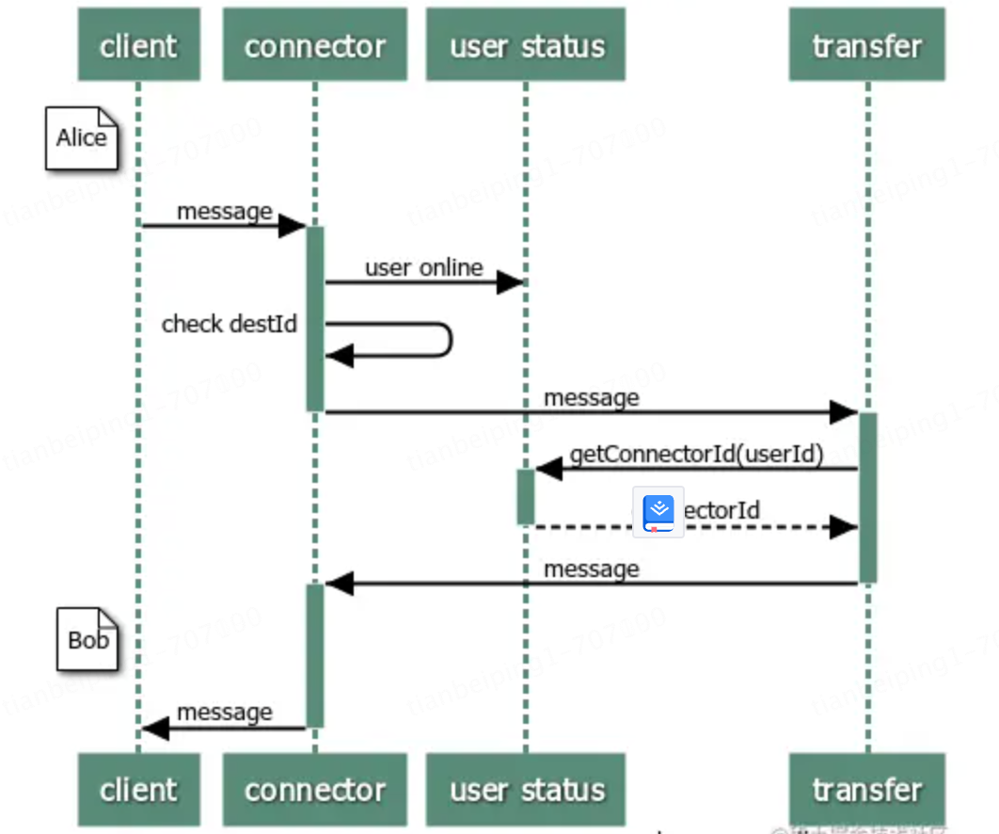
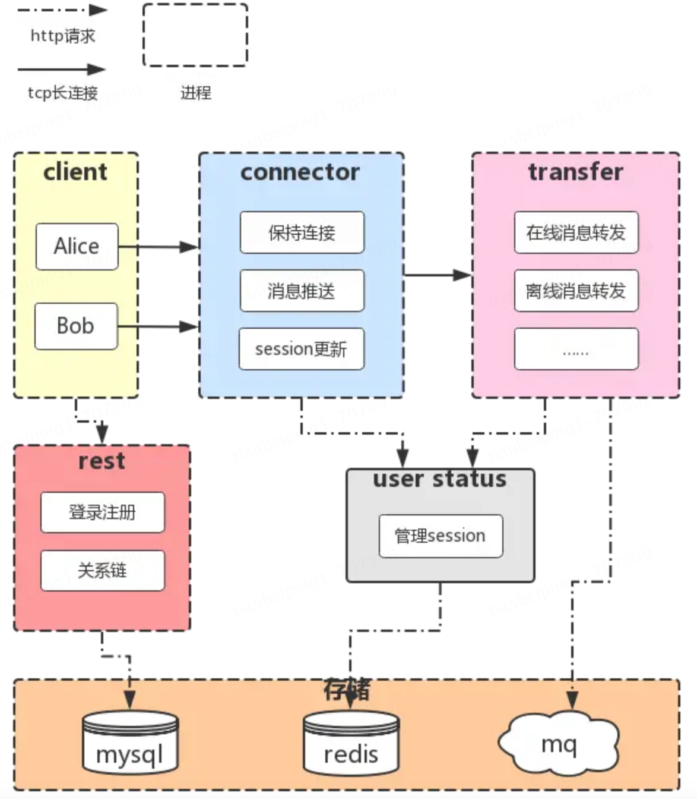

# IM逻辑关系

### 发送回执

定义一种回执数据格式ACK，MsgType有三种，分别是`sent`（已发送）,` delivered`（已送达）, `read`（已读）

```protobuf
message AckMsg {
    id;
    //消息id
    fromId;
    //发送者id
    destId;
    //接收者id
    msgType;
    //消息类型
    ackMsgId;
    //确认的消息id
}
enum MsgType {
    DELIVERED;
    READ;
}
```

当服务端接受到Alice发来的消息时：

1. 消息发送成功回执
   1. message AckMsg {    id = 2*;*    fromId = Alice*;*    destId = Bob*;*    msgType = **SENT**;    ackMsgId = 1*;* }
2. 消息投递成功回执
   1. message AckMsg {    id = 3*;*    fromId = Bob*;*    destId = Alice*;*    msgType = **DELIVERED**;   ackMsgId = 1*;* }
3. 消息已读回执
   1. message AckMsg {    id = 4*;*    fromId = Bob*;*    destId = Alice*;*    msgType = READ*;*    ackMsgId = 1*;* }



**在服务器这里不区分`ChatMsg`和`AckMsg`，处理过程都是一样的：解析消息的`destId`并进行转发**


### 消息转发

#### 消息发送流程

`connector`和`transfer`两个模块，`connector`模块用于维持用户的长链接，而`transfer`的作用是将消息在多个`connector`之间转发



现在Alice和Bob连接到了两台connector上，那么消息要如何传递呢？

1. Alice上线，连接到`机器[1]`上时
   1. 将Alice和它的连接存入内存中。
   2. 调用`user status`的`online`方法记录Alice上线。
2. Alice发送了一条消息给Bob
   1. `机器[1]`收到消息后，解析destId，在内存中查找是否有Bob。
   2. 如果没有，代表Bob未连接到这台机器，则转发给`transfer`。
3. `transfer`调用`user status`的`getConnectorId(Bob)`方法找到Bob所连接的connector，返回`机器[2]`，则转发给`机器[2]`。



### 离线消息

如果用户当前不在线，就必须把消息持久化下来，等待用户下次上线再推送，这里使用mysql存储离线消息。
 为了方便地**水平扩展**，我们使用**消息队列进行解耦**。

- `transfer`接收到消息后如果发现用户不在线，就发送给消息队列入库。
- 用户登录时，服务器从库里拉取离线消息进行推送。

### 用户登录、好友关系

用户的注册登录、账户管理、好友关系链等功能更适合使用http协议，因此我们将这个模块做成一个restful服务，对外暴露http接口供客户端调用


### 架构图

