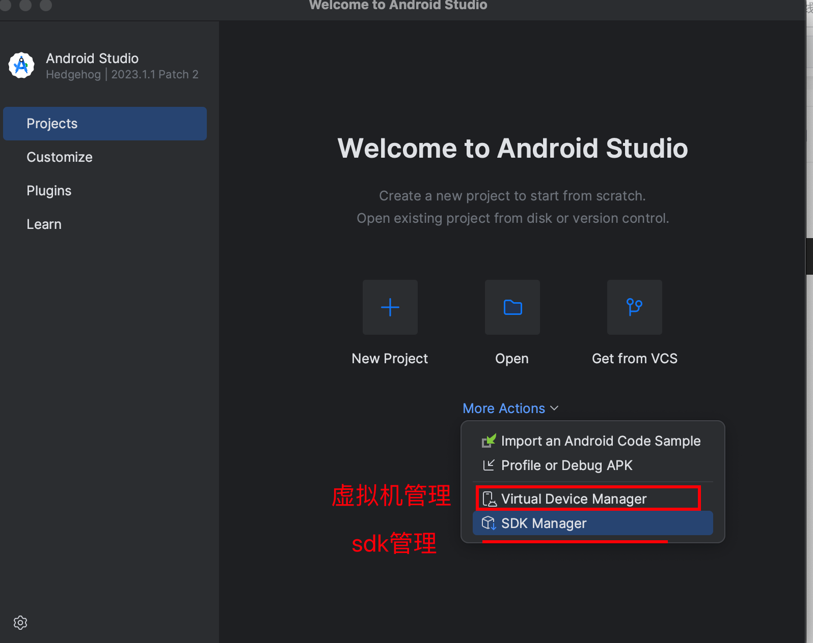
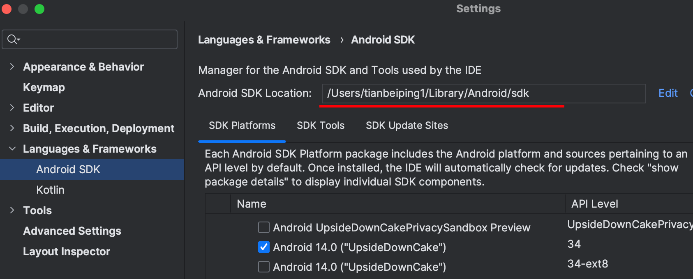
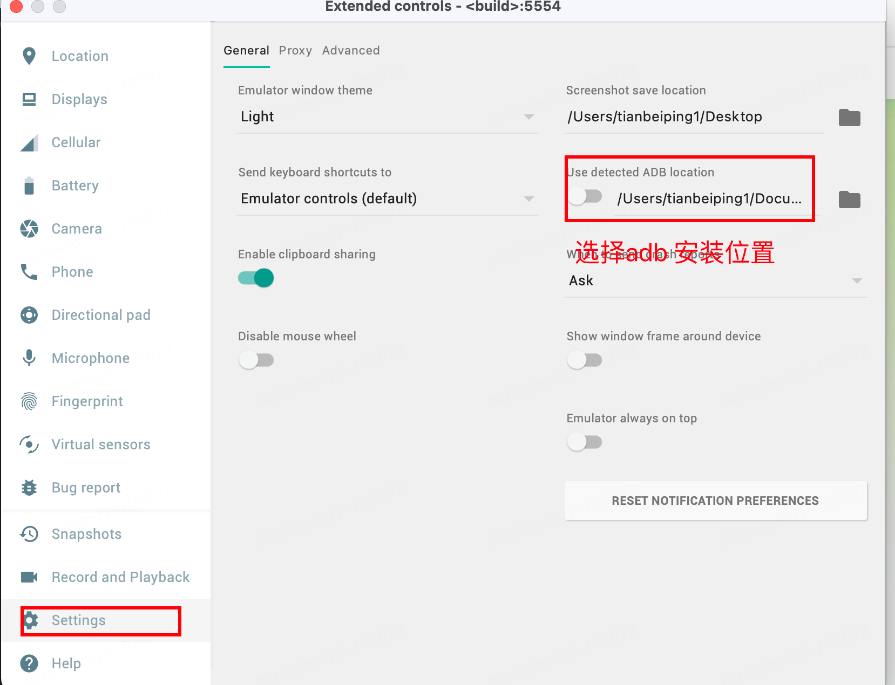

# 以下安装完成可以使用

```python
# pip install Appium-Python-Client
from appium import webdriver
from appium.options.android import UiAutomator2Options
from appium.webdriver.common.appiumby import AppiumBy

capabilities = {
    "platformName": "Android",
    "automationName": "uiautomator2",
    "deviceName": "avd",  # 非必选
    "appPackage": "com.jingdong.app.mall",
    "appActivity": ".main.MainActivity",
    "appium:noReset": True, # 保持被测应用和数据不被恢复
  	# 并行测试时，每个会话需要指定一个唯一的端口，否则可能会出现端口冲突的问题，建议每个会话都分配一个单独的端口。
	  # "appium:systemPort": 8201, # 每个设备一个端口
  	# "newCommandTimeout": 120,  # 设置会话时长，用于调试代码，默认为60S
    # "language":"en",
    # "locale":"US",
}
appium_server_url = "http://localhost:4723"

# 设置默认值
options = UiAutomator2Options()
if custom_opts is not None:
  options.load_capabilities(capabilities) # 自定义参数
# 启动京东app
# driver = webdriver.Remote(appium_server_url,options=UiAutomator2Options().load_capabilities(capabilities))
driver = webdriver.Remote(appium_server_url,options=capabilities)
# 
el = driver.find_element(by=AppiumBy.XPATH, value='//*[@text="同意"]')
el.click()

# driver.find_element_by_xpath('//*[@resource-id="com.jd.lib.productdetail.feature:id/a0n"]').click()
# driver.find_element(by=AppiumBy.XPATH, value='//*[@resource-id="com.jingdong.app.mall:id/d9y"]').click()
# driver.find_element(AppiumBy.ID, "com.android.launcher3:id/tv_search")
size=driver.get_window_size() # {'width': 1080, 'height': 2220}
# 选中屏幕上点，点击
driver.tap([(0.91*size['width'],0.869*size['height'])],2000)
# driver.back()
```

>  错误处理
>
> UiAutomation not connected!   1、重启模拟器；2、重启appium

# appium

## 安装

```shell
npm i -g appium
```

## 安装组件

```shell
# 查看 appium driver ls
appium driver install uiautomator2
# 查看 appium plugin ls
appium plugin install execute-driver
```

## 启动

```shell
appium # 或 appium server
```

### Appium 启动时候，应该会自动推送uiautomator2到手机上

#### 手机端需要安装appium-uiautomator2-server

```shell
# github地址：https://github.com/appium/appium-uiautomator2-server
# 启动
adb shell am instrument -w io.appium.uiautomator2.server.test/androidx.test.runner.AndroidJUnitRunner
```

使用API博客：https://blog.csdn.net/weixin_42550871/article/details/120672957

# 安装SDK、配置adb

## 安装android studio

```shell
export ANDROID_HOME=/Users/tianbeiping1/Library/Android/sdk
export platform_tools=$ANDROID_HOME/platform-tools
export PATH=$PATH:$platform_tools
```



sdk位置



### 配置adb



## 报错处理

```
SWT folder '/Users/xxx/Library/Android/sdk/tools/lib/aarch64' does not exist.
Please export ANDROID_SWT to point to the folder containing swt.jar for your platform.
```

### 处理方案

uiautomatorviewer`依赖`Java环境`，我使用的是zulu arm版本`jdk`，所以切换`jdk`为x64版本。 `export JAVA_HOME=/Library/Java/JavaVirtualMachines/jdk1.8.0_281.jdk/Contents/Home， 然后再次执行`./uiautomatorviewer`，成功运行


```
from appium import webdriver
from appium.options.android import UiAutomator2Options
from appium.webdriver.common.appiumby import AppiumBy

capabilities = dict(
    platformName="Android",
    automationName="uiautomator2",
    deviceName="emulator-5554",
    appPackage="com.jingdong.app.mall",
    appActivity=".main.MainActivity",
    # language="en",
    # locale="US",
)
appium_server_url = "http://localhost:4723"
```

