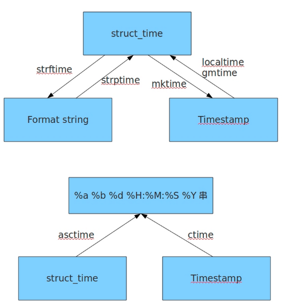

## formate 

> | **格式** | **含义**                                |
> | -------- | --------------------------------------- |
> | %Y       | 完整的年份                              |
> | %m       | 月份（01 - 12）                         |
> | %d       | 一个月中的第几天（01 - 31）             |
> | %H       | 一天中的第几个小时（24小时制，00 - 23） |
> | %M       | 分钟数（00 - 59）                       |
> | %S       | 秒（01 - 61）                           |
> | %Z       | 时区的名字（如果不存在为空字符）        |

# time

```python
#! /usr/bin/env python
# -*- coding:utf-8 -*-
# __author__ = "tbp"

import time

# 生成timestamp
time.time()
# 1477471508.05
#struct_time to timestamp
time.mktime(time.localtime())
#生成struct_time
# timestamp to struct_time 本地时间
time.localtime()
time.localtime(time.time())
# time.struct_time(tm_year=2016, tm_mon=10, tm_mday=26, tm_hour=16, tm_min=45, tm_sec=8, tm_wday=2, tm_yday=300, tm_isdst=0)

# timestamp to struct_time 格林威治时间
time.gmtime()
time.gmtime(time.time())
# time.struct_time(tm_year=2016, tm_mon=10, tm_mday=26, tm_hour=8, tm_min=45, tm_sec=8, tm_wday=2, tm_yday=300, tm_isdst=0)

#format_time to struct_time
time.strptime('2011-05-05 16:37:06', '%Y-%m-%d %X')
# time.struct_time(tm_year=2011, tm_mon=5, tm_mday=5, tm_hour=16, tm_min=37, tm_sec=6, tm_wday=3, tm_yday=125, tm_isdst=-1)

#生成format_time
#struct_time to format_time
time.strftime("%Y-%m-%d %X")
time.strftime("%Y-%m-%d %X",time.localtime())
# 2016-10-26 16:48:41

# 时间戳转换成时间字符串
time.strftime('%Y-%m-%d %H:%M:%S', time.localtime(time.time()))

#生成固定格式的时间表示格式
time.asctime(time.localtime())
time.ctime(time.time())
# Wed Oct 26 16:45:08 2016

#timestamp加减单位以秒为单位
import time
t1 = time.time()
t2=t1+10
print time.ctime(t1)#Wed Oct 26 21:15:30 2016
print time.ctime(t2)#Wed Oct 26 21:15:40 2016
```

# datetime

## date类

静态方法和字段

```
date.max、date.min：date对象所能表示的最大、最小日期；
date.resolution：date对象表示日期的最小单位。这里是天。
date.today()：返回一个表示当前本地日期的date对象；
date.fromtimestamp(timestamp)：根据给定的时间戮，返回一个date对象；
```

方法和属性

```
d1 = date(2011,06,03)#date对象
d1.year、date.month、date.day：年、月、日；
d1.replace(year, month, day)：生成一个新的日期对象，用参数指定的年，月，日代替原有对象中的属性。（原有对象仍保持不变）
d1.timetuple()：返回日期对应的time.struct_time对象；
d1.weekday()：返回weekday，如果是星期一，返回0；如果是星期2，返回1，以此类推；
d1.isoweekday()：返回weekday，如果是星期一，返回1；如果是星期2，返回2，以此类推；
d1.isocalendar()：返回格式如(year，month，day)的元组；
d1.isoformat()：返回格式如'YYYY-MM-DD’的字符串；
d1.strftime(fmt)：和time模块format相同。
```

## time类

> datetime.time(hour[ , minute[ , second[ , microsecond[ , tzinfo] ] ] ] ) 

静态方法和字段

```
time.min、time.max：time类所能表示的最小、最大时间。其中，time.min = time(0, 0, 0, 0)， time.max = time(23, 59, 59, 999999)；
time.resolution：时间的最小单位，这里是1微秒；
```

方法和属性

```
t1 = datetime.time(10,23,15)#time对象
t1.hour、t1.minute、t1.second、t1.microsecond：时、分、秒、微秒；
t1.tzinfo：时区信息；
t1.replace([ hour[ , minute[ , second[ , microsecond[ , tzinfo] ] ] ] ] )：创建一个新的时间对象，用参数指定的时、分、秒、微秒代替原有对象中的属性（原有对象仍保持不变）；
t1.isoformat()：返回型如"HH:MM:SS"格式的字符串表示；
t1.strftime(fmt)：同time模块中的format；
```

## datetime类

> datetime相当于date和time结合起来。
>
> datetime.datetime (year, month, day[ , hour[ , minute[ , second[ , microsecond[ , tzinfo] ] ] ] ] )
>
> 静态方法和字段
>
> ```python
> datetime.today()：返回一个表示当前本地时间的datetime对象；
> datetime.now([tz])：返回一个表示当前本地时间的datetime对象，如果提供了参数tz，则获取tz参数所指时区的本地时间；
> datetime.utcnow()：返回一个当前utc时间的datetime对象；#格林威治时间
> datetime.fromtimestamp(timestamp[, tz])：根据时间戮创建一个datetime对象，参数tz指定时区信息；
> datetime.utcfromtimestamp(timestamp)：根据时间戮创建一个datetime对象；
> datetime.combine(date, time)：根据date和time，创建一个datetime对象；
> datetime.strptime(date_string, format)：将格式字符串转换为datetime对象；
> 
> # 时间字符串转datetime对象，再转时间戳
> datetime_stamp2 = datetime.timestamp(datetime.strptime(datetime_str, '%Y-%m-%d %H:%M:%S'))
> ```
>
> 方法和属性
>
> ```
> dt=datetime.now()#datetime对象
> dt.year、month、day、hour、minute、second、microsecond、tzinfo：
> dt.date()：获取date对象；
> dt.time()：获取time对象；
> dt.replace([year[,month[,day[,hour[,minute[, second[,microsecond[,tzinfo]]]]]]]])：
> dt.timetuple()
> dt.utctimetuple()
> dt.toordinal()
> dt.weekday()
> dt.isocalendar()
> dt.isoformat([ sep] )
> dt.ctime()：返回一个日期时间的C格式字符串，等效于time.ctime(time.mktime(dt.timetuple()))；
> dt.strftime(format)
> ```

## timedelta类，时间加减

> 使用timedelta可以很方便的在日期上做天days，小时hour，分钟，秒，毫秒，微妙的时间计算，如果要计算月份则需要另外的办法。

```python
#coding:utf-8
from  datetime import *

dt = datetime.now()
#日期减一天
dt1 = dt + timedelta(days=-1)#昨天
dt2 = dt - timedelta(days=1) #昨天
dt3 = dt + timedelta(days=1 )#明天
delta_obj = dt3-dt
print type(delta_obj),delta_obj #<type 'datetime.timedelta'> 1 day, 0:00:00
print delta_obj.days ,delta_obj.total_seconds() #1 86400.0
```

### tzinfo时区类

```python
#! /usr/bin/python
# coding=utf-8

from datetime import datetime, tzinfo,timedelta

"""
tzinfo是关于时区信息的类
tzinfo是一个抽象类，所以不能直接被实例化
"""
class UTC(tzinfo):
    """UTC"""
    def __init__(self,offset = 0):
        self._offset = offset

    def utcoffset(self, dt):
        return timedelta(hours=self._offset)

    def tzname(self, dt):
        return "UTC +%s" % self._offset

    def dst(self, dt):
        return timedelta(hours=self._offset)

#北京时间
beijing = datetime(2011,11,11,0,0,0,tzinfo = UTC(8))
print "beijing time:",beijing
#曼谷时间
bangkok = datetime(2011,11,11,0,0,0,tzinfo = UTC(7))
print "bangkok time",bangkok
#北京时间转成曼谷时间
print "beijing-time to bangkok-time:",beijing.astimezone(UTC(7))

#计算时间差时也会考虑时区的问题
timespan = beijing - bangkok
print "时差:",timespan

#Output==================
# beijing time: 2011-11-11 00:00:00+08:00
# bangkok time 2011-11-11 00:00:00+07:00
# beijing-time to bangkok-time: 2011-11-10 23:00:00+07:00
# 时差: -1 day, 23:00:00
```

