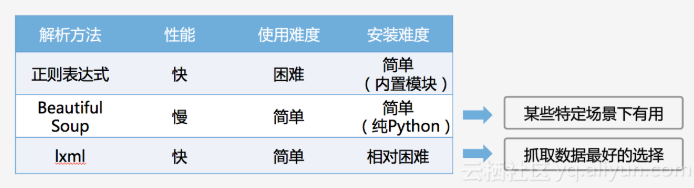

### pythons中，用作网络请求。。 <br/> 网络爬虫


#### 官方文档
[中文文档](http://docs.python-requests.org/zh_CN/latest/user/quickstart.html)
&nbsp;&nbsp;&nbsp;
[英文文档](http://www.python-requests.org/en/master/user/quickstart/#custom-headers)

> 安装 requests
>
> 基本用法
>
> pip3 install lxml bs4


``` Python
import requests
from lxml import etree
from fake_useragent import UserAgent  # 伪装请求头的库

# 伪装请求头中的浏览器
ua = UserAgent()

url = "https://book.douban.com/subject/27147922/comments/"
# html数据，使用requests获取
# 写爬虫最实用的是可以随意变换headers，一定要有随机性。ua.random支持随机生成请求头
r = requests.get(url, headers={"User-Agent": ua.random}).text

# 解析html数据
s = etree.HTML(r)

# 使用.xpath()
print(s.xpath('//*[@id="comments"]/div[1]/ul/li[1]/div[2]/p/span'))
# [<Element span at 0x24ee3701a08>]

# 获取文本，加上/text()
print(s.xpath('//*[@id="comments"]/div[1]/ul/li[1]/div[2]/p/span/text()'))
# ['周而复始、如履薄冰的生活仍值得庆幸，因为无论是主动还是被动的脱轨，都可能导致万劫不复。吉根是描绘“日常灾难”的大师，所有绝望都薄如蝉翼，美得微妙。']

```

