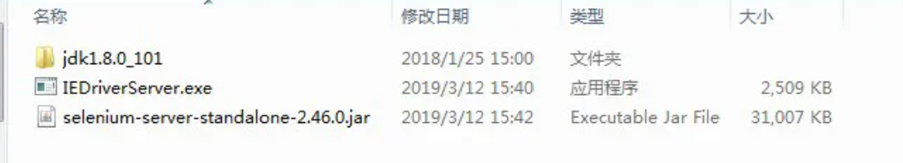

## Selenium-java

参考：https://blog.csdn.net/a460550542/article/details/132735101

> java Selenium WebDriver

```xml
<!-- selenium-java -->
<dependency>
  <groupId>org.seleniumhq.selenium</groupId>
  <artifactId>selenium-java</artifactId>
</dependency>
<!-- jsoup-java -->
<dependency>
  <!-- jsoup HTML parser library @ https://jsoup.org/ -->
  <groupId>org.jsoup</groupId>
  <artifactId>jsoup</artifactId>
</dependency>

```

## 本地模式

--remote-debugging-port=9222 --user-data-dir=./selenium/chromeData

-no-first-run --no-default-browser-check

- --remote-debugging-port：指定浏览器调试端口号，这里可以随机指定一个端口号，不要指定为已经被占用的端口号。
- --user-data-dir：用户配置文件目录，这里需要单独指定一个文件夹目录（不存在会新建），如果不显式指定该参数，运行会污染浏览器默认的配置文件。

```java
public class SeleniumDemo {
    //访问地址
    private static final String url = "http://localhost/system/dict";
    public static void main(String[] args) throws InterruptedException {
      //设置驱动，后面的路径自己要选择正确，也可以放在本地
      // ./chromedriver --remote-debugging-port=9222 --user-data-dir="./selenium/ChromeProfile"
      System.setProperty("webdriver.chrome.driver", "./chromedriver");  //指定驱动路
      //谷歌新版本增加
      System.setProperty("webdriver.http.factory", "jdk-http-client");
      //创建设置
      ChromeOptions options = new ChromeOptions();
      
      //然后前面debuggerAddress 这个不用动 只改后面的地址就是浏览器设置的地址
      // 设置浏览器访问IP
      options.setExperimentalOption("debuggerAddress", "127.0.0.1:9222");
      //谷歌新版本增加
      options.addArguments("--remote-allow-origins=*");
      // options.add_argument("-headless") // 无头模式
			// options.add_argument("--disable-gpu") // 不启动GPU渲染
      WebDriver driver = new ChromeDriver(options);
      driver.get(url);
    }
}
```

## 远程模式

### docker 启动

docker run --name firefox -d -p 4444:4444 -p 7900:7900 --shm-size="2g" selenium/standalone-firefox:3.141

### jar启动

启动： java -jar ./selenium-server-standalone-2.46.0.jar





扩展

```sh
java -Dwebdriver.IE.driver=.\IEDriverServer.exe \
-jar .\selenium-server-standalone-2.46.0.jar \
-role node \
-port 6666 \
-hub http://10.10.12.161:4444/grid/register \
-browser \
browserName=IE
# -role node :启动的是node节点
# -hub :hub 的地址及端口号
# -Dwebdriver.chrome.driver:驱动类型
# -maxSession :最大会话数量
# -browserName:浏览器名称
# -注意,有些参数如果不必要时,是可以不用写的,比如platform是系统.

# hub端浏览器刷新页面http://localhost:4444/grid/console，这里也可以看见node节点的情况
```

// 封装方法如下：

```java
public static WebDriver getRemoteIEDriver(String myUrl) {
    try {
        DesiredCapabilities capabilities = DesiredCapabilities.internetExplorer();
        URL urlInstance = new URL(myUrl); // 指定URL
        WebDriver driver = new RemoteWebDriver(urlInstance, capabilities); // 使用RemoteWebDriver初始化
        logger.info("远程浏览器启动完成！");
        return driver;
    } catch (Exception e) {
        logger.error("远程浏览器启动失败！");
        logger.error("===============>" + e.getMessage().toString());
        e.printStackTrace();
        return null;
    }
}
```

python

```python
from selenium import webdriver
from selenium.webdriver import DesiredCapabilities

driver = webdriver.Remote(
    # 指定远程浏览器的地址
    command_executor='http://127.0.0.1:4444/wd/hub',
    # 指定期望的浏览器类型，这里安装的是 firefox 所以指定firefox
    desired_capabilities=DesiredCapabilities.FIREFOX,
)
# 发送请求
driver.get("https://www.baidu.com")
# 获取网页源码
html = driver.page_source
print(html)
# 获取网页title
title = driver.title
print(title)  # 百度一下，你就知道
# 获取当前网页的 url
current_url = driver.current_url
print(current_url)  # https://www.baidu.com/
# 退出驱动，关闭所有关联的窗口
driver.quit()

```

